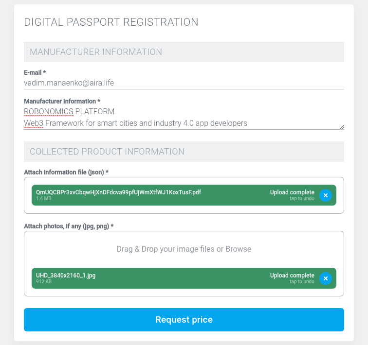

# Create Digital Identity Run by Ethereum

One of the Robonomics services is [Digital Passport Registration](https://dapp.robonomics.network/#/passport/) for arbitrary data.

The service allows you to create a digital identity saving the hashes of the data to the public blockchain and assigning a unique address.

You can find the service [here](https://dapp.robonomics.network/#/passport/) or via the main [Dapp](https://dapp.robonomics.network/) -> Services -> Digital Passport Registration.

The following video shows a progress of Robonomics Whitepaper registration:

<iframe width="756" height="425" src="https://www.youtube.com/embed/E8R6VbZvf9w" frameborder="0" allow="accelerometer; autoplay; encrypted-media; gyroscope; picture-in-picture" allowfullscreen></iframe>

## Step-by-Step Walkthrough

### 1. Open the Service

### 2. Add necessary information and files

It's possible to add several images

### 3. Sign the Demand

### 4. Approve Tokens

The service charges a small fee. But first you must approve the required amount of tokens to be spent from your account

### 5. Accept the Offer and Sign the Message Again

### 6. Have a Look at the Created Passport

The process of registration takes some time. In the end you will see a link to the created identity

