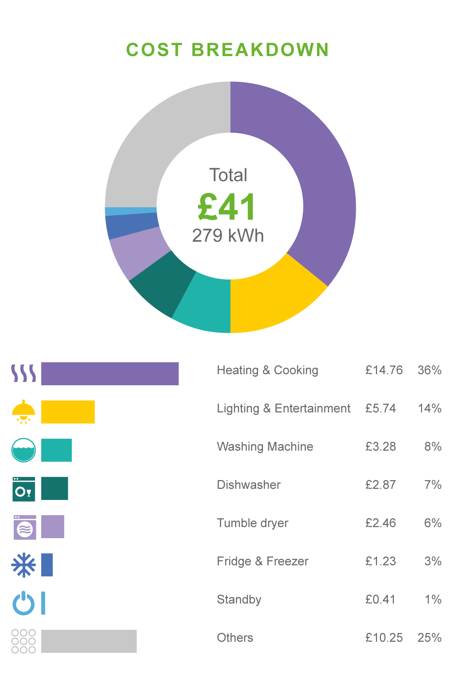

# Offset Electricity Consumption Rub by Ethereum

Вы используете датчик для подсчета потребеленной электроэнергии, скажем Voltaware. 
Этот датчик подключается неинвазивным способом в вашу сеть и считает количество электроэнергии, которое прошло через данную сеть.

За подробностоями по настройке и подключению датчика обратитесь к официальной документации https://www.voltaware.com/support

Здесь предполагается, что вы подключили и правильно настроили датчик, а так же зарегистрировались и начали получать ежемесячные отчеты о потребленном электричестве в виде

Отсюда нам интересно количество электроэнергии в kWh. Чтобы погасить углеродный след, в Robonomics Network существует специальный агент.

Идем на Дапп https://new.dapp.ipci.io/#/offsetting 

Необходимо заполнить следующие поля:

В зависимости от страны, берется renewable energy factor который означает, какой процент электроэнергии получено с помощью возобновляемых источников. 

Этот показатель необходим, чтобы вычислить, сколько было выброшено CO2, то есть сколько не зеленой энергии было потреблено.

Во второе поле пишем то, что пришло в ежемесячном отчете от датчика Voltaware и нажимаем Request for cost.

Агент расчитает стоимость погашения углеродного следа и пришлет предложение.

