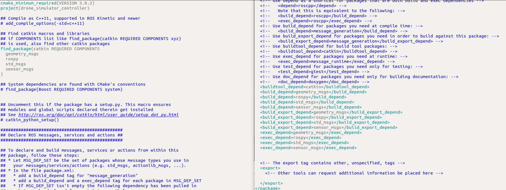

# Connect any ROS-compatitable robot under Robonomics parachain control. Part 2: IPFS

**In this article we will continue using Robonomics tools to make a drone be controlled by a parachain. This time we will add sending data to IPFS and hash storing in chain options. Below is the instruction and code snippets. Requirements:**
- **Part 1 of this tutorial**
- Ubuntu 18.04 LTS
- ROS Melodic + Gazebo + RViz (installation manual [here](http://wiki.ros.org/melodic/Installation))
- IPFS 0.4.22 (download from [here](https://dist.ipfs.io/go-ipfs/v0.4.22/go-ipfs_v0.4.22_linux-386.tar.gz) and install)
- Robonomics node (binary file) (download latest release [here](https://github.com/airalab/robonomics/releases))
- Python dependencies:
```
pip install cv_bridge ipfshttpclient 
```
## 1. Add dependencies
If we launch a simulation and look at the topic list (see previous tutorial), we will see, that there is one topic containing front camera data and using `sensor_msgs/Image` message type:


Let's try to take a picture every 1 second and after the flight publish these photos to IPFS. To do so, we need ato add a new dependency to our `CMakeList.txt` and `package.xml` in `drone_simulator_controller` package. 
Add  `sensor_msgs` to `find_package` block
and `<build_depend>sensor_msgs</build_depend>`, 
`<build_export_depend>sensor_msgs</build_export_depend>`, 
`<exec_depend>sensor_msgs</exec_depend>` to `package.xml` dependencies block.



Build the package after editing files:
```
cd ~/drone_simulator_controller
catkin build
```
## 2. Edit controller script
Open `drone_sample_controller.py` and add lines to imports block:
```python
import cv2 #for image converting
import ipfshttpclient #to send data to IPFS

from cv_bridge import CvBridge, CvBridgeError
from sensor_msgs.msg import Image #message type for /drone/front_camera/image_rawfrom cv_bridge import CvBridge, CvBridgeError
```
In the functions defining block add two new fuctions, made for reading image data from topic and saving them once a second:
```python
def image_callback(msg):
    global dirname
    global i
    if (i - time.time() <-1):
        i = time.time()
        try:
            # Convert your ROS Image message to OpenCV2
            cv2_img = bridge.imgmsg_to_cv2(msg, "bgr8")
            cv2.imwrite(dirname + 'src/drone_images/front_camera_image' + str(time.time()) + '.jpeg', cv2_img)
            rospy.loginfo("Image Saved")
        except CvBridgeError, e:
            print(e)


def take_pictures():
    # Define your image topic
    image_topic = "drone/front_camera/image_raw"
    # Set up your subscriber and define its callback
    rate = rospy.Rate(2)
    while not rospy.is_shutdown():
        if stop_taking_pictures:
            break
        rospy.Subscriber(image_topic, Image, image_callback)
        rate.sleep()
```
In the main body add global variables and class instance initializing:
```python
global i
global dirname
i = time.time()
bridge = CvBridge()
```
After parsing block add folder creating lines:
```python
rospy.loginfo("Creating directory for pictures")
os.mkdir(dirname + 'src/drone_images')
```
A new thread, flag for it and thread start method:
```python
taking_pictures = threading.Thread(target=take_pictures)
stop_taking_pictures = False #flages used to stop threads
taking_pictures.start()
rospy.loginfo("Started taking pictures")
```
And the last large block to push files to IPFS and send the IPFS hash to chain:
```python
stop_taking_pictures = True
taking_pictures.join()

rospy.loginfo("Pushing files to IPFS")
try:
    client = ipfshttpclient.connect()
    res = client.add(dirname + 'src/drone_images', recursive=True)
except Exception, e:
    print(e)
rospy.loginfo ("Files pushed. IPFS hash is " + res[-1].values()[0].encode('utf8'))

rospy.loginfo("Removing directory")
try:
    piclist = [f for f in os.listdir(dirname + 'src/drone_images')]
    for f in piclist:
        os.remove(os.path.join(dirname + 'src/drone_images', f))
    os.rmdir(dirname + 'src/drone_images')
except Exception, e:
    print(e)

rospy.loginfo ("Publishing IPFS hash to chain")
try:
    program = "echo \"" + res[-1].values()[0].encode('utf8') + "\" | " + configParser.get('key_and_addresses', 'ROBONOMICS_DIR') + "/robonomics io write datalog -s " + configParser.get('key_and_addresses', 'DRONE_KEY')
    process = subprocess.Popen(program, shell=True, stdout=subprocess.PIPE)
    output = process.stdout.readline()
    rospy.loginfo("Published data to chain. Transaction hash is " + output.strip())
except Exception, e:
    print(e)
rospy.loginfo("Job done. Check DAPP for IPFS data hash")
```
The full code is available in a [GitHub repository.](https://github.com/PaTara43/robonomics_drone_controller)
## 4. Launch
As done in a previous tutorial, create a local robonomics network node with robonomics binary file:
```
./robonomics --dev
```
**Important!** Before next launches it is necessary to remove a directory `db` with
```
rm -rf /home/$USER/.local/share/robonomics/chains/dev/db
```
After a successful launch go to https://parachain.robonomics.network and switch to local node:


Go to Accounts. There should be previously saved **DRONE** and **EMPLOYER** ones. They should have the same key and address as obtained in part 1, so just transfer some money (units) to these accounts:


In a separate terminal launch drone simulation:
```
roslaunch sjtu_drone simple.launch
```
In another one launch ipfs daemon:
```
ifps init # you only need to do this once
ipfs daemon
```
Run the script:
```
rosrun drone_simulator_controller drone_sample_controller.py
```
Now you can send a transaction triggering the drone to start flying and taking pictures. To do so, you should use the Robonomics IO `write` subcommand of robonomics binary file:
```
echo "ON" | ./robonomics io write launch -r <DRONE_ADDRESS> -s <EMPLOYER’S_KEY>
```
Where `<DRONE_ADDRESS>`  and `<EMPLOYER’S_KEY>` are replaced with  previously saved strings accordingly.
You should see the log `"Taking Off"` and the drone should start flying and taking pictures:


Later, when the job is done, on the Robonomics portal go to `Developer` -> `Chain state` and add a `DRONE` datalog using `“+”` button with selected `datalog` as state query. The IPFS hash of the telemetry has been saved in the blockchain. To see the data simply copy the hash and add it to the local [gateway](https://gateway.ipfs.io/ipfs/QmeYYwD4y4DgVVdAzhT7wW5vrvmbKPQj8wcV2pAzjbj886/docs/getting-started/) address `localhost:8080/ipfs/`:


