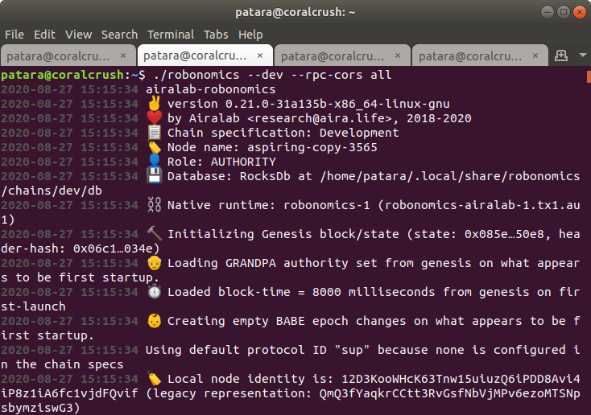
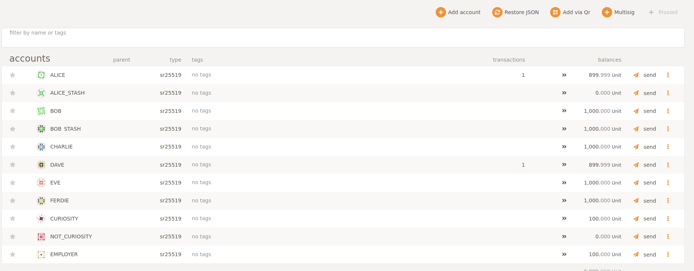
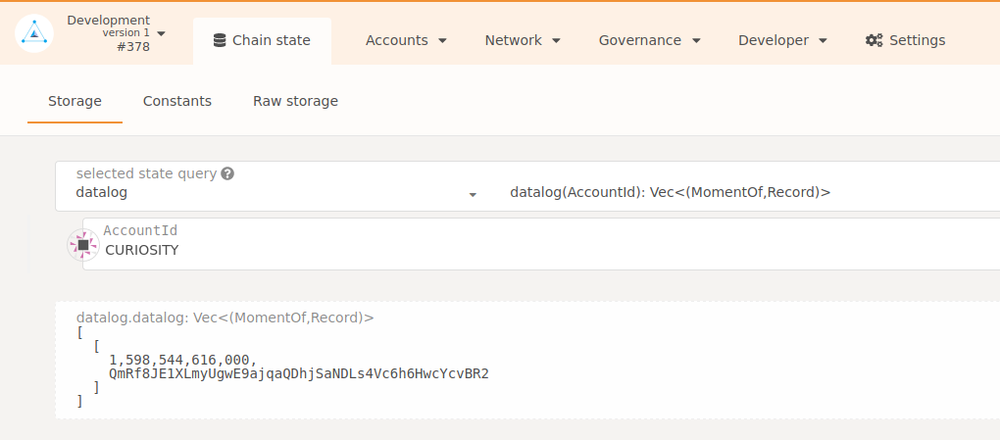
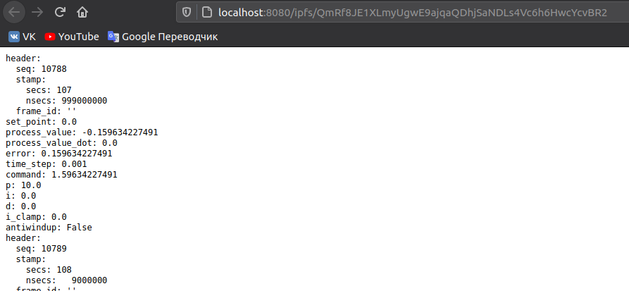

https://youtu.be/pl3eIEC_T2o
# DEMO "Connect Mars Curiosity Rover under Robonomics Parachain control"

**Let's see how Robonomics Parachain control allows to make Mars Curiossity Rover move.**

** Requirements:**
- Ubuntu 18.04 LTS
- ROS Melodic + Gazebo + RViz (installation manual [here](http://wiki.ros.org/melodic/Installation))
- extra packages:
```shell
sudo apt-get install ros-melodic-gazebo-ros-control ros-melodic-effort-controllers ros-melodic-joint-state-controller
```
- IPFS 0.4.22 (download from [here](https://dist.ipfs.io/go-ipfs/v0.4.22/go-ipfs_v0.4.22_linux-386.tar.gz) and install)
- Python dependencies:
```
pip install ipfshttpclient
```
- Robonomics node (binary file) (download latest release [here](https://github.com/airalab/robonomics/releases))
- IPFS browser extension (optional)

------------

## 1. Set up a simulation
Download Curiosity rover package:
```
mkdir -p robonomics_ws/src
cd robomonics_ws/src
git clone https://bitbucket.org/theconstructcore/curiosity_mars_rover/src/master/
cd ..
catkin build
```
We need to adjust starting conditions to make our rover spawn smoothly:
- Go to

`/robonomics_ws/src/master/curiosity_mars_rover_description/worlds` and change line 14 of the file` mars_curiosity.world` to 
`<pose>0 0 9 0 0 0</pose>`.

- Go to

`/robonomics_ws/src/master/curiosity_mars_rover_description/launch` and change line 4 of the file `mars_curiosity_world.launch` to 
`<arg name="paused" default="false"/>`.

Don’t forget to add ROS environment variables to the `~/.bashrc`:
'''
echo "source /home/patara/robonomics_ws/devel/setup.bash" >> ~/.bashrc
'''

------------

## 2. Download controller package
In terminal do the following. This will download a sample script used in the demo:
```
cd ~/robonomics_ws/src
mkdir robonomics_sample_controller
cd robonomics_sample_controller
git clone https://github.com/PaTara43/robonomics_sample_controller
cd ../..
catkin build
```

------------

## 3. Manage accounts in DAPP
Since we are testing, let's create a local robonomics network with robonomics binary file:
```shell
./robonomics --dev --rpc-cors all
```


**Important!** After each launch it is necessary to remove a directory `db` in

`rm -rf /home/$USER/.local/share/robonomics/chains/dev/db`

After a successful launch go to https://parachain.robonomics.network and switch to local node:



Go to Accounts and create **CURIOSITY** and **EMPLOYER** accounts (**NOT_CURIOSITY** is **not** necessary).

**Important**! Copy each account key and address (to copy address click on its icon) and add these addresses and path to robonomics binary file to file `config.config` in `robonomics_ws/src/robonomics_sample_controller/src`

Transfer some money (units) to these accounts:



Add these addresses and path to robonomics binary file location to file `config.config` in `robonomics_ws/src/robonomics_sample_controller/src`

------------

### 4. Start Robonomics
Up to now the **only thing running** should be the robonomics local node
In a separate terminal launch IPFS:
```
ifps init # you only need to do this once
ipfs daemon
```

In another separate terminal launch Curiosity simulation:
```
roslaunch curiosity_mars_rover_description main_real_mars.launch
```

Wait till it stays still and after that in another terminal launch the controller:
```
rosrun robonomics_sample_controller sample_controller.py

```


Now you can send a transaction triggering the Rover to start moving and collecting data. To do so, you should use the [Robonomics IO](https://wiki.robonomics.network/docs/rio-overview/)  "write" subcommand of robonomics binary file:
```
echo "ON" | ./robonomics io write launch -r <CURIOSITY ADDRESS> -s <EMPLOYER’S KEY>
```
Where `<CURIOSITY ADDRESS>`  and `<EMPLOYER’S KEY>` are replaced with  previously saved strings respectively.
You should see the log "Arming..." and the robot should start moving its camera and arm. Later, when the job is done (there is a log informing user when the program has finished), on the Robonomics portal go to Developer -> Chain state and add a CURIOSITY datalog using “+” button with selected “datalog” as state query: 



The IPFS hash of the telemetry has been saved in the blockchain. To see the data simply copy the hash and add it to the Gateway address `localhost:8080/ipfs/`:




