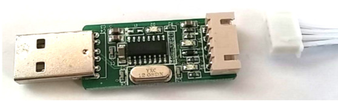
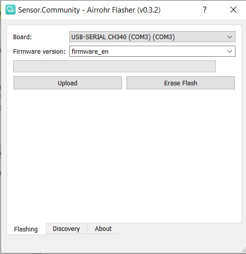

# Connect Sensor To Robonomics Network
## Requiremets
* ESP8266 Node MCU v3
* particle sensor SDS011
* micro USB cable
* connecting wires
---

## Assembling
### Connection Diagram


### Connecting SDS011

* Pin 1 (TX) -> (RX) Pin D1 (GPIO5)
* Pin 2 (RX) -> (TX) Pin D2 (GPIO4)
* Pin 3 (GND) -> GND
* Pin 4 (2.5m) -> unused
* Pin 5 (5V) -> VU
* Pin 6 (1m) -> unused

Sensor is shipped with a USB adapter and connection wires. You don't need USB adapter, so disconnect wires from it.



You may connect it to ESP via connecting wires "Female-Male":


And connect them to your ESP according to the connection diagram.

Or you can use wires from USB adapter. Disconnect one wire: push on it with some sharp object and carefully pull the wire:


Insert it to last connector:


Then cut the connector in the middle:


And connect them to ESP according to the diagram:


---
## Device Firmware
Download `airrohr-flasher` from the [latest release](https://github.com/airalab/sensors-connectivity/releases) for your OS. 
Connect ESP to computer via micro-USB and run flasher. 

### For Linux:
Firstly you need to add the user to `dialout` group:
```bash
sudo usermod -a -G dialout $USER
```
Then logout and login or restart computer.

Now you can run flasher (don't forget to give it permission to execute):
```bash
chmod +x airrohr-flasher-linux
./airrohr-flasher-linux
```
---
### For Windows:
Unpack flasher and run it with double click.
You need to install drivers for the USB2serial chipset (Windows 10 should be able to automatically download these):

* Drivers for NodeMCU v3 (CH340): [Windows](http://www.wch.cn/downloads/file/5.html) ([2018/09/04 v3.4 mirror](https://d.inf.re/luftdaten/CH341SER.ZIP))

---
### For MacOS
Download flasher and run it.
You need to install drivers for the USB2serial chipset: 
* Drivers for NodeMCU v3 (CH340): [MacOS](http://www.wch.cn/downloads/file/178.html) ([2018/09/04 v1.4 mirror](https://d.inf.re/luftdaten/CH341SER_MAC.ZIP))

---
Choose firmware (English or Russian) and press upload. It will take a few minutes.



---
## Configuration
Reboot your ESP (simply reconnect USB to computer).
Then connect to airRohr--xxxxxxx Wi-Fi network and in your browser write address 192.168.4.1:


Go to Configuration -> Wi-Fi Settings and add the information about your Wi-Fi network:


Then press "Save configuration and restart" and ESP will be connected to the provided Wi-Fi network.


---
Then find ESP in local network (for that your computer and ESP must be in one network). You can do it using airrohr-flasher. Run it, go to the Discovery tab and press Refresh, then you'll be able to see the address.


---

Open ESP local address in your browser, go to Configuration and click `API Robonomics`. 


> If you want to send data to your own server, enable `Custom API` and write your address and port 

Then enable GPS, put in your coordinates. Also enable all the sensors you connected:


Then press `Save configuration and restart`.

---

## Results
Go to [sensors.robonomics.network](https://sensors.robonomics.network/#/), and you will see your sensor on the map.

