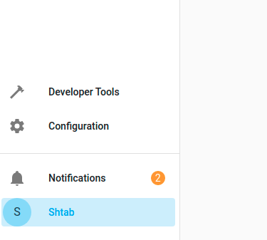

For each device you need separate [Robonomics accounts](/docs/create-account-in-dapp/). After you've added your devices, you need to add them in a `config.config` file with their seeds. Firstly in `Configuration/Entities` tab in your Home Assistant find entity ids of your devices:


Open the configuration file:
```bash
nano /srv/homeassistant/python_scripts/config.config
```
And add there information of your devices in the following format:

```
[device_name]
IDS = ['entity_id1', 'entity_id2']
SEED = word word word
```
Where `device_name` is the name of your device (you can choose any name), `IDS` are entity ids of the data from the device (it may be one or more ids) and `SEED` is a mnemonic or raw seed from robonomics account to this device.

After you fill the configuration file you need to get access token from Home Assistant. For that open your `profile` in the lower left corner:



In the end of the page find `Long-Lived Access Tokens` and press `create token`. Save it somewhere, you will not be able to see it again.


Now run `create_config.py` script with your token:

```bash
cd /srv/homeassistant
source bin/activate
python3 python_scripts/create_config.py --token <access_token>
```
And restart Home Assistant:
```bash
systemctl restart home-assistant@homeassistant.service
```

You can add the data from sensors to your homepage like in `Home Assistant setup` in the description to [Method 1](/docs/zigbee2-mqtt/).

You can see the data in [subscan](https://robonomics.subscan.io/), find your account and you will see datalog transactions. Data looks like this:


You can decrypt it with script `decrypt.py`, run it with the data from datalog:
```bash
cd /srv/homeassistant/
source bin/activate
python3 python_scripts/decrypt.py <data>
```