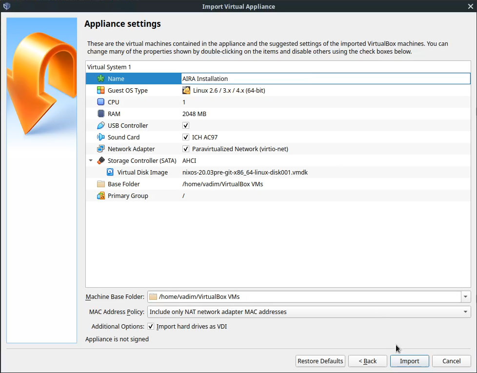
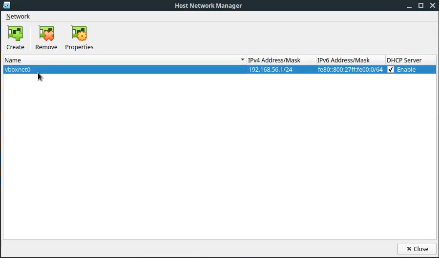
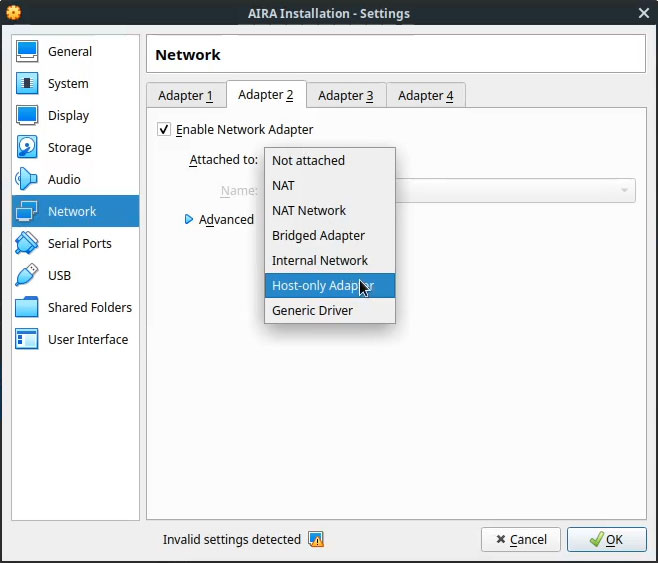
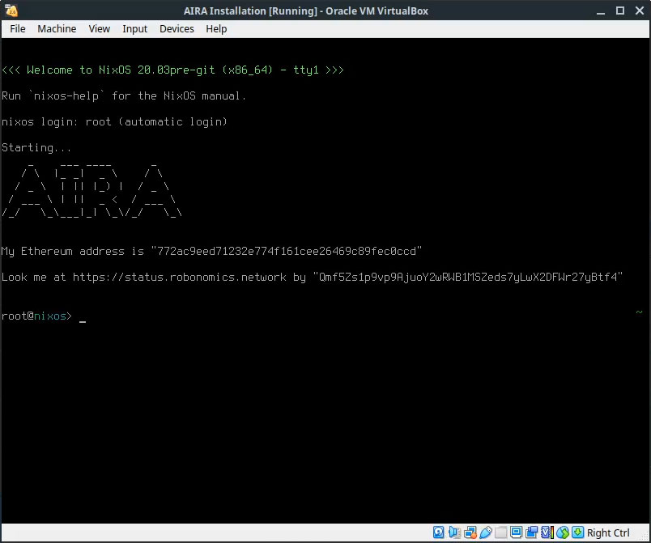

AIRA stands for "Autonomous Intelligent Robot Agent". It is the client for Robonomics Network developed by [Airalab](https://aira.life). It is an operating system based on [NixOS](https://nixos.org/). With AIRA you can  turn any cyber-physical system in an economic agent, where robots operate as a services for the reasonable payments. [More theory about AIRA here](/docs/aira-overview).

It's possible to install AIRA on a x86_64 PC. Also there are images for Raspberry Pi 3 and 4 supported by the team.

The best way to try AIRA is to start from installing it as a virtual machine on [VirtualBox](https://www.virtualbox.org/).

## Requirements

* VirtualBox
* [VirtualBox Extension Pack](https://www.virtualbox.org/wiki/Downloads#VirtualBox6.1.2OracleVMVirtualBoxExtensionPack)
* 2Gb of RAM for the machine
* 40Gb of free disk space

## Obtain the image

AIRA has [stable](https://aira.life/channels/aira-stable/) and [unstable](https://aira.life/channels/aira-unstable/) channels.

To get stable image download the file with `.ova` extension.
	The link for stable image is [here](https://releases.aira.life/channels/aira/stable/862-aira-stable/nixos-20.03pre-git-x86_64-linux.ova)

Don't forget to compare checksum of the downloaded image with the last column `SHA-256 hash` on the [download page](https://aira.life/channels/aira-stable/). It must be equal to the output of the following command (it is an example, please check the name of downloaded by you .ova file first):

```
sha256sum nixos-20.03pre-git-x86_64-linux.ova
```

You may wish to check out the walkthrough video:

https://www.youtube.com/embed/cDcaypYPBhI

## Troubleshooting

If you have fresh installed VirtualBox, you need to install the [extension](https://www.virtualbox.org/wiki/Downloads) pack or disable USB 2.0 controller.

Also VirtualBox may show a warning about `Display settings`. Consider switching `Graphics Controller` in settings of the VM to `VMSVGA`.

## Import to VirtualBox

Open VirtualBox and press `Ctrl+I` or go to `File > Import Applicance...`



At this moment the next step is not necessary but it will help you to connect to the VM via SSH easily.

First add `Host-Only` adapter in VirtualBox menu `File > Host Network Manager...` or by pressing `Ctrl+H`



Then go to the image's settings, Network and add the second network adapter



For more details look at the standalone [lesson](/docs/aira-connecting-via-ssh/).

Optionally you can increase the amount of video memory and switch `Graphics Controller` to `VMSVGA`.

## Launch the machine

Finally press Start and you'll see AIRA welcoming you with generated Ethereum address and IPFS identifier



At the very first initialization AIRA generates new Ethereum address and IPNS identifier for you.

