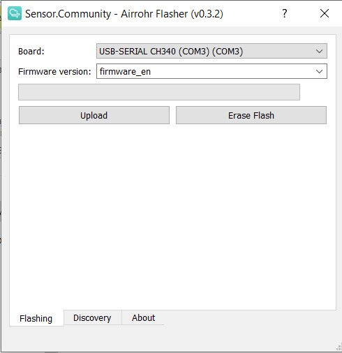
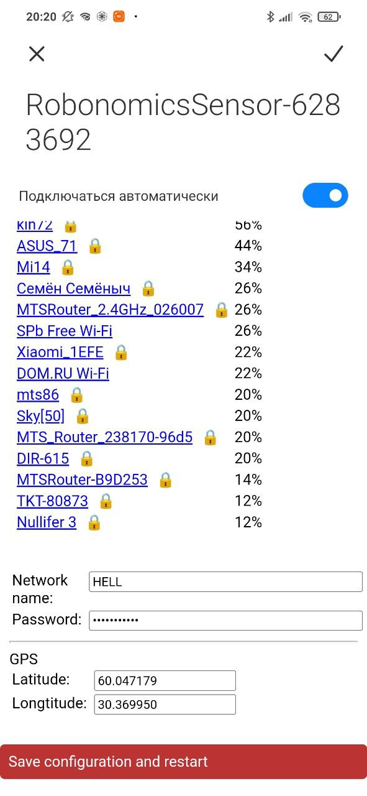
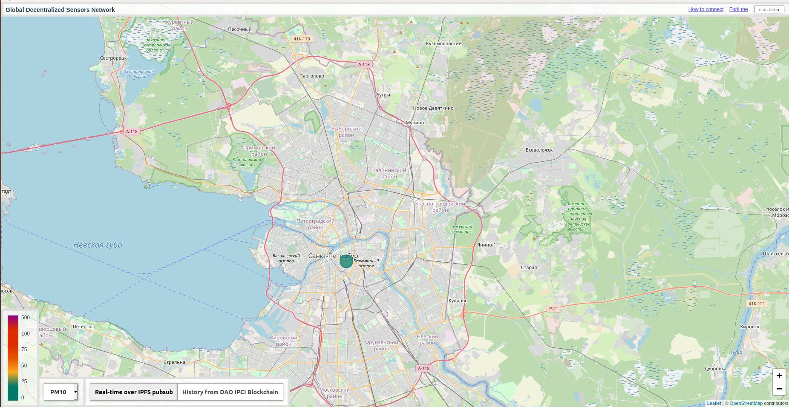
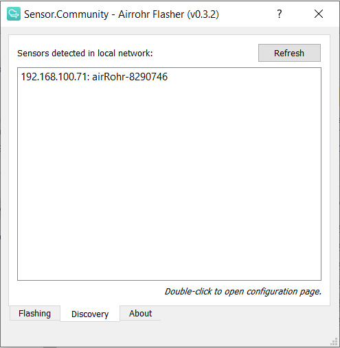
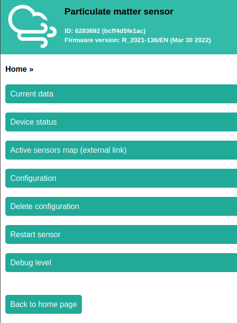
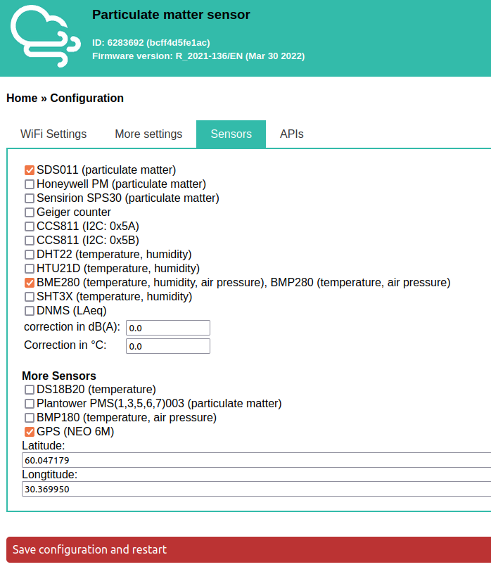
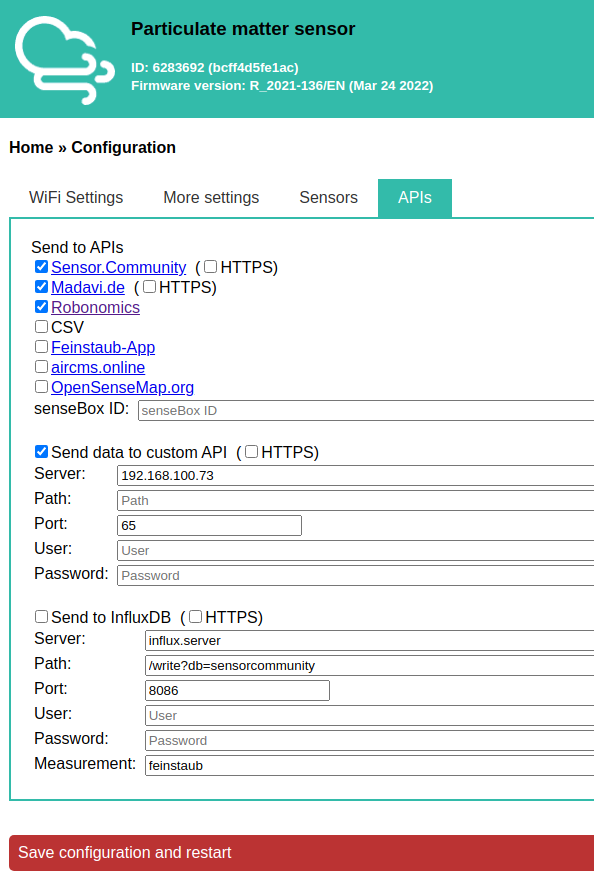

## Hardware

Universal board for air quality sensor, based on ESP8266 allows to use the following modules: NODEMCU v3, NODEMCU v2, WEMOS D1 MINI. The device is designed for 6 - 24 volt power supply, using DC-DC converter DC MINI560.


This board allows you to connect PM sensors:

- [SDS011](https://cdn-reichelt.de/documents/datenblatt/X200/SDS011-DATASHEET.pdf)

Possibility of connection via I2C interface:

- [BMP180](https://cdn-shop.adafruit.com/datasheets/BST-BMP180-DS000-09.pdf) - temperature and humidity
- [BME/P280](https://www.mouser.com/datasheet/2/783/BST-BME280-DS002-1509607.pdf) - temperature, humidity, atmospheric pressure
- [HTU21D](https://eu.mouser.com/ProductDetail/Measurement-Specialties/HTU21D?qs=tx5doIiTu8oixw1WN5Uy8A%3D%3D) - temperature and humidity
- SHT3x(I2C) - temperature and humidity
- [CCS811 VOC SENSOR](https://www.sciosense.com/wp-content/uploads/documents/Application-Note-Baseline-Save-and-Restore-on-CCS811.pdf) - volatile Organic Compounds, CO2 equivalent
- LCD1602/ 2004 / OLED SSD1306 / SH1106 - supported displays

Possibility of connection via 1 Wire interface:

- DTH22(AM2302) - temperature and humidity
- DS18B20 - temperature.

There is also a smaller MINI model with a trimmed down list of connectable devices. The source circuits for both models can be found at [full model](https://oshwlab.com/ludovich88/aira_sensor_rev0-1) and [MINI model](https://oshwlab.com/ludovich88/aira_sensor_d1_mini).

> To obtain a ready-made board, contact the developers at vm@multi-agent.io or ping@airalab.org.

After receiving/assembling the sensor, all that remains is to flash and configure it.

## Assembly

Let's take a closer look at the board:
The board has several connectors for connection - they are highlighted in blue and green. Consider the blue block of terminal blocks.


From left to right (all terminals are signed):
- Terminal for connecting the power supply of the board. The recommended voltage is 12 volts.
- Ground (point of zero potential). Serves both for connection of zero potential of the power supply, and for connection of sensors.
- Supply of sensors. Configurable power output to which sensors are connected. The output can be set to 3.3 or 5 volts.
- SDA terminal. Serial data line, is used to connect sensors via the I2C interface.
- SSL/1-Wire terminal. Configurable terminal to which the serial clock line  is connected. Used to connect sensors via I2C or 1-Wire interface.

Setting the power output for the sensor and selecting the interface is done by setting the jumpers, marked yellow in the image.
The jumpers are installed horizontally, the places for installing the jumpers are signed.

***BE CAREFUL!!!*** You can choose the voltage for the power supply by setting only one jumper to 3.3 volts or 5 volts. Setting two jumpers to 3.3 and 5 volts will damage the device. The same rule works when choosing an interface for sensors, install only one jumper in place of I2C or 1-Wire. Installing two jumpers may damage the device.

There is also an additional block of Inputs In the image it is marked in green.

> There is a power switch on the left side of the blue box to force the board to reboot. It is in the ON position by default.

## Firmware

Our firmware is based on the firmware from [Sensor.Community](https://github.com/opendata-stuttgart/sensors-software), with some sensors added and the data sending scheme changed. The source code can be found [at the link](https://github.com/LoSk-p/sensors-software/tree/master/airrohr-firmware). 

To flash the sensor you can use `airrohr-flasher`. Download the executable for your operating system from [latest release](https://github.com/airalab/sensors-connectivity/releases).

### For Linux

First you need to add a user to the `dialout` group (for Ubuntu) to gain access to the USB port:

```bash
sudo usermod -a -G dialout $USER
```

After that, reboot the computer. Next, change the permissions of the file and run it:

```bash
chmod +x airrohr-flasher-linux
./airrohr-flasher-linux
```

### For Windows:
Unzip the flasher and double-click to run it. You will also need to install drivers for USB2serial (Windows 10 should start automatically):

* Drivers for NodeMCU v3 (CH340): [Windows](http://www.wch.cn/downloads/file/5.html) ([2018/09/04 v3.4 mirror](https://d.inf.re/luftdaten/CH341SER.ZIP))

### For MacOS.
Download the flasher and run it. You will also need to install the drivers for USB2serial: 
* Drivers for NodeMCU v3 (CH340): [macOS](http://www.wch.cn/downloads/file/178.html) ([2018/09/04 v1.4 mirror](https://d.inf.re/luftdaten/CH341SER_MAC.ZIP))

---

Select the firmware (in English or Russian) and click `Upload`. Uploading the firmware will take some time.



## Setup

After downloading the firmware, reboot the ESP (just disconnect and reconnect the USB).

After a while after the reboot, ESP will create a Wi-Fi network called RobonomicsSensor-xxxxxxxxx. Connect to it from your phone or computer, then an authorization window will open (if it doesn't open in any browser go to 192.168.4.1). Select your Wi-Fi network from the list (or write it yourself if it's not on the list) and fill in the password field. Also write the coordinates of the place where the sensor will be installed in the field below:



Click `Save and restart`.

The board will connect to the specified Wi-Fi network and in a couple of minutes you will be able to see the data on [map](https://sensors.robonomics.network/#/):



## Advanced Setup

For a more detailed setup (you may need it to connect additional sensors or send data to your own server) you need to find the address of the sensor in your Wi-Fi network. To do this, you can use `airrohr-flasher` (your computer must be on the same network as the sensor is connected to). Start it and go to the `Discovery` tab, then press `Refresh`, wait a moment and your sensor address will appear.



Double-click on this address (or type it into your browser), you will get to the sensor menu:



Under the `Configuration` tab you can configure the sensors used:



And also set up sending to your own server. To do this, in the tab `APIs` uncheck `Robonomics` and check `Send to own API` and specify the server address and port (65 for sensors connectivity):



Click `Save and restart` to save the settings.


