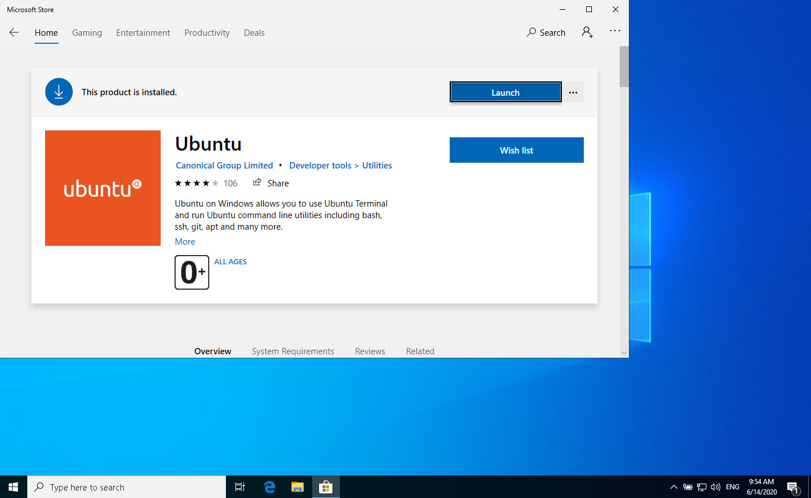

Robonomics Network allows you to communicate with any sensor you wish and get data from the sensor all around the world. This data can be transferred to different destinations.

On this page you'll find step-by-step instructions to connect an ESP board to the connectivity server provided by AiraLab.

## Requirements

* ESP8266/ESP32 like board with WiFi

## 1. Get the software

### On Windows

Install [WSL](https://docs.microsoft.com/en-us/windows/wsl/install-win10).

Install Ubuntu via Windows Store:



and clone the [package](https://github.com/airalab/sensors-connectivity)

```
git clone https://github.com/airalab/sensors-connectivity
```

The next step is to install python and dependencies:

```
sudo apt update && sudo apt install python3-pip
cd sensors-connectivity
pip3 install -r requirements.txt
```

### On Ubuntu

```
sudo apt update && sudo apt install python3-pip git
git clone https://github.com/airalab/sensors-connectivity
cd sensors-connectivity
pip3 install -r requirements.txt
```

> You can ignore such warnings:
>
> ```
> The script ... is installed in '...' which is not on PATH.
> Consider adding this directory to PATH or, if you prefer to suppress this warning, use --no-warn-script-location.
> ```

### On NixOS

```
git clone https://github.com/airalab/sensors-connectivity
cd sensors-connectivity
nix build -f release.nix
source result/setup.bash
```
