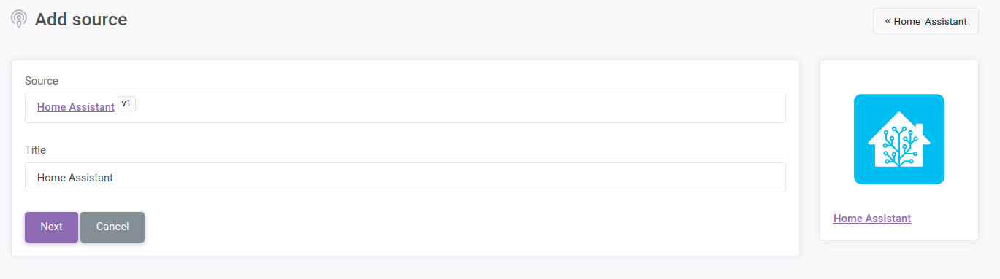
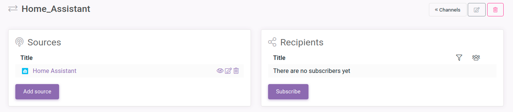

You can receive notifications on your smartphone with [notify](https://notify.events/). Girstly register there and on `Control Panel` creae new channel:


Add title and press `Save`:


Then press `Add Source` and choose `Home Assistant` in `IoT and Smart Home` tab:


Write title and press `Next`:



There you will see the token which you need to add to your configuration file for home Assistant. Save it somewhere and press `Done`:


then press `Subscribe` to add subscribers:



Choose whatever subscriber you want and follow the instructions.

Now you need to edit configuration on your compuer with Home Assistant. Under `homeassistant` user open `configuration.yaml` file:

```bash
sudo -u homeassistant -H -s
nano ~/.homeassistant/configuration.yaml
```

And add theese lines:

```yaml
notify_events:
    token: <your token from notify>
```
Also add new automation after `automation:` line:
```yaml
- alias: notifications
  trigger:
  - entity_id: binary_sensor.contact_sensor_contact
    platform: state
    from: 'off'
    to: 'on'
  action:
  - service: notify.notify
    data:
      message: Door was changed to {{ states("binary_sensor.contact_sensor_contact") }}
```
This automation will send message `Door was changed to on/off` after sensor wit entity id `binary_sensor.contact_sensor_contact` change state from `off` to `on`.

And restart Home Assistant:
```bash
systemctl restart home-assistant@homeassistant.service
```