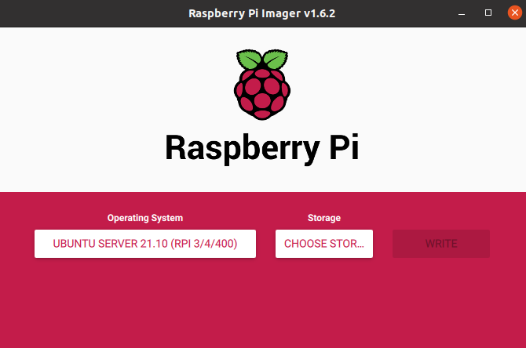
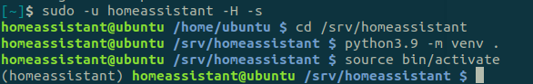

For both methods, the first thing you need to do is setup a Raspberry Pi.

Install [Raspberry Pi Imager](https://www.raspberrypi.com/software/) on your computer. Then, insert the SD card and run the Imager program. From the menu, select 64-bit Ubuntu Server as the operating system and ensure to select your SD card from the storage dropdown, and then press `write`.



Open the SD card's storage from your computer and navigate inside the root folder of the card. The name of the folder should be something similar to `system-boot`.

Find the file named `network-config` and open it in a text editor. Copy the below text and paste it into the file:
```
version: 2
ethernets:
  eth0:
    dhcp4: true
    optional: true
wifis:
  wlan0:
    dhcp4: true
    optional: true
    access-points:
      "YOUR_WIFI_NAME":
        password: "YOUR_WIFI_PASSWORD"
```

**Make sure that you input your actual wifi name and your wifi password.** Then you need to save the file, and insert the SD card to the Raspberry Pi and turn it on. It must connect to your wi-fi network, now you need to find its address. Firstly find your address in the local network with:
```bash
ip a
```
It must look like `192.168.xx.xx` or `172.xx.xx.xx`.

Then scan the network with your address and zero in the end (also you can use `arp -a`):

```bash 
$ sudo nmap -sP 192.168.xx.0/24
Starting Nmap 7.80 ( https://nmap.org ) at 2020-06-26 13:50 CEST
Nmap scan report for _gateway (192.168.43.1)
Host is up (0.015s latency).
MAC Address: 8E:F5:A3:DB:03:27 (Unknown)
Nmap scan report for ubuntu (192.168.43.56)
Host is up (0.049s latency).
MAC Address: DC:A6:32:02:46:50 (Raspberry Pi Trading)
Nmap scan report for LAPTOP-27UBLNO7 (192.168.43.234)
Host is up (0.00057s latency).
MAC Address: 7C:B2:7D:9E:95:DA (Intel Corporate)
Nmap scan report for ed-vm (192.168.43.138)
Host is up.
Nmap done: 256 IP addresses (4 hosts up) scanned in 2.07 seconds
```

In this example we can see that the Raspberry Pi's address is `192.168.43.56`. Now you can connect to it over ssh:
```bash
ssh ubuntu@192.168.43.56
```
Password is "ubuntu".

## Home Assistant

Now we need to install Home Assistant to the Raspberry Pi. Detailed instructions can be found [here](https://www.home-assistant.io/installation/linux#install-home-assistant-core). You need to install `Home Assistant Core`. It's actual version is 2021.11.5 and instruction assumes that we already have installed Python 3.9 or newer.

Update your system and install necessary packages:
```bash
sudo apt-get update
sudo apt-get upgrade -y
sudo apt-get install -y python3 python3-dev python3-venv python3-pip libffi-dev libssl-dev libjpeg-dev zlib1g-dev autoconf build-essential libopenjp2-7 libtiff5 tzdata libcurl4-openssl-dev
```

Create user `homeassistant` and the directory for homeassistant core:
```bash
sudo useradd -rm homeassistant
sudo mkdir /srv/homeassistant
sudo chown homeassistant:homeassistant /srv/homeassistant
```

Next up is to create and change to a virtual environment for Home Assistant Core. This will be done as the homeassistant account.
```bash
sudo -u homeassistant -H -s
cd /srv/homeassistant
python3.9 -m venv .
source bin/activate
```


Then install required Python packages:
```bash
python3 -m pip install wheel
pip3 install homeassistant==2022.6.2
```

Start Home Assistant Core for the first time. This will complete the installation for you, automatically creating the `.homeassistant `configuration directory in the `/home/homeassistant` directory, and installing any basic dependencies:
```bash
(homeassistant) homeassistant@ubuntu:/srv/homeassistant$ hass
```

You can now reach your installation via the web interface on `http://%RASPBERRY_IP_ADDRESS%:8123`. 
In this example: `http://192.168.43.56:8123`

> You don't need to connect you raspberry to the screen, you can open Web UI from any computer connected to your local network

Create user and finish setup (first setup is described [here](https://www.home-assistant.io/getting-started/onboarding/) in more details), then stop Home Assistant with `Ctrl+C`.

## Systemd services

Now change user (you can run under any user, which allows you to use sudo):

```bash
(homeassistant) homeassistant@ubuntu:/srv/homeassistant/python_scripts$ exit
```

Create new service for home assistant start: 

```bash
ubuntu@ubuntu:~$ sudo nano /etc/systemd/system/home-assistant@homeassistant.service 
```

Paste the following:

```
[Unit]
Description=Home Assistant
After=network-online.target
[Service]
Type=simple
User=%i
WorkingDirectory=/srv/%i/
ExecStart=/srv/homeassistant/bin/hass -c "/home/%i/.homeassistant"
Environment="PATH=/srv/%i/bin"

[Install]
WantedBy=multi-user.target
```

And enable service:
```bash
ubuntu@ubuntu:~$ sudo systemctl enable home-assistant@homeassistant.service
```

After that you can connect your devices:
- [Connection with zigbee2MQTT](/docs/zigbee2-mqtt/)
- [Setup SLS Gateway](/docs/sls-setup) and [connect it to Home Assistant](/docs/sls-gateway-connect)
- [Connection through Xiaomi Gateway](/docs/xiaomi-gateway/)
- [Connect Vacuum Cleaner](/docs/vacuum-connect/)