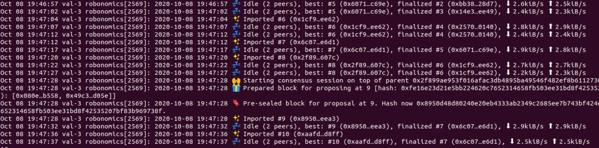

**Need to start Robonomics network of N (N> = 2) nodes**

## Requirements
- Robonomics binary, download latest here: https://github.com/airalab/robonomics/releases/
- Subkey tool, download latest here: https://github.com/airalab/robonomics/releases/
- 3 servers with root shell. Their ip-addresses in the current instruction will be `165.227.171.127`, `159.89.25.75` and `159.89.30.50`

## Introduction
In this tutorial, we will first create all key files locally, and then upload them to their corresponding nodes. 

## Prepare directories
Download 2 archives from the links above and open the folder with them in the terminal.
Then create a directory for the project, unpack the archives into it and go to the created folder:
```
$ mkdir robonomics_test_network
$ tar -xf ./robonomics-ubuntu-0.21.0-x86_64.tar.xz -C ./robonomics_test_network/
$ tar -xf ./subkey-ubuntu-0.21.0-x86_64.tar.xz -C ./robonomics_test_network/
$ cd ./robonomics_test_network/
```

Next, create a separate **uploads** directory and the necessary subdirectories for each server. All files intended for uploading to a specific server will be stored in these subdirectories:
```
$ mkdir -p uploads/165.227.171.127/keystore && mkdir -p uploads/165.227.171.127/network
$ mkdir -p uploads/159.89.25.75/keystore && mkdir -p uploads/159.89.25.75/network
$ mkdir -p uploads/159.89.30.50/keystore && mkdir -p uploads/159.89.30.50/network
```

Also, create a **local** folder with **validators** and **sudo** folders, which will store the validators and sudo keys locally.
```
$ mkdir -p local/validators && mkdir -p local/sudo
```

## Prepare spec.json
Using the robonomics binary, generate a **spec.json** file, which will use as the basis:
```
$ ./robonomics build-spec --chain dev > uploads/spec.json
```

Next, edit this file. At first correct the first three fields, make them look like this:
```
"name": "Test Robonomics Network",
"id": "dev",
"chainType": "Live",
```

### bootNodes
The **bootNodes** field is a list of strings of special format. For each of the bootnodes must write the corresponding string here.
To do this, first create a key file for each bootnode using **subkey**:
```
$ ./subkey generate-node-key uploads/165.227.171.127/network/secret_ed25519  
12D3KooWBPq1fDLQC2iqQ4FpM2mUpiXjBRcb8ptk7tbaqr2B6HZN
$ ./subkey generate-node-key uploads/159.89.25.75/network/secret_ed25519
12D3KooWRbGmdpbz6o1fe66wFs7nJsUYfBp2f3W7J1uDXj3gt4Bh
$ ./subkey generate-node-key uploads/159.89.30.50/network/secret_ed25519
12D3KooWMuTrL9CmJxj8LjH43s4hsJMsyuMdbuB86zCaAf9VCwFf
```

Each command creates a key file in the specified directory and outputs to stdout the string that will be needed to fill in the **bootNodes** field in the **spec.json** file. As a result, the **bootNodes** section should look like following example:
```
"bootNodes": [
"/ip4/165.227.171.127/tcp/30333/p2p/12D3KooWBPq1fDLQC2iqQ4FpM2mUpiXjBRcb8ptk7tbaqr2B6HZN",
"/ip4/159.89.25.75/tcp/30333/p2p/12D3KooWRbGmdpbz6o1fe66wFs7nJsUYfBp2f3W7J1uDXj3gt4Bh",
"/ip4/159.89.30.50/tcp/30333/p2p/12D3KooWMuTrL9CmJxj8LjH43s4hsJMsyuMdbuB86zCaAf9VCwFf"
],
```
The next 3 fields (telemetryEndpoints, protocolId, properties) can be filled like this:
```
 "telemetryEndpoints": [
     [
       "/dns4/telemetry.polkadot.io/tcp/443/x-parity-wss/%2Fsubmit%2F",
       0
     ]
 ],
"protocolId": "txrt",
"properties": {
    "ss58Format": 32,
    "tokenDecimals": 9,
    "tokenSymbol": "TXRT"
},
```
Further up to the **palletBalances** field leave unchanged.


### palletBalances
To fill the palletBalances field create **the number of nodes + 1** (the last key is for **sudo**) keys. This can be done using **subkey**, in the file name must specify **SS58 Address** from the generated key, in the file content must specify **seed** phrase in quotes. 

Example creating one key.
 - Generate key:
    ```
    $ ./subkey -n robonomics generate
    Secret phrase `display cargo domain april joy still bundle notice bridge pencil fat approve` is account:
      Network ID/version: substrate
      Secret seed:        0x0275ab9bce53e4359184f02112943162c708f483009e0b7b3ba63549c5c2e514
      Public key (hex):   0xd0996b85dd1b2876080b26123f9c27097d698f871c5978c3cb9c299253e7a530
      Account ID:         0xd0996b85dd1b2876080b26123f9c27097d698f871c5978c3cb9c299253e7a530
      SS58 Address:       4CnxYUugEzLQ8Re2d5P2Jso25pe8PBttcVjc3VdNL2V9shVx
    ```
 - Create key file:
    ```
    $ touch ./local/validators/4CnxYUugEzLQ8Re2d5P2Jso25pe8PBttcVjc3VdNL2V9shVx && echo '"display cargo domain april joy still bundle notice bridge pencil fat approve"' | tee ./local/validators/4CnxYUugEzLQ8Re2d5P2Jso25pe8PBttcVjc3VdNL2V9shVx
    ```
  
Command template for creating a validator key file:  
`touch ./local/validators/**SS58_Address** && echo '"**seed**"' | tee ./local/validators/**SS58_Address**`

Command template for creating a sudo key file:   
`touch ./local/sudo/**SS58_Address** && echo '"**seed**"' | tee ./local/sudo/**SS58_Address**`

Three keys are stored in the **local/validators** folder and one in the **local/sudo** folder. As a result, the following content should appear in the **local** directory:
```
./local/
├── sudo
│   └── 4Dy6bzrvoApwjLaAjfrtvtX3tthCw6fnCU1Ym5KNyRGt3kKb
└── validators
    ├── 4CnxYUugEzLQ8Re2d5P2Jso25pe8PBttcVjc3VdNL2V9shVx
    ├── 4EeMi84pk5P5nQpyupQeCZ1C4NhUFtMF7Xh1MXJLANkZ3BTd
    └── 4FPRYfSVqwaX39vXZ78tT3DPBT9FmFXvdQDD7y5UQKncJGu1
```

Now fill the palletBalances section in the spec.json file with these keys.
As a result, it should look like this:
```
"palletBalances": {
  "balances": [
    [
      "4CnxYUugEzLQ8Re2d5P2Jso25pe8PBttcVjc3VdNL2V9shVx",    <-- Generated validator 1 key
      1000000000000000000
    ],
    [
      "4EeMi84pk5P5nQpyupQeCZ1C4NhUFtMF7Xh1MXJLANkZ3BTd",    <-- Generated validator 2 key
      1000000000000000000
    ],
    [
      "4FPRYfSVqwaX39vXZ78tT3DPBT9FmFXvdQDD7y5UQKncJGu1",    <-- Generated validator 3 key
      1000000000000000000
    ],
    [
      "4Dy6bzrvoApwjLaAjfrtvtX3tthCw6fnCU1Ym5KNyRGt3kKb",    <-- Generated sudo key
      1000000000000000000
    ],
  ]
},
```
The values that were previously presented in the palletBalances section must be deleted.

### palletSession
Next step is the **palletSession** section in file **spec.json**. First let's describe its format. 
This section contains the "keys" field, that contains a list of three lists (equals of nodes count). Each of these lists looks like follows:
```
[
    "%validator_SS58_address%",
    "%validator_SS58_address%",
    {
        "babe": "%sr25519_babe_SS58_address%",
        "im_online": "%sr25519_im_online_SS58_address%"
        "authority_discovery": "%sr25519_authority_discovery_SS58_address%",
        "grandpa": "%ed25519_grandpa_SS58_address%",
    }
]
```
**%validator_SS58_address%** is the validator key that was generated for each node in the **palletBalances** section of this manual. Just copy it twice for each node.

To fill in the remaining 4 lines for each node, you need to create 4 key files for each node and store them in the **keystore** folders.
As key files are generated, you can fill **palletSession**.

Each key file must contain a **seed** phrase in quotes.
Making of the name of each key file require separate consideration.
The name of each key file is formed as **prefix** + **account_id without leading hexadecimal zero**.

Prefixes matching:  
>      grandpa: '6772616e'  
>      babe: '62616265'
>      im_online: '696d6f6e'  
>      authority_discovery: '61756469'  

An example of creating keys for one node:
- Creating a **babe** (prefix *62616265*) key file.   
  ```
  $ ./subkey --sr25519 -n robonomics generate
  ```
  >  Secret phrase **cover once garment syrup income chair elder business diary frozen rack damage** is account:  
  >
  >  Network ID/version: `substrate`
  >
  >  Secret seed:        `0x90ddeee3a9a0c464572021d311c245eefc41f9a59c739faefda47efcf4755677`
  >
  >  Public key (hex):   `0xfa44d96e310cf68350dd855c745794f7c1afa63089ebdb2c96bff3797972bb43`
  >
  >  Account ID:         `0xfa44d96e310cf68350dd855c745794f7c1afa63089ebdb2c96bff3797972bb43`
  > 
  >  SS58 Address:       `4HirHF5BVHxkRBtqptFxBSmnAiZir1qQLs6pL9Utmm4eF77C`
  
 ```
 $ touch uploads/165.227.171.127/keystore/62616265fa44d96e310cf68350dd855c745794f7c1afa63089ebdb2c96bff3797972bb43 && echo '"cover once garment syrup income chair elder business diary frozen rack damage"' | tee ./uploads/165.227.171.127/keystore/62616265fa44d96e310cf68350dd855c745794f7c1afa63089ebdb2c96bff3797972bb43 
 ```
 This command creates a **babe** key file for the `165.227.171.127` node. To fill in **spec.json**, need to take from this output the value **SS58 Address**: `4HirHF5BVHxkRBtqptFxBSmnAiZir1qQLs6pL9Utmm4eF77C`. This address need to insert instead of `%sr25519_babe_SS58_address%` in the above **palletSession** template.
   
 **babe** key file creation command template:  
`touch ./uploads/[node_ip]/keystore/62616265+[Account_ID] && echo '"[seed]"' | tee ./uploads/[node_ip]/keystore/62616265+[Account_ID]`  

As you can see, the name of the babe key file is the sum of two substrings: `babe prefix ('62616265')`, and the `account_id` of the generated key, without the leading zero (`fa44d96e310cf68350dd855c745794f7c1afa63089ebdb2c96bff3797972bb43`). 
  Note that the keys `babe, im_online, authority_discovery` are generated with the indication `--sr25519`.  
  **grandpa** key have to generate with the indication `--ed25519`.
 

- Creating an **im_online** (prefix *696d6f6e*) key file.  
  ```
  $ ./subkey --sr25519 -n robonomics generate
  ```
  > Secret phrase **envelope truly balance turkey undo casual waste skill average ordinary gun split** is account:
  >
  >   Network ID/version: `substrate`
  > 
  >   Secret seed:        `0x8a19df08feeff9f1fa3581902ca22a305252aea32e284d32f10e990d00bb8926`
  > 
  >   Public key (hex):   `0x6c13ff8e37d91b80fe3b03f9b92a91a1ef7db741434cf12cc44d5ed29257ab09`
  >  
  >   Account ID:         `0x6c13ff8e37d91b80fe3b03f9b92a91a1ef7db741434cf12cc44d5ed29257ab09`
  >  
  >   SS58 Address:       `4EWQyBRoucH4Wjd4JtGoSEYYCw4bbkonjoFy9hNUX5fbmMEt`
   
  ```
  $ touch uploads/165.227.171.127/keystore/696d6f6e6c13ff8e37d91b80fe3b03f9b92a91a1ef7db741434cf12cc44d5ed29257ab09 && echo '"envelope truly balance turkey undo casual waste skill average ordinary gun split"' | tee uploads/165.227.171.127/keystore/696d6f6e6c13ff8e37d91b80fe3b03f9b92a91a1ef7db741434cf12cc44d5ed29257ab09
  ```
  **im_online** key file creation command template:  
  `touch ./uploads/[node_ip]/keystore/696d6f6e+[Account_ID] && echo '"[seed]"' | tee ./uploads/[node_ip]/keystore/696d6f6e+[Account_ID]`
  
  **spec.json**: `4EWQyBRoucH4Wjd4JtGoSEYYCw4bbkonjoFy9hNUX5fbmMEt` need to insert instead of `%sr25519_im_online_SS58_address%` in the above **palletSession** template.


- Creating an **authority_discovery** (prefix *61756469*) key file.
   ```
   $ ./subkey --sr25519 -n robonomics generate
   ```
   > Secret phrase **boy harsh because omit equip atom apart spring undo explain walnut crystal** is account:
   >
   > Network ID/version: `substrate`
   >
   >   Secret seed:        `0x27838c9ea0524353da3717862ef0ecef123f40e81b73bb5ef377d12b47d1c543`
   > 
   >   Public key (hex):   `0x4e33ccfd4105d30dfd93c5ef4658e2585a749508ea7c7abe754efc36dd634c07`
   > 
   >   Account ID:         `0x4e33ccfd4105d30dfd93c5ef4658e2585a749508ea7c7abe754efc36dd634c07`
   >  
   >   SS58 Address:       `4DqEyoefRSz746sjaonxJ7KZQz8MUq4cKFA87DfoLzQgWk8t`
   
   ```
   $ touch uploads/165.227.171.127/keystore/617564694e33ccfd4105d30dfd93c5ef4658e2585a749508ea7c7abe754efc36dd634c07 && echo '"boy harsh because omit equip atom apart spring undo explain walnut crystal"' | tee uploads/165.227.171.127/keystore/617564694e33ccfd4105d30dfd93c5ef4658e2585a749508ea7c7abe754efc36dd634c07
   ```
  **authority_discovery** key file creation command template:  
  `touch ./uploads/[node_ip]/keystore/61756469+[Account_ID] && echo '"[seed]"' | tee ./uploads/[node_ip]/keystore/61756469+[Account_ID]` 
  
   **spec.json**: `4DqEyoefRSz746sjaonxJ7KZQz8MUq4cKFA87DfoLzQgWk8t` need to insert instead of `%sr25519_authority_discovery_SS58_address%` in the above **palletSession** template.


- Creating a **grandpa** (prefix *6772616e*) key file.
   ```
   $ ./subkey --ed25519 -n robonomics generate
   ```
   > Secret phrase **squeeze nature off vendor comic pause tattoo seek omit spatial regular cattle** is account:
   > 
   >   Network ID/version: `substrate`
   >
   >   Secret seed:        `0xef0a9f51a4da7b789c0a25d39b44428d4da7262cc3fe013d4383b45216e8b83e`
   >  
   >   Public key (hex):   `0x7ea1beed13fb66a333b50b1ae417ebfd152bab99b223be2d4d886adb5fa7f009`
   >  
   >   Account ID:         `0x7ea1beed13fb66a333b50b1ae417ebfd152bab99b223be2d4d886adb5fa7f009`
   > 
   >   SS58 Address:       `4EvjwRdgUg6YtdUDjq6Z3PoTKtzH5cgFgwnzArMSbw3RzYTa`
    
   ```
   $ touch uploads/165.227.171.127/keystore/6772616e7ea1beed13fb66a333b50b1ae417ebfd152bab99b223be2d4d886adb5fa7f009 && echo '"squeeze nature off vendor comic pause tattoo seek omit spatial regular cattle"' | tee uploads/165.227.171.127/keystore/6772616e7ea1beed13fb66a333b50b1ae417ebfd152bab99b223be2d4d886adb5fa7f009
   ```
   **grandpa** key file creation command template:  
  `touch ./uploads/[node_ip]/keystore/6772616e+[Account_ID] && echo '"[seed]"' | tee ./uploads/[node_ip]/keystore/6772616e+[Account_ID]`
   
   **spec.json**: `4EvjwRdgUg6YtdUDjq6Z3PoTKtzH5cgFgwnzArMSbw3RzYTa` need to insert instead of `%sr25519_grandpa_SS58_address%` in the above **palletSession** template.
   
   
**Now 4 key files have been created for one node. Need to repeat this actions for the remaining two nodes.**

You should get the following **uploads** directory structure after creating all the keys:
```
./uploads/
├── 165.227.171.127
│   ├── keystore
│   │   ├── 617564694e33ccfd4105d30dfd93c5ef4658e2585a749508ea7c7abe754efc36dd634c07
│   │   ├── 62616265fa44d96e310cf68350dd855c745794f7c1afa63089ebdb2c96bff3797972bb43
│   │   ├── 6772616e7ea1beed13fb66a333b50b1ae417ebfd152bab99b223be2d4d886adb5fa7f009
│   │   └── 696d6f6e6c13ff8e37d91b80fe3b03f9b92a91a1ef7db741434cf12cc44d5ed29257ab09
│   └── network
│       └── secret_ed25519
├── 159.89.25.75
│   ├── keystore
│   │   ├── 617564692ac9bd30c0168fa623cfd66abb4327992d900a652bcbb238b740bdde497a565f
│   │   ├── 626162657cd666bb540c41cb33896a34d7413ffb86fcef1eddddfcd4edb325166df6335d
│   │   ├── 6772616e084402349bc08ef90c2837e8e3f12ebe8bd4ab86809e9ee5f4f8ca26e73a0518
│   │   └── 696d6f6e6ed2d507c0283ae869ba6514975bd8765eb8e06abd22afc09e8f36ef3950a116
│   └── network
│       └── secret_ed25519
└── 159.89.30.50
|   ├── keystore
|   │   ├── 61756469f20a4e16a0ee79431d6f9a70c38892c7532ad1347c2226d43ef6ffe8966e9b30
|   │   ├── 62616265e695aa459dbfd42bea7ed3b87970f164f34b6fee4d5a831ffbecd89eb9769b26
|   │   ├── 6772616eadef59f896ea6b94bcd4519be8cc4b70263fc318cec1a3be14850bbc22117c34
|   │   └── 696d6f6e2cb4dc8f8a67f477da15045ca40ef3861a2a6b2034ae0c64a179b4431341ea2c
|   └── network
|       └── secret_ed25519
└── spec.json
```

The palletSession section should look like this:
```
"palletSession": {
    "keys": [
        [
            "4CnxYUugEzLQ8Re2d5P2Jso25pe8PBttcVjc3VdNL2V9shVx",    <-- Validator 1 SS58 Address
            "4CnxYUugEzLQ8Re2d5P2Jso25pe8PBttcVjc3VdNL2V9shVx",    <-- Validator 1 SS58 Address
            {
                "authority_discovery": "4DqEyoefRSz746sjaonxJ7KZQz8MUq4cKFA87DfoLzQgWk8t",
                "babe": "4HirHF5BVHxkRBtqptFxBSmnAiZir1qQLs6pL9Utmm4eF77C",
                "grandpa": "4EvjwRdgUg6YtdUDjq6Z3PoTKtzH5cgFgwnzArMSbw3RzYTa",
                "im_online": "4EWQyBRoucH4Wjd4JtGoSEYYCw4bbkonjoFy9hNUX5fbmMEt"
            }
        ],
        [
            "4EeMi84pk5P5nQpyupQeCZ1C4NhUFtMF7Xh1MXJLANkZ3BTd",    <-- Validator 2 SS58 Address
            "4EeMi84pk5P5nQpyupQeCZ1C4NhUFtMF7Xh1MXJLANkZ3BTd",    <-- Validator 2 SS58 Address
            {
                "authority_discovery": "4F6daoG2gBXRLvbT4mVRajExZdZBHH7APmX3wDuLYJyzxHSS",
                "babe": "4C7vBVHUYKqApCywqGsuap6XhjZ3gdYnW4YYP2mMyvYctLqT",
                "grandpa": "4G3Ai6BGUjqtCoM2aTvWyR19gQ8WZiNnh1KFM47RyiYTwkE6",
                "im_online": "4FHA7gzKfSLvd8jP85JUCWV6RyeRLm331KHcjnynGx7TWm7D"
            }
        ],
        [
            "4FPRYfSVqwaX39vXZ78tT3DPBT9FmFXvdQDD7y5UQKncJGu1",    <-- Validator 3 SS58 Address                        
            "4FPRYfSVqwaX39vXZ78tT3DPBT9FmFXvdQDD7y5UQKncJGu1",    <-- Validator 3 SS58 Address
            {
                "authority_discovery": "4CqzJFkdSZg52PfV6Fd4gJ3vPLmRu1HGuPvNivjJ8dDWaz1a",
                "babe": "4EComk8TsrT399xT6MPhGnhbZEif6U6cny8DiyZ3zezo9b5f",
                "grandpa": "4Cqi4rG3CzWRZairhZX4isT8qG2jyz9fGDXJMrP6uBYkrft5",
                "im_online": "4C7V6R59cZVbabExqgWvHVE1vj1E1cV42SZr8d8zZD3gmsqk"
            }
        ]
    ]
},
```

### palletStaking
**palletStaking** must be filled in as follows:
```
"palletStaking": {
    "historyDepth": 84,
    "validatorCount": 10,
    "minimumValidatorCount": 2,
    "invulnerables": [
        "4CnxYUugEzLQ8Re2d5P2Jso25pe8PBttcVjc3VdNL2V9shVx",     <-- Validator 1 SS58 Address
        "4EeMi84pk5P5nQpyupQeCZ1C4NhUFtMF7Xh1MXJLANkZ3BTd",     <-- Validator 2 SS58 Address
        "4FPRYfSVqwaX39vXZ78tT3DPBT9FmFXvdQDD7y5UQKncJGu1"      <-- Validator 3 SS58 Address
    ],
    "forceEra": "NotForcing",
    "slashRewardFraction": 100000000,
    "canceledPayout": 0,
    "stakers": [
        [
            "4CnxYUugEzLQ8Re2d5P2Jso25pe8PBttcVjc3VdNL2V9shVx",  <-- Validator 1 SS58 Address
            "4HirHF5BVHxkRBtqptFxBSmnAiZir1qQLs6pL9Utmm4eF77C",  <-- Validator 1 babe address
            1000000,
            "Validator"
        ],
        [
            "4EeMi84pk5P5nQpyupQeCZ1C4NhUFtMF7Xh1MXJLANkZ3BTd",  <-- Validator 2 SS58 Address
            "4C7vBVHUYKqApCywqGsuap6XhjZ3gdYnW4YYP2mMyvYctLqT",  <-- Validator 2 babe address
            1000000,
            "Validator"
        ],
        [
            "4FPRYfSVqwaX39vXZ78tT3DPBT9FmFXvdQDD7y5UQKncJGu1",   <-- Validator 3 SS58 Address
            "4EComk8TsrT399xT6MPhGnhbZEif6U6cny8DiyZ3zezo9b5f",   <-- Validator 3 babe address
            1000000,
            "Validator"
        ]
    ]
},
```
The example specified in which fields what values should be substituted.

### palletSudo
In the rest of the **spec.json** file, you need to change only the contents of **palletSudo**, substituting the previously generated **sudo** address there:
```
            "palletBabe": {
                "authorities": []
            },
            "palletGrandpa": {
                "authorities": []  
            },
            "palletImOnline": {
                "keys": []
            },
            "palletAuthorityDiscovery": {
                "keys": []
            },
            "palletTreasury": {},
            "palletElectionsPhragmen": {
                "members": []
            },
            "palletCollectiveInstance1": {
                "phantom": null,
                "members": []
            },
            "palletSudo": {
                "key": "4Dy6bzrvoApwjLaAjfrtvtX3tthCw6fnCU1Ym5KNyRGt3kKb"   <-- sudo address
            }
        }
    }
}
```

## systemd unit file
Now create systemd unit file:
```
$ touch ./uploads/robonomics.service
```

And fill it like this:
```
[Unit]
Description=robonomics
After=network.target

[Service]
User=root
Group=root
Type=users
WorkingDirectory=/root
Restart=on-failure
ExecStart=/usr/bin/robonomics  --chain /etc/substrate/spec.json --name ${HOSTNAME} --validator

[Install]
WantedBy=multi-user.target
```
As you can see from the "ExecStart" line, the **robonomics** binary is stored in the **/usr/bin/** directory, and the **spec.json** file is stored in the **/etc/substrate/** directory.

## Uploading files
The following one-line command uploads all files to the required directories on the servers. It is important that there are no other folders in the **uploads** directory, except for the folders with the ip-addresses of the nodes:
```
$ \
for IP in `ls -l ./uploads/ | grep '^d' | awk '{print $9}'`; do \
    ssh root@"$IP" "mkdir -p /root/.local/share/robonomics/chains/dev" && \
    scp -r ./uploads/$IP/* root@$IP:/root/.local/share/robonomics/chains/dev/ && \
    scp ./uploads/robonomics.service root@$IP:/etc/systemd/system/ && \
    scp ./robonomics root@$IP:/usr/bin/ && \
    ssh root@$IP "mkdir -p /etc/substrate" && \
    scp ./uploads/spec.json root@$IP:/etc/substrate/ \
; done
```

## Network launch
Now connect to all nodes, enable and start the **robonomics.service** unit:
```
$  \
for IP in `ls -l ./uploads/ | grep '^d' | awk '{print $9}'`; do \
   ssh root@$IP "systemctl enable robonomics.service && systemctl start robonomics.service" \
; done
```
After starting the service on all three nodes, you can view the node logs using **journalctl**. 
To do this, you can connect to any existing server via ssh and run the following command:
```
$ journalctl -u robonomics.service -f
```

