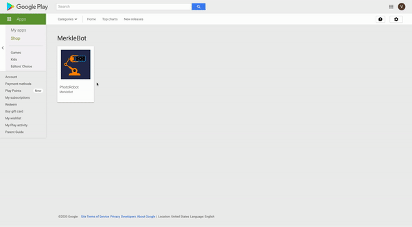

Robonomics technologies can already solve the challenges that Industry 4.0 faces and they are already applied to real-world scenarios in the industrial environment.

A large number of AI companies are building solutions to optimize the processes on the factory floor, allowing plants to produce more with less cost. However, most plants are hesitant to connect their infrastructure to the cloud directly since this results in potential cybersecurity risks, which could lead to million-dollar losses and even the loss of human life.

[MerkleBot](https://merklebot.com) has used [Robonomics Network](https://robonomics.network) to build a solution for industrial clients to connect their factory to the cloud-based AI in a secure way.

This article is written in the wake of an experiment we conducted with [Veracity Protocol](https://www.veracityprotocol.org/) that uses algorithms to create non-invasive protection of any physical item based on the photographs from a mobile device.

This use case shows the process of scanning the industrial parts using a robotic arm.

[Demo video](https://youtu.be/8AL70LFVX5w)

## Step-by-step process

### DApp as user interface

<!--  -->
<!--  -->
<robo-wiki-picture src="google-play-store.gif" />

DApp acts as a user interface for the operator. It is used to request the launch of the robot to collect the photographs and its purpose is to allow secure communication between the factory environment and cloud-based AI.

### Launching the robot

<!--  -->
<!--  -->
<robo-wiki-picture src="Veracity_Protocol_Transaction.gif" />

The operator launches the robotic scan by signing the transaction in the DApp. This step guarantees that the process on the factory floor can only start based on the transaction in the public blockchain.

The robot receives a command from the blockchain through the Robonomics Network and begins the scan. Robonomics Network technologies allow us to close the gap between the business objective and robotics operation.

### Data collection and sending to cloud-based AI

In the DApp the operator sees the confirmation and the robot begins to scan the items placed on the table, such as in this use case, or on the factory line directly if the need arises.

<!--  -->
<!--  -->
<robo-wiki-picture src="Veracity_Protocol_Launch.gif" />

When the robot collects the data, it stores it locally and makes it available to cloud-based AI through IPFS protocol. By encrypting the data and organizing the data exchange through a blockchain transaction as well, we can authorize access to cloud-based AI while making sure that the data remains secure and in place.

The security mechanism built into Robonomics based on the shared security of public blockchains allows gaining the level of security that is prohibitively expensive for most factories to organize on their own.

### Digital passport creation

When the cloud-based AI analyses the data, the log file and recommendations are recorded as a [Digital Passport](https://wiki.robonomics.network/docs/create-digital-identity-run-by-ethereum/) automatically. Every operation and scan can be traced back since the blockchain record has the hash to all these files through IPFS protocol.

## Comments about the use case

In this use case, Universal Robot UR3 industrial arm was used. But thanks to Robonomics support for ROS, most major industrial manipulators can be used and connected to cloud-based AI securely, including KUKA, Fanuc, and Yaskawa.

If you are interested to learn more about the deployment and integration of cloud-based AI instruments securely please [reach out](mailto:v@merklebot.com)
