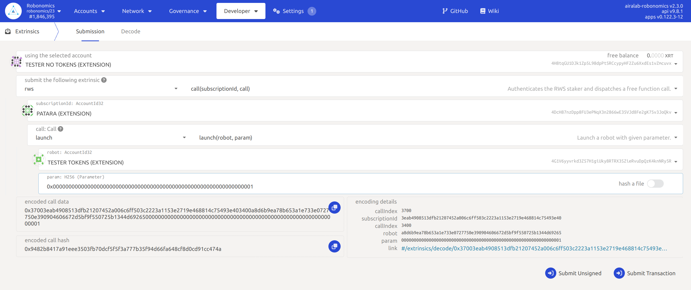
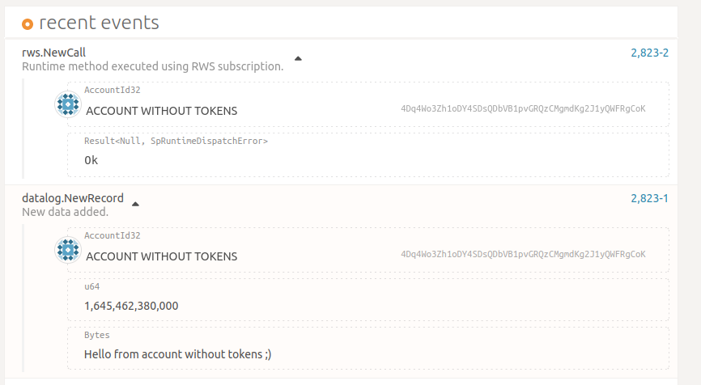

If your address has an active subscription, then any devices set up with that account's secret can send extrinsics with no fee. 
Let's try to send the `launch` command.

Go to the `Developer/Extrinsics` page, then choose your account (our acount is named `MAIN` in the picture) and select `rws -> call(subscriptionId, call)`. Then in `subscriptionId` field write the subscription's owner address (this account is named `SUBSCRIPTION OWNER` in the picture) and in the next field choose `launch -> launch(robot, param)`. In the `robot` field write the address you want to send `launch` transaction to (this account is named`LIGHTBULB (EXTENTION)` in the picture) and choose the parameter `Yes` or `No`. Then submit transaction:

Now go to the `Network/Explorer` page, and in the `Recent Events` area you will see two events that you created; `rws.NewCall` and `launch.NewLaunch`:

