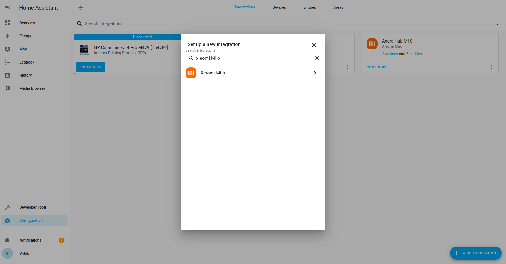
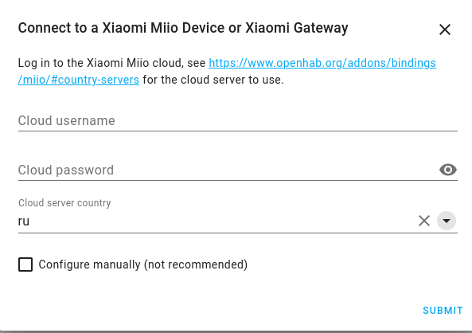
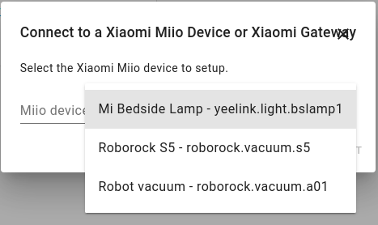

## Connect to Home Assistant

You need your vacuum to be connected to Mi Home app. If you haven't done this yet press `+` button on the top right corner, find your vacuum (it must be in connecting mode via a long press of the power button) and follow instructions in the app. For more details look at the user manual of your vacuum.

Open Home Assistant web page with this address:
```
http://<raspberry_address>:8123
```

Go to `Integrations` tab, press `Add integration` and choose `Xiaomi Miio`:



Then fill your username (or phone) and password from Mi Home account and choose your country server:



Press `Submit` and choose your Vacuum (Robot vacuum in this example):



After that you can connect your device to Robonomics with this [instruction](/docs/add-smart-device-to-robonomics).
