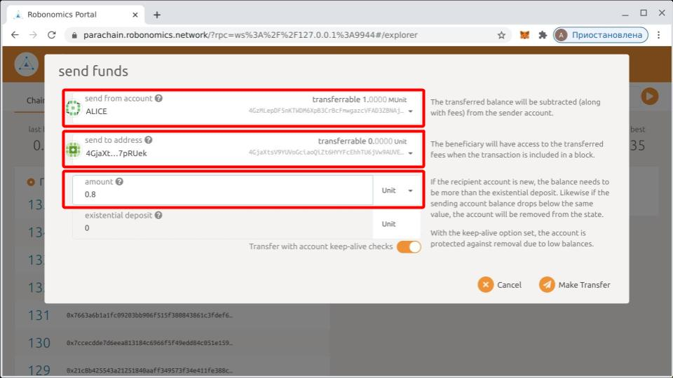
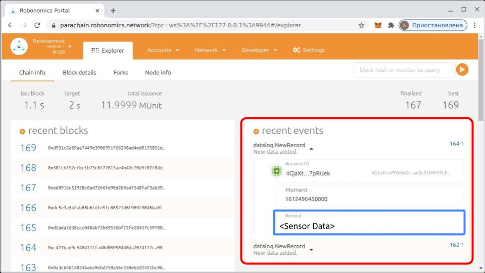
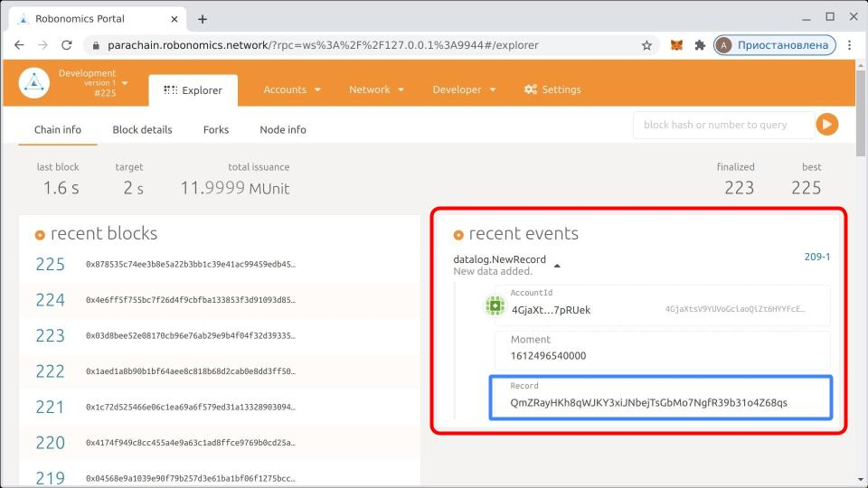

In this lesson we will show you how to use Robonomics to connect to an I/O device. 

Since you might not necessarily have the real sensor, we have provided the procedure for using both the real and virtual sensors.

<!-- In the first section, we assume that you do not have the actual hardware, thus we would initially provide you with a simulated sensor that gives you info about the air quality.

In the second section, we would follow the same procedure as in section one but with the real sensor. Therefore, if you want to get the best experience, prepare the sensor mentioned in the requirement and jump to section 2. -->

## Requirements

* Docker, please install it from [here](https://docs.docker.com/engine/install/)
* [Nova SDS011](https://aqicn.org/sensor/sds011) sensor (optional).

## Robonomics Docker Installation

After installing the docker container, pull the Robonomics docker using the command below:

```
sudo docker pull robonomics/robonomics
```

## Running Docker Container

* <font color="orange">For using the virtual sensor:</font>
```
sudo docker run -ti --rm --network host  robonomics/robonomics:winter-school bash
```

* <font color="orange">For using the real sensor:</font>

If you have the connected SDS011 sensor, first check that it is available in `/dev` folder and has correct access rights by running the commands below:

```
ls -l /dev/ttyUSB0   ## Shows if the sensor is available in the /dev folder 
sudo chmod 666 /dev/ttyUSB0  ## Gives correct access rights to the sensor
```

After making sure that the sensor is connected and has the correct access rights, run the docker by using the command below:

```
sudo docker run -ti --rm --network host --device /dev/ttyUSB0 robonomics/robonomics:winter-school bash
```

## Testing Connection To Sensor

* <font color="orange">For the virtual sensor:</font>

After running the docker, you should now launch `vsds011.sh` script to access the virtual/simulated sensor which gives you air quality updates. In order to do that, run the following command in the docker:

```
vsds011.sh

{"timestamp":"1612837969","pm25":1.8,"pm10":5.7}    ## Sample output
```

* <font color="orange">For the real sensor:</font>

Run the following command in the docker:

```
robonomics io read sds011

{"timestamp":"1612495226","pm25":0.6,"pm10":1.3}    ## Sample output
```

<!-- After installing the docker, pull Robonomics docker image and run it using the commands below. Use `winter-school` tag during this lesson. -->


## Running IPFS

We use IPFS to write data to block chain. Thus in order to use Robonomics `read` and `write` subsystems and transfer data back and forth to blockchain, we need to run IPFS daemon.

In order to run IPFS daemon in the docker container, stop the scripts you ran in the previous section and run the following commands in the docker: 

```
ipfs init
ipfs daemon
```
You should see a key-pair generated and IPFS daemon would be started.

## Accessing Running Instance of Docker
Now that the daemon is launched, you need to connect to the docker in a separate terminal. In order to access the docker in a separate terminal, you first need to get the ID of the docker. Run the following the command in a new terminal window to get the ID of the running docker:

```
sudo docker ps
```
Copy the ID of the docker from the output of the previous command and  run the following command. Replace the `<DOCKER-CONTAINER-ID>` with your ID.

```
sudo docker exec -ti <DOCKER-CONTAINER-ID> bash
```
You should now be connected to the docker in a separate terminal window.

## Writing Data To IPFS Using Robonomics I/O

The Robonomics IO subsystem has two kinds of commands:

* `read` - Get data from device that supports read access.
* `write` - Write data into device that supports write access.

In the new window for the docker, run the following command in order to write the output of the sensor into IPFS and subsequently to the blockchain.

* <font color="orange">For the virtual sensor:</font>

```
vsds011.sh | robonomics io write ipfs
```

* <font color="orange">For the real sensor:</font>

```
robonomics io read sds011 | robonomics io write ipfs
```

## Robonomics Datalog

> The target of Robonomics [Datalog](https://crates.robonomics.network/robonomics_protocol/datalog/index.html) is data blockchainization. This pallet provides function to store custom data on blockchain to make it immutable, in other words, impossible to change in future.

For this section, we would need a running instance of the Robnomics binary. Development mode is preferred because of quick block time and already distributed balances on preset accounts. Let's launch the ***Robonomics*** binary in a separate terminal in the same docker container (Use the same procedure mentioned in ***Accessing Running Instance of Docker*** section to access the running docker in a new terminal window).

In the new docker window, launch the Robonomics binary in development mode by running the following:

```
robonomics --dev
```

The private seed is also required as an argument for `datalog` device. This seed is used to sign transactions and presents the account as a sender. To get the private seed, you can use `robonomics key` command.

Connect to the docker in a separate terminal window and run the following command:

```
robonomics key generate
```
Sample output:

```
Secret phrase `rebel federal super deer dinosaur sick pledge hint truth wool input enjoy` is account:
  Secret seed:      0xf5a371d1b1ae8279c4c950cb39a4070b0a17c7cee016e59506d177e433db842c
  Public key (hex): 0x088ccc48a72db4f056e24a67fc8b7676403593010aa5b2c06ebeff4a1151e930
  Account ID:       0x088ccc48a72db4f056e24a67fc8b7676403593010aa5b2c06ebeff4a1151e930
  SS58 Address:     5CFv4nCHq53hT963smDJsYqiujdT5HGaTjCztuqhprbXcTxK
```
 **Note:** Save the generated address and seed for later use.

Initially, balance of the account at the generated address is zero, thus the network does not allow sending transactions from this address. To fix this, you need to transfer some tokens from an account like `Alice` to the account at the generated address. Use [Robonomics Parachain portal](https://polkadot.js.org/apps/?rpc=wss%3A%2F%2Fkusama.rpc.robonomics.network%2F#/) for making the transfer.



After token addition is done, `datalog` device could be used for saving any data on blockchain. The argument `-s` is used to set secret seed of account. Remember, the account should have non-zero balance to send transactions.

**Note:** In case you have problems adding funds, make sure the development setting is set according to [this](https://wiki.robonomics.network/docs/en/troubleshooting/#couldnt-send-tokens-between-accounts). A step by step guide for adding funds to an account can be found [here](https://wiki.robonomics.network/docs/en/adding-funds-to-account-in-dapp/).

If you everything is set correctly,  you should see `datalog` event on `Explorer` page of Robonomics portal.




## Read Data From Sensor and Save In Blockchain

As the final step of this lesson, let's write a command that collects data from the sensor, packs it into IPFS and then sends `datalog` transaction to be saved as a hash on blockchain.

The pipeline would be like the following:
```
Sensor -> IPFS -> Blockchain
```
In order to achieve this, run the following command in the docker.

* <font color="orange">For the virtual sensor:</font>
```
vsds011.sh | robonomics io write ipfs | robonomics io write datalog -s <private_key>
```

* <font color="orange">For the real sensor:</font>

```
robonomics io read sds011 | robonomics io write ipfs | robonomics io write datalog -s <private_key>
```
**Note:** For these commands to work, the IPFS and Robonomics binary should be running in the docker as well.

If everything goes well, the `datalog` event with IPFS hash should be presented in the ***recent events*** section. 



