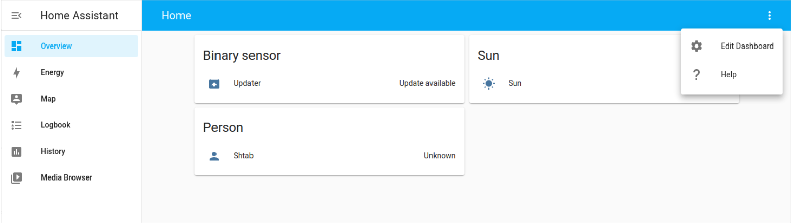
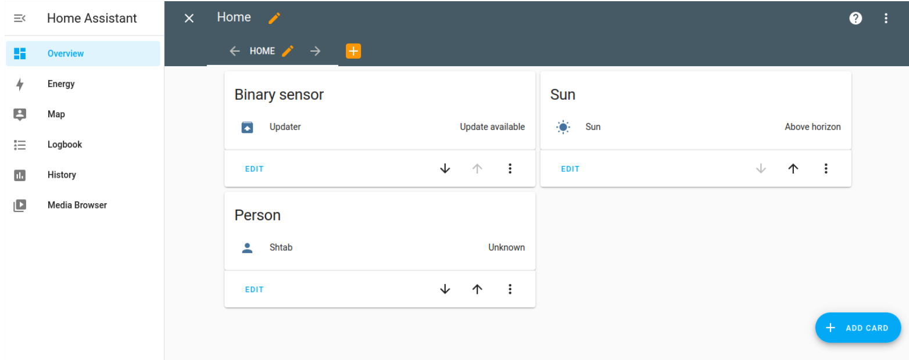
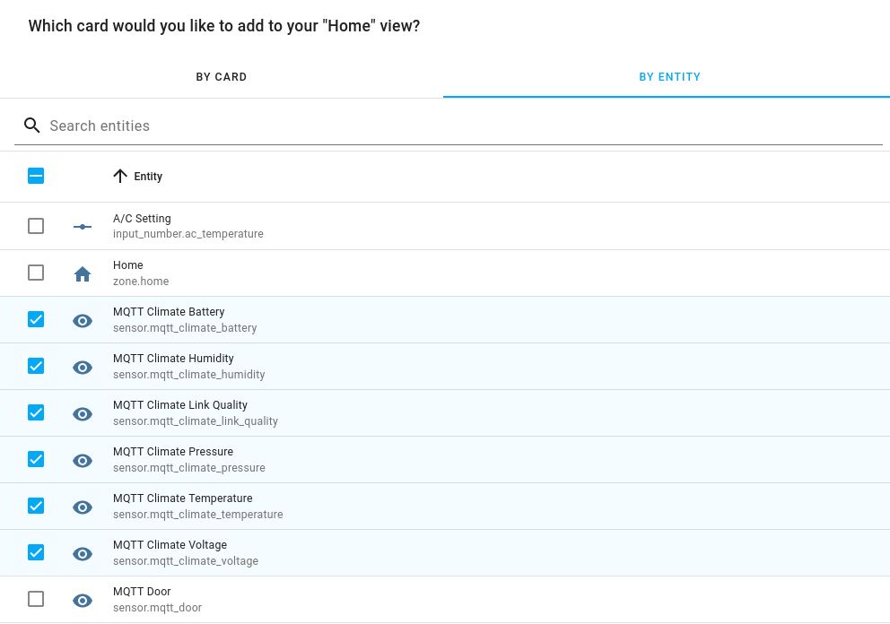
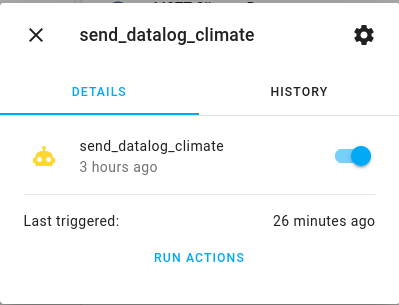
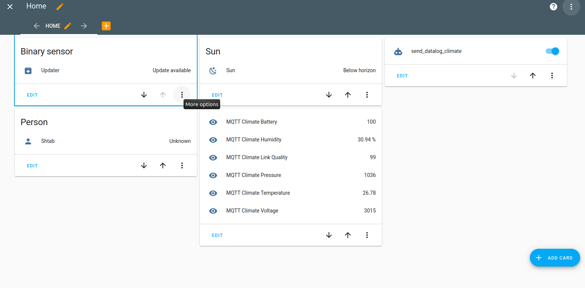

## Mosquitto MQTT broker

For this method, you neet to install MQTT broker to the Raspberry Pi:

```bash
sudo apt update
sudo apt install mosquitto mosquitto-clients
```
The Mosquitto program will run automatically after installation.

## Zigbee2MQTT setup

If you have the JetHome USB JetStick Z2 it will already have the necessary firmware so you don't need to flash it. However, if you have another adapter the first thing you need to flash it with zigbee2MQTT software. You can find instructions for your device [here](https://www.zigbee2mqtt.io/information/supported_adapters.html).

Then we need to install the ziqbee2mqtt software on the  Raspberry PI. Connect the adapter and verify the adapter address (it also may be `/dev/ttyUSB1`):
```bash
$ ls -l /dev/ttyUSB0
crw-rw---- 1 root dialout 166, 0 May 16 19:15 /dev/ttyUSB0 
```
Install zigbee2MQTT:
```bash
# Setup Node.js repository
sudo curl -sL https://deb.nodesource.com/setup_14.x | sudo -E bash -

# NOTE 1: If you see the message below please follow: https://gist.github.com/Koenkk/11fe6d4845f5275a2a8791d04ea223cb.
# ## You appear to be running on ARMv6 hardware. Unfortunately this is not currently supported by the NodeSource Linux distributions. Please use the 'linux-armv6l' binary tarballs available directly from nodejs.org for Node.js 4 and later.
# IMPORTANT: In this case instead of the apt-get install mentioned below; do: sudo apt-get install -y git make g++ gcc

# NOTE 2: On x86, Node.js 10 may not work. It's recommended to install an unofficial Node.js 14 build which can be found here: https://unofficial-builds.nodejs.org/download/release/ (e.g. v14.16.0)

# Install Node.js;
sudo apt-get install -y nodejs git make g++ gcc

# Verify that the correct nodejs and npm (automatically installed with nodejs)
# version has been installed
node --version  # Should output v10.X, v12.X, v14.X or v15.X
npm --version  # Should output 6.X or 7.X

# Clone Zigbee2MQTT repository
sudo git clone https://github.com/Koenkk/zigbee2mqtt.git /opt/zigbee2mqtt
sudo chown -R ubuntu:ubuntu /opt/zigbee2mqtt

# Install dependencies (as user "ubuntu")
cd /opt/zigbee2mqtt
npm ci
```
Then you need to configure it. Open configuration file:
```bash
nano /opt/zigbee2mqtt/data/configuration.yaml
```
And paste this:
```
permit_join: true
mqtt:
  # MQTT base topic for Zigbee2MQTT MQTT messages
  base_topic: zigbee2mqtt
  # MQTT server URL
  server: 'mqtt://localhost'
```
Now you can run zigbee2mqtt:
```bash
cd /opt/zigbee2mqtt
npm start
```
## Pairing device

Then you need to pair your sensor. For that just long press the power button until it starts to blink (zigbee2MQTT must be launched). After sensor connects you will see the message like:
```
Zigbee2MQTT:info  2019-11-09T12:19:56: Successfully interviewed '0x00158d0001dc126a', device has successfully been paired
```
> Remember this number `0x00158d0001dc126a` it will be the topic name for your sensor's data.
Then open configuration file again and set `permit_join: false`.

Then lets make a service. Create the file:
```bash
sudo nano /etc/systemd/system/zigbee2mqtt.service
```
Add the following to this file:
```
[Unit]
Description=zigbee2mqtt
After=network.target

[Service]
ExecStart=/usr/bin/npm start
WorkingDirectory=/opt/zigbee2mqtt
StandardOutput=inherit
# Or use StandardOutput=null if you don't want Zigbee2MQTT messages filling syslog, for more options see systemd.exec(5)
StandardError=inherit
Restart=always
User=pi

[Install]
WantedBy=multi-user.target
```

Verify that the configuration works:

```bash
sudo systemctl start zigbee2mqtt
```

```bash
systemctl status zigbee2mqtt.service
```

Output should look like:
```
pi@raspberry:/opt/zigbee2mqtt $ systemctl status zigbee2mqtt.service
● zigbee2mqtt.service - zigbee2mqtt
   Loaded: loaded (/etc/systemd/system/zigbee2mqtt.service; disabled; vendor preset: enabled)
   Active: active (running) since Thu 2018-06-07 20:27:22 BST; 3s ago
 Main PID: 665 (npm)
   CGroup: /system.slice/zigbee2mqtt.service
           ├─665 npm
           ├─678 sh -c node index.js
           └─679 node index.js

Jun 07 20:27:22 raspberry systemd[1]: Started zigbee2mqtt.
Jun 07 20:27:23 raspberry npm[665]: > zigbee2mqtt@1.6.0 start /opt/zigbee2mqtt
Jun 07 20:27:23 raspberry npm[665]: > node index.js
Jun 07 20:27:24 raspberry npm[665]: Zigbee2MQTT:info  2019-11-09T13:04:01: Logging to directory: '/opt/zigbee2mqtt/data/log/2019-11-09.14-04-01'
Jun 07 20:27:25 raspberry npm[665]: Zigbee2MQTT:info  2019-11-09T13:04:01: Starting Zigbee2MQTT version 1.6.0 (commit #720e393)
```

Now that everything works, we want systemctl to start Zigbee2MQTT automatically on boot, this can be done by executing:

```bash
sudo systemctl enable zigbee2mqtt.service
```

## Home Assistant Setup

Open Home Assistant configuration file:

```bash
nano ~/.homeassistant/configuration.yaml
```

And add the following to setup MQTT broker and sensor (replace `topic_name` with the topic name from previous step):

```
# MQTT broker setup
mqtt:
  broker: localhost
  port: 1883

# Sensor setup
sensor:
  - platform: mqtt
    state_topic: "zigbee2mqtt/<topic_name>"
    name: "MQTT Climate Humidity"
    unit_of_measurement: '%'
    value_template: "{{ value_json.humidity }}"
  - platform: mqtt
    state_topic: "zigbee2mqtt/<topic_name>"
    name: "MQTT Climate Temperature"
    unit_of_measurement: ''
    value_template: "{{ value_json.temperature }}"
  - platform: mqtt
    state_topic: "zigbee2mqtt/<topic_name>"
    name: "MQTT Climate Pressure"
    unit_of_measurement: ''
    value_template: "{{ value_json.pressure }}"
  - platform: mqtt
    state_topic: "zigbee2mqtt/<topic_name>"
    name: "MQTT Climate Battery"
    unit_of_measurement: ''
    value_template: "{{ value_json.battery }}"
  - platform: mqtt
    state_topic: "zigbee2mqtt/<topic_name>"
    name: "MQTT Climate Link Quality"
    unit_of_measurement: ''
    value_template: "{{ value_json.linkquality }}"
  - platform: mqtt
    state_topic: "zigbee2mqtt/<topic_name>"
    name: "MQTT Climate Voltage"
    unit_of_measurement: ''
    value_template: "{{ value_json.voltage }}"
```

Then restart Home Assistant with new configuration:

```bash
systemctl restart home-assistant@homeassistant.service
```

To see the sensor data in Home Assistant you need to add it. For that open the browser on your computer and go to:
```
http://<raspberry_address>:8123
```
Press on three dots on the right side and choose `Edit Dashboard`



Then press `Add Card`



Go to `By Entity` and tick all sensors that you need



Press continue and you will be able to see sensor data at the homepage (you may see `unknown` before sensor send new data)

In a similar way you can add card for Robonomics Service. With this you can start or stop the servise or send current measurements with `run action` button.



You homepage will look like this


