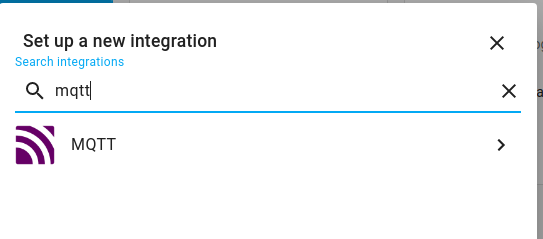
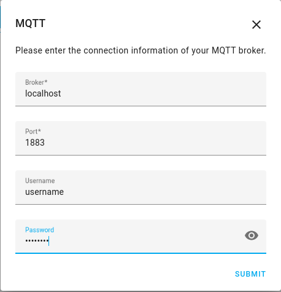
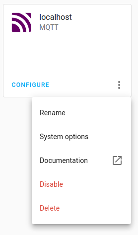
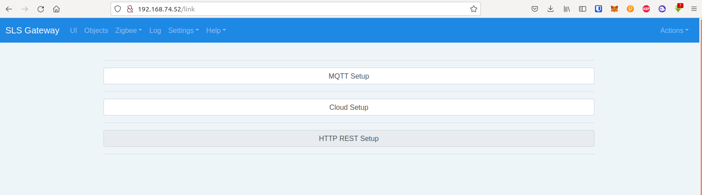
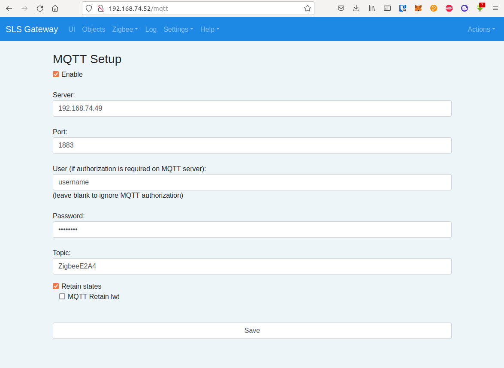

## MQTT Brocker

First, you need to run MQTT brocker on your raspberry with Home Assistant. Connect to it under `ubuntu` login. Then install [Mosquitto Brocker](https://mosquitto.org/):

```bash
sudo apt update -y && sudo apt install mosquitto mosquitto-clients -y
```
Configure username (you can use any username you want) and password (you will be asked to enter the password after the command):
```bash
sudo mosquitto_passwd -c /etc/mosquitto/passwd <username>
```
Then edit configuration file:
```bash
sudo nano /etc/mosquitto/mosquitto.conf
```
Add the following at the end of the file:
```
listener 1883
allow_anonymous false
password_file /etc/mosquitto/passwd
```

Then restart the service:

```bash
sudo systemctl restart mosquitto
```

And check the brocker status:
```bash
systemctl status mosquitto
```


## MQTT Integration

Then you need to add MQTT integration to Home Assistant. Open web interface then go to `Configuration/Integrations` page and press `Add Integration` button. Find MQTT:



Press on it and set up your brocker with address (localhost), port (1883) and your username and password, then press `submit`:



Then press on three dots on MQTT integration and choose `System Options`:



And check if automatically adding new devices is enabled:


## MQTT on SLS Gateway

Also you need to configure MQTT on SLS Gateway. On your SLS Gateway go to `Settings/Link` -> `MQTT Setup`:



And add your brocker address (address of the raspberry with Home Assistant in local network) and port (1883). Also write the topic name (you can choose any). 
> Don't forget to tick `Enable` and `Retain states`.



Save changes. Now devices will be automatically shown in Home Assistant.

After that you can connect your devices to Robonomics with this [instruction](/docs/add-smart-device-to-robonomics).