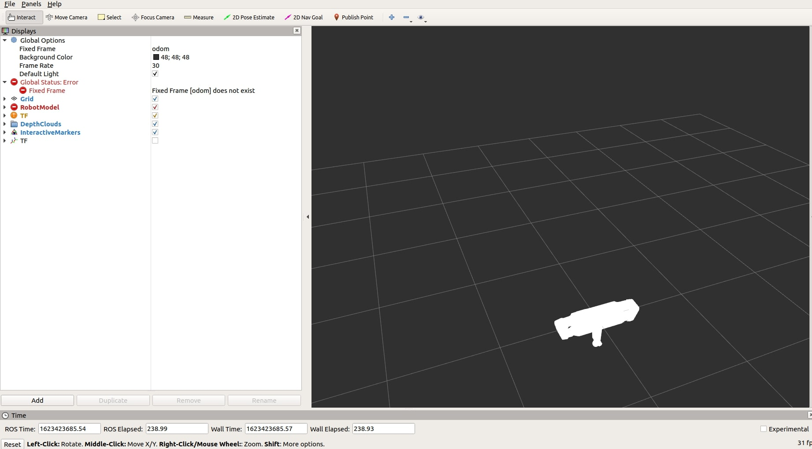
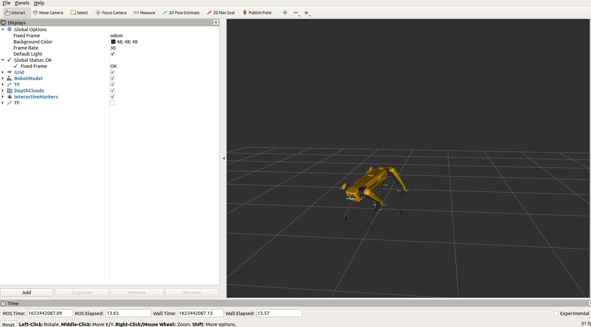

With this tutorial you will be able to see in simulation what real Spot did.

## Requirements

* ROS melodic desktop (installation instructions [here](http://wiki.ros.org/melodic/Installation/Ubuntu))

## Install package

Create workspace and clone packages:
```bash
mkdir -p ~/catkin_ws/src
cd ~/catkin_ws/src
git clone https://github.com/clearpathrobotics/spot_ros.git
git clone https://github.com/ros/geometry2 --branch 0.6.5
```
Open the `view_model.launch` file:
```bash
nano ~/catkin_ws/src/spot_ros/spot_viz/launch/view_model.launch
```

And set `use_sim_time` parameter to `true`, file must look like this:
```xml
<launch>
  <param name="/use_sim_time" value="true"/>
  <include file="$(find spot_description)/launch/description.launch"/>

  <node name="joint_state_publisher_gui" pkg="joint_state_publisher_gui" type="joint_state_publisher_gui" />

  <node name="rviz" pkg="rviz" type="rviz" args="-d $(find spot_viz)/rviz/model.rviz" />
</launch>
```

Then install dependencies:
```bash
cd ~/catkin_ws/
rosdep install --from-paths src --ignore-src -y
catkin_make
```

## Run

Get example rosbag file:
```bash
wget -O spot_rosbag.bag https://gateway.ipfs.io/ipfs/QmTDrfMy7Zs7uDLN3KPBC1UYqXNMXBKEwX7ggVmJKAm7Ef
```

Run rviz with the Spot model:
```bash
source ~/catkin_ws/devel/setup.bash
roslaunch spot_viz view_model.launch
``` 
Then in a new terminal:
```bash
source ~/catkin_ws/devel/setup.bash
roslaunch spot_viz view_robot.launch
``` 



Play rosbag file and you will see the robot move:
```bash
rosbag play spot_rosbag.bag
```
