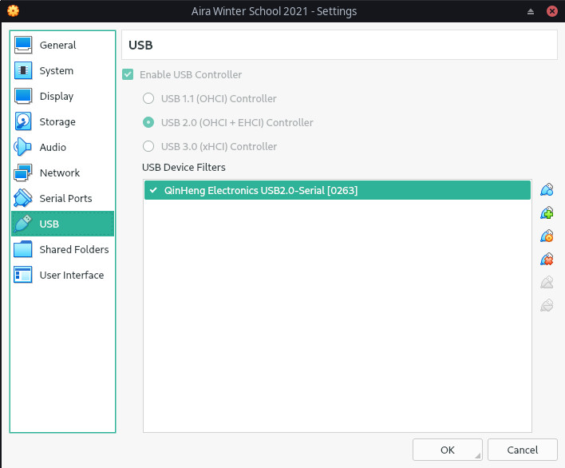

## IoT como un pie multiple

* Software del dispositivo
    * FreeRTOS
    * ESP/Arduino
    * Computadoras de placa única (RPi, LattePanda, etc.)
* Conectividad
    * IoT Hub
    * IoT Manager
* Servicios analíticos
    * AWS
    * Google Cloud IoT Core
    * ThingsBoard

Como regla general, la mayoría no está interesada en sensores y servidores, sino en análisis de datos. Para obtenerlo, debe decidir qué dispositivo usar, cómo trabajar con él y dónde conectarse.

## Software del Dispositivo

Considere el ejemplo de una estación meteorológica doméstica. Es necesario recopilar datos sobre contaminación atmosférica (SDS011), temperatura y humedad (BME). El microcontrolador ESP8266 puede manejar esta tarea.

Requisitos:

* Leer correctamente los datos de los sensores
* Tener un identificador único
* Transferir datos a un servidor conocido
* Proporcionar firma digital de datos (opcional)

Puede encontrar el firmware actual [aquí](https://github.com/LoSk-p/sensors-software/tree/366b19bf447a5fc19220ef89eab0f2440f8db1c2).

## Que es Conectividad?

En el mundo de IoT, la conectividad se refiere a la conexión de varios dispositivos de IoT a Internet para enviar datos y/o controlar el dispositivo.

Las soluciones arquitectónicas conocidas se pueden dividir aproximadamente en 3 grupos:

* Totalmente descentralizado. Por ejemplo, los dispositivos están conectados por una red de malla. No apto para redes de área extensa debido a los altos requisitos de hardware.
* Centralizado. Por ejemplo, AWS. Proporciona un único punto de entrada y facilidad de conexión, pero existe un alto riesgo de falla en caso de problemas con el servidor.
* Híbrido. Por ejemplo, [Robonomics Connectivity](https://github.com/airalab/sensors-connectivity). Proporciona una dirección para dispositivos en una red “local” y publica datos en un canal de mensajes IPFS distribuido.

## Comparison of AWS and Robonomics Connectivity

| Management services 	| AWS                               	|               Robonomics              	|
|---------------------	|-----------------------------------	|---------------------------------------	|
| Transaction type    	| Technical                         	| Technical and economic                	|
| Security            	| IT-company cloud control          	| Polkadot and Ethereum                 	|
| Protocol            	| HTTPS, MQTT                       	| IPFS, Robonomics                      	|
| Ecosystem           	| Private                           	| Shared                                	|
| Access to DeFi      	| No                                	| Yes                                   	|
| Costs               	| Pushing data - $1-2 a sensor      	| Pushing data - $0                     	|
|                     	| Shadow         - from $10 a month 	| Digital Twin    - $0,01 a transaction 	|

## Instalación de Conectividad en AIRA

https://www.youtube.com/watch?v=JbBNMHAzJKM

### Requerimientos

* [VirtualBox 6.1 o superior](https://www.virtualbox.org/wiki/Downloads) and above
* [Aira OS ova image](https://static.aira.life/ova/airaos-21.03_robonomics-winter-school.ova)

Importe la Aira Image en VirtualBox como se describe [aquí](/docs/aira-installation-on-vb/)

Configurar una conexión a través de [SSH](/docs/aira-connecting-via-ssh/)

Cuando todo esté configurado e inicie sesión con éxito a través de SSH, clonemos el paquete principal y compilemos.

```
git clone https://github.com/airalab/sensors-connectivity
cd sensors-connectivity
git checkout v0.9
nix build -f release.nix
```

Ahora creemos una copia del archivo de configuración predeterminado para su uso posterior. Para conocer todas las opciones, consulte [este artículo]((/docs/configuration-options-description/). Luego lanza el paquete con `roslaunch`.

```
cp config/default.json config/my.json
source result/setup.zsh
roslaunch sensors_connectivity agent.launch config:=$PWD/config/my.json
```

## Conectar el Sensor a la Conectividad

https://www.youtube.com/watch?v=yxqxBk-6bpI

### Requerimientos

* [Nova SDS011](https://aqicn.org/sensor/sds011) sensor 
* [Yarn Packet Manager](https://yarnpkg.com/getting-started/install)

Ahora conectemos un sensor real, enviemos el puerto USB a la máquina virtual, configuremos un mapa y miremos nuestras propias medidas.

Primero, detenga el AIRA OS si se estaba ejecutando y agregue un dispositivo USB correspondiente.



Inicie la VM, conéctese a través de SSH y configure la opción de `comstation/port` de acuerdo con su dispositivo USB en la VM. También habilite la `comstation` y configure su latitud y longitud. Al final, `config/my.json` debería verse así:

```
{
   "general":{
      "publish_interval":30
   },
   "comstation":{
      "enable":true,
      "port":"/dev/ttyUSB0",
      "work_period":0,
      "geo":"59.944917,30.294558",
      "public_key":""
   },
   "httpstation":{
      "enable":false,
      "port":8001
   },
   "mqttstation": {
      "enable": false,
      "host": "connectivity.robonomics.network",
      "port": 1883
   },
   "luftdaten":{
      "enable":false
   },
   "robonomics":{
      "enable":true,
      "ipfs_provider":"/ip4/127.0.0.1/tcp/5001/http",
      "ipfs_topic":"airalab.lighthouse.5.robonomics.eth"
   },
   "datalog":{
      "enable":false,
      "path":"",
      "suri":"",
      "remote":"wss://substrate.ipci.io",
      "dump_interval":3600,
      "temporal_username":"",
      "temporal_password":""
   },
   "dev":{
      "sentry":""
   }
}
```

> Si no tiene un sensor real, puede usar el script de `sensors-connectivity/utils/virtual-sensor.py` para emular uno.
> 
> Habilite `HTTPStation` y deshabilite `COMStation` cambiando el archivo de configuración como:
> ```
> {
>    "general":{
>       "publish_interval":30
>    },
>    "comstation":{
>       "enable":false,
>       "port":"/dev/ttyUSB0",
>       "work_period":0,
>       "geo":"59.944917,30.294558",
>       "public_key":""
>    },
>    "httpstation":{
>       "enable":true,
>       "port":8001
>    },
>    ...
> }
> ```
>
> y el lanzamiento de `utils/virtual-sensor.py` en una terminal dedicada en la VM.  

Guarde el archivo e inicie la conectividad desde la carpeta de `sensors-connectivity`:

```
source result/setup.zsh
roslaunch sensors_connectivity agent.launch config:=$PWD/config/my.json
```

Debería ver las primeras medidas en la salida de la consola

Busque su ID de IPFS en la VM. Aparece justo después de iniciar la imagen o mediante el comando `ipfs id`. Lo necesitaremos más tarde.

Ahora configuremos nuestra propia instancia del mapa. En su computadora portátil (no en la VM), clone [este](https://github.com/airalab/sensors.robonomics.network) repositorio y compile la aplicación:

```
git clone https://github.com/airalab/sensors.robonomics.network
cd sensors.robonomics.network
yarn install
```

Edite el archivo `src/agents.json` y ponga su ID de IPFS. Por ejemplo:

```
[
  "12D3KooWSCFAD3Lpew1HijniE6oFTuo4jsMwHzF87wNnXkpCRYWn"
]
```

Lanzar el mapa:

```
yarn serve
```

Vaya a [http://localhost:8080/](http://localhost:8080/) o la dirección que le dio el hilo y busque el sensor.

## Práctica

### Trayectoria 1. Flashear un sensor ESP + SD011

Requerimientos:

* ESP8266
* Al menos uno de los sensores SDS011, BME280, HTU21D

Use la [instrucción](https://wiki.robonomics.network/docs/connect-sensor-to-robonomics/) para conectar un sensor a la Robonomics Connectivity.

Fíjese que su sensor aparezca en nuestro [mapa](https://sensors.robonomics.network/#/).

### Trayectoria 2. Lanzamiento de Conectividad

Requerimientos:

* ROS
* Python
* Nix (Opcional)

Construcción y lanzamiento [sensores-conectividad](https://github.com/airalab/sensors-connectivity#get-a-package-and-build)

> Como construir, instalar [aqui](https://wiki.robonomics.network/docs/iot-sensors-connectivity/) y configurar [aqui](https://wiki.robonomics.network/docs/configuration-options-description/)

Esquema General del paquete:

```
    station1 \                        / feeder1
    station2 -  sensors-connectivity  - feeder2
    station3 /                        \ feeder3
```

Se propone la opción de implementar una nueva estación, por ejemplo, un generador de números aleatorios, o un nuevo alimentador, por ejemplo, mostrando una cadena en la pantalla.

Interfase `IStation` [aqui](https://github.com/airalab/sensors-connectivity/blob/master/src/stations/istation.py#L73).

Interfase `IFeeder` [aqui](https://github.com/airalab/sensors-connectivity/blob/master/src/feeders/ifeeder.py#L5)


