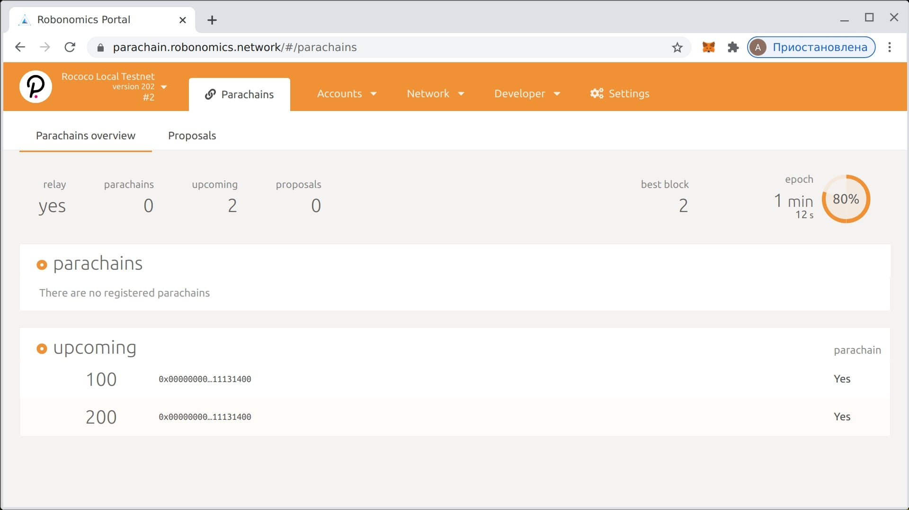
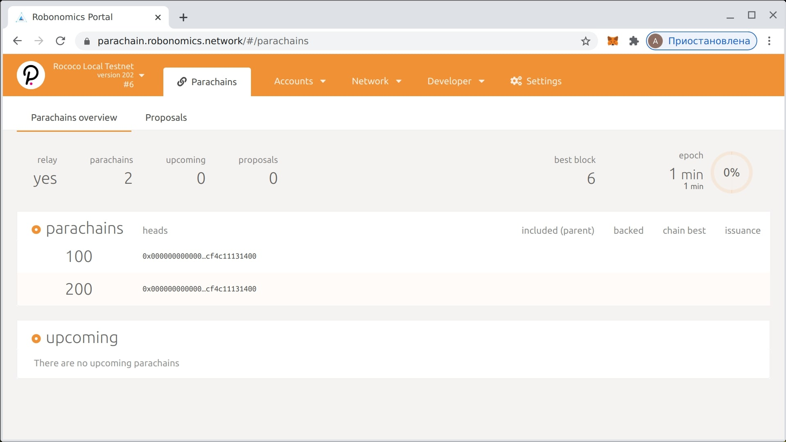
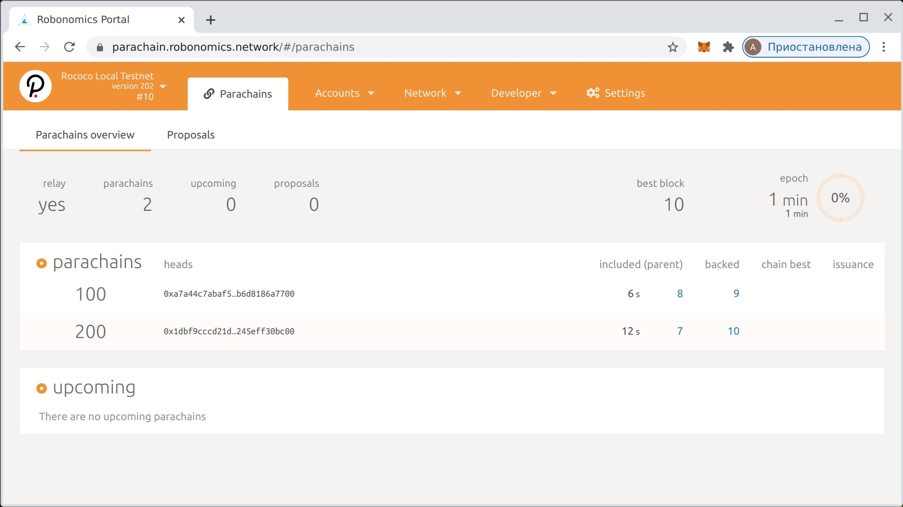
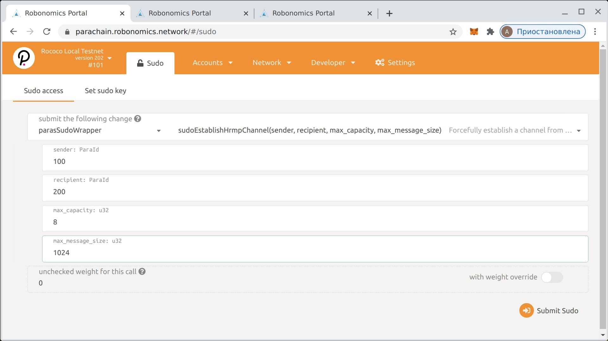
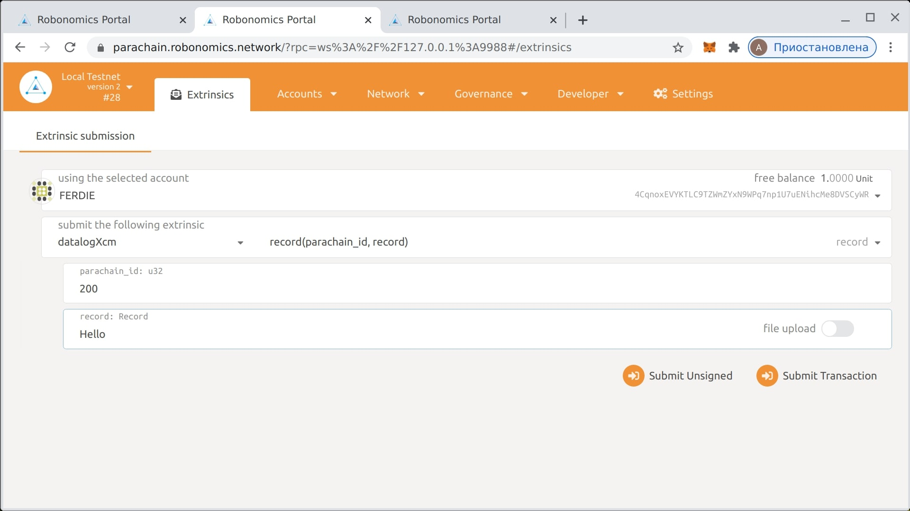
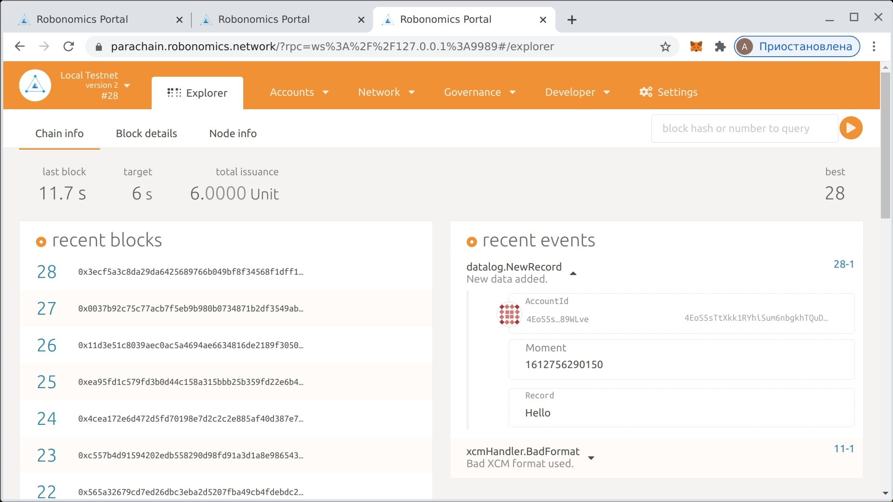

import Asciinema from '~/components/Asciinema.vue'

La Parachain de Robonomics no es una parachain de propósito general en el ecosistema de Polkadot. El objetivo de Robonomics es la construcción de la economía de las máquinas, el parachain en este ámbito de objetivos ayuda a integrar el ecosistema Polkadot con los conceptos de IoT, Smart Cities e Industria 4.0.

## Requerimientos

* Docker, por favor [instale](https://docs.docker.com/engine/install/).
* Polkadot-launch, por favor [instale](https://github.com/paritytech/polkadot-launch#install).

## Lanzar el Relay

La cadena de retransmisión es un núcleo de Polkadot, [proporciona seguridad](https://wiki.polkadot.network/docs/en/learn-security) compartida para todos los niños parachains e implementa mecanismos de transmisión de mensajes para ellos. Lancemos una instancia local de la Rococó relay chain (polkadot testnet) con dos parachains basadas en robonomics como niños. Usaré la etiqueta de imagen preparada de [Docker: “winter-school-2”](https://hub.docker.com/layers/robonomics/robonomics/winter-school-2/images/sha256-92f4795262f3ded3e6a153999d2777c4009106a7d37fd29969ebf1c3a262dc85?context=explore) pero todo el código fuente de los ejemplos está disponible en [Robonomics GitHub](https://github.com/airalab/robonomics/tree/master/scripts/polkadot-launch).

<Asciinema vid="419Jrg22ziFfMFPZlh2WtiLvg"/>

Podría llevar un tiempo, pero sea partícipe. Como resultado, debe tener tres instancias de cadena en los puertos:

* `9944` - local rococo relay chain.
* `9988` - robonomics parachain with `id=100`
* `9989` - robonomics parachain with `id=200`

Si usa un servidor remoto, necesita crear algunos túneles SSH en la VM:
```
ssh -f -N -L 9944:127.0.0.1:9944 root@REMOTE_SERVER_IP
ssh -f -N -L 9988:127.0.0.1:9988 root@REMOTE_SERVER_IP
ssh -f -N -L 9989:127.0.0.1:9989 root@REMOTE_SERVER_IP
```
Después de eso, puede usar `ws://127.0.0.1:9944`, `ws://127.0.0.1:9988`and `ws://127.0.0.1:9989` en https://parachain.robonomics.network/



Hace algún tiempo se deberían registrar las parachains.



Y empieza a producir bloques.



Como siguiente paso, creemos un canal HRMP para pasar mensajes entre parachains. Usaré la llamada del módulo `sudo` en la página de la relay chain.



Cuando se crea el canal, las llamadas XCM están disponibles. Usemos la paleta `datalogXcm`, una versión XCM de la paleta de `datalog`.



Como resultado, el mensaje en el segundo parachain llamará a la paleta de `datalog` y escribirá los datos en la cadena.



Como resultado, este ejemplo demuestra cómo se podría utilizar XCM para el uso de cadenas cruzadas de palets estándar de robonomics.
