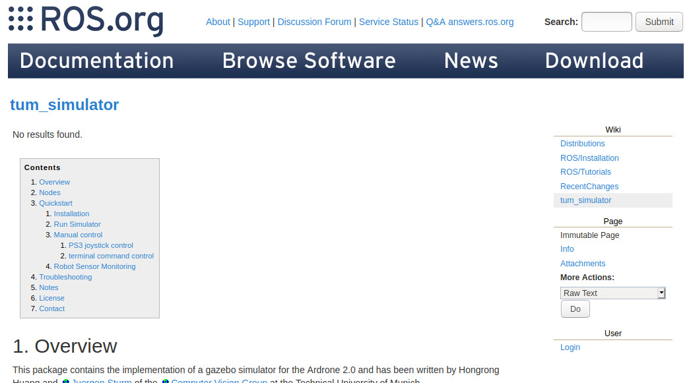
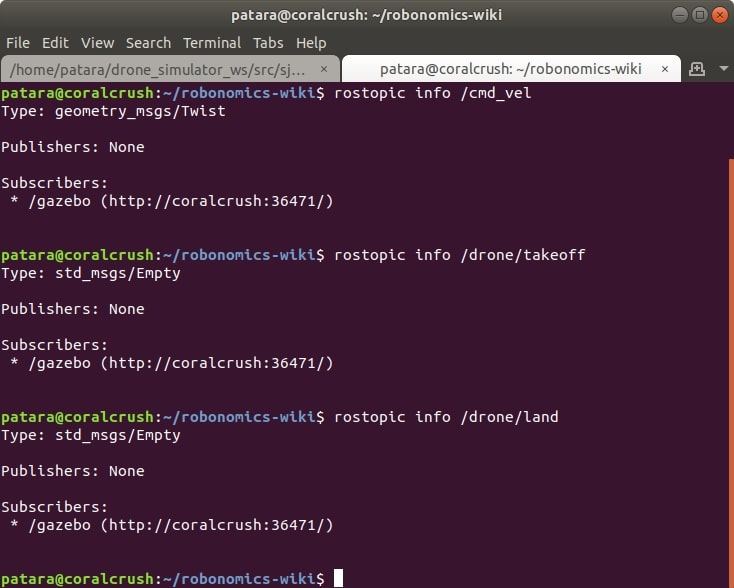
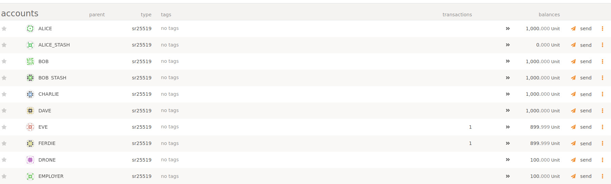
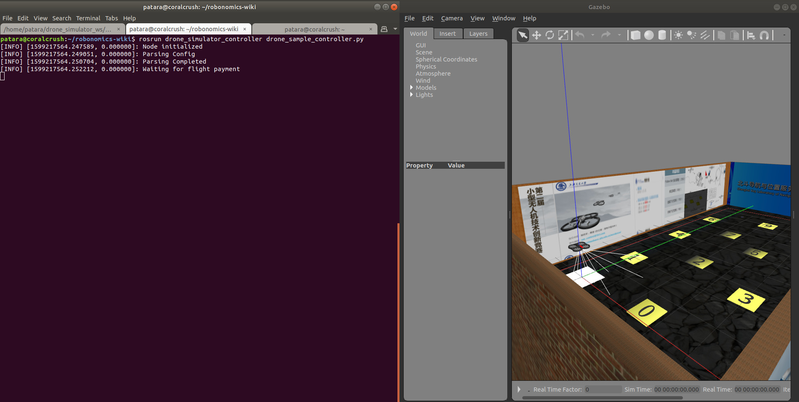
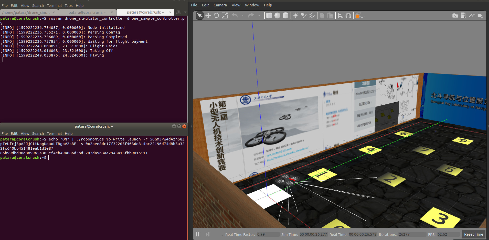

**In this article we will show that with the help of Robonomics tools you can control any ROS-compatible device. We will find a random drone simulation package on the web and adjust it to run with Robonomics.**
**Requirements:**
- Ubuntu 18.04 LTS
- ROS Melodic + Gazebo + RViz (installation manual [here](http://wiki.ros.org/melodic/Installation))
- Robonomics node (binary file) (download latest release [here](https://github.com/airalab/robonomics/releases))

The entire process of coding this part of demo is presented in a video below.

https://www.youtube.com/watch?v=fDpwhBasQ5o&feature=youtu.be

## 1. Find a simulation
Let's surf the web. Google for `ROS drone simulator`. The first link will mostly likely show you the `tum_simulator` page on [http://wiki.ros.org/tum_simulator](http://wiki.ros.org/tum_simulator)



It's pretty outdated, so we better find a fork for our system. Google for `tum_simulator Ubuntu 18 Gazebo 9 fork`. The first result is a GitHub [repo](https://github.com/tahsinkose/sjtu-drone) with an appropriate package. Dowload it
```
mkdir -p drone_simulator_ws/src
cd drone_simulator_ws/src
git clone https://github.com/tahsinkose/sjtu-drone
cd ..
catkin build
```
Don’t forget to add source command to `~/.bashrc`:
```
echo "source /home/$USER/drone_simulator_ws/devel/setup.bash" >> ~/.bashrc
source "~/.bashrc"
```
Now we can run the simulation to see what do we need to do to take the drone under parachain control.
```
roslaunch sjtu_drone simple.launch
```

## 2. Inspect ROS topics
When the simulation is runnung, in a new tab run the following command to see the list of topics used by the drone:
```
rostopic list
```
Let's take a look at `/cmd_vel`, `/drone/takeoff` and `/drone/land`:
```
rostopic info /cmd_vel
rostopic info /drone/takeoff
rostopic info /drone/land
```



As may be seen, there should be messages of `Twist` and `Empty` types, they are parts of `std_msgs` and `geometry_msgs`, we'll use this in the controller. Shut the simulation for a while.
## 3. Download controller package
Globally, the main difference from the casual ROS robot controller is a block of code, which checks all the transactions in the network using [Robonomics IO](https://wiki.robonomics.network/docs/rio-overview/). The package itself is available on GitHub. Download it and build the workspace:
```
cd ~/drone_simulator_ws/src
git clone https://github.com/PaTara43/drone_simulator_controller
cd drone_simulator_controller/src
chmod +x *.py
cd ~/drone_simulator_ws/src
catkin build
```
## 4. Manage accounts in DAPP
Since we are testing, let's create a local robonomics network node with robonomics binary file:
```
./robonomics --dev
```
**Important!** Before next launches it is necessary to remove a directory `db` with

```
rm -rf /home/$USER/.local/share/robonomics/chains/dev/db
```
After a successful launch create accounts following [this](/docs/create-account-in-dapp) manual. **Do not forget to save each account's seed and address! You will need them for transactions**. Add these addresses, seeds and path to robonomics binary file to file `config.config` in `robonomics_ws/src/robonomics_sample_controller/src`. Transfer some money (units) to these accounts:


## 5. Launching the drone under parachain control
Up to now the **only thing running** should be the robonomics local node. In a separate terminal launch drone simulation:
```
roslaunch sjtu_drone simple.launch
```
Run the script:
```
rosrun drone_simulator_controller drone_sample_controller.py
```



Now you can send a transaction triggering the drone to start flying. To do so, you should use the Robonomics IO `write` subcommand of robonomics binary file:
```
echo "ON" | ./robonomics io write launch -r <DRONE_ADDRESS> -s <EMPLOYER’S_KEY>
```
Where `<DRONE_ADDRESS>`  and `<EMPLOYER’S_KEY>` are replaced with  previously saved strings accordingly.
You should see the log `"Taking Off"` and the drone should start flying:



That's how any ROS-compatible robot can be controlled by Robonomics parachain control. Proceed to [part 2](/docs/connect-any-ros-compatible-robot-under-robonomics-parachain-control-2) to learn more
