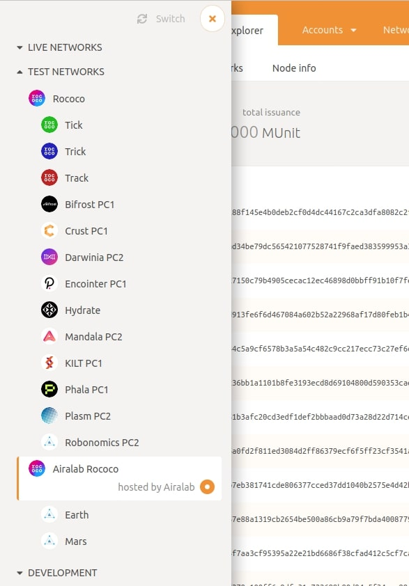
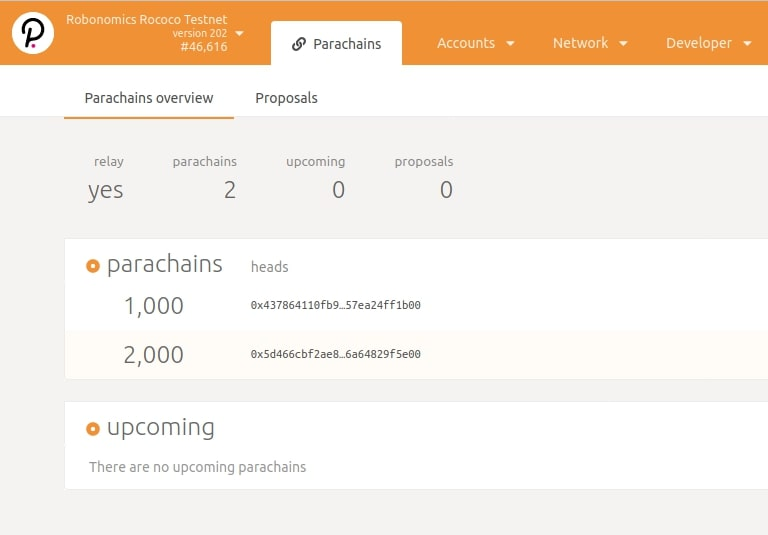
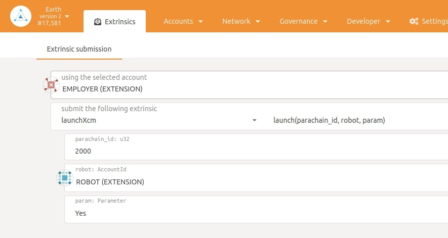
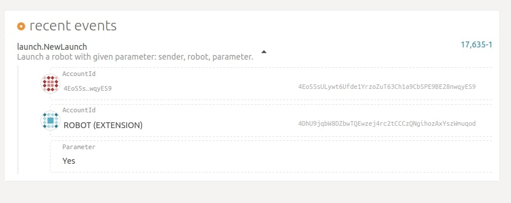
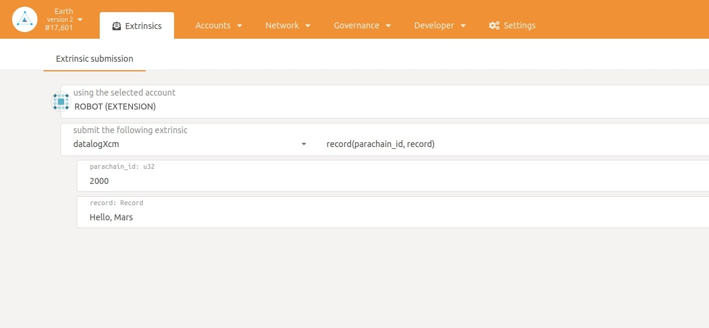
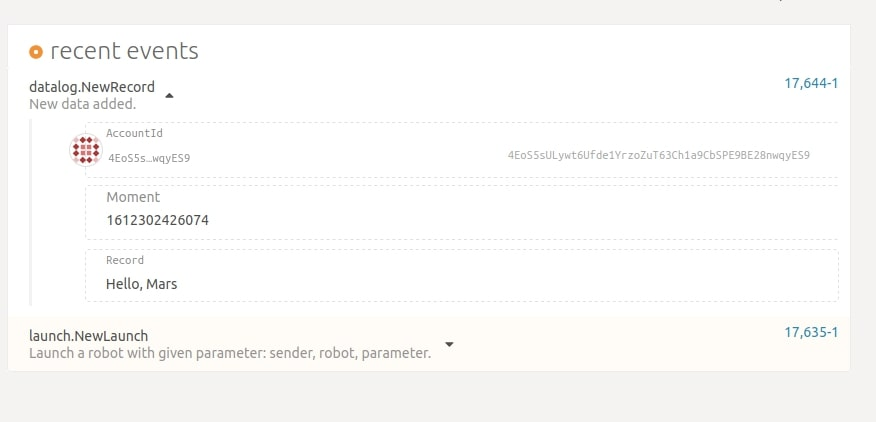

XCM (Cross-chain Message) allows sending messages between parachains. You can send launchXcm transaction to run/stop your robot or datalogXcm transaction to save data to blockchain.

https://www.youtube.com/watch?v=a6XrqoaYhK8&feature=emb_logo

## Create Account

Lets try to send message from Earth to Mars.
Go to [parachain.robonomics.network](https://parachain.robonomics.network/#/explorer) and choose `Airalab Rococo` testnet:

In `Network/Parachains` you will see two parachains with their id:

Then go to Earth parachain and [create](https://wiki.robonomics.network/docs/create-account-in-dapp/) two accounts (for example `ROBOT` and `EMPLOYER`). In a new tab go to Mars parachain.

## LaunchXcm

In Earth parachain go to `Developer/Extrinsics` and choose your `EMPLOYER` account and launchXcm. Then write Mars parachain id (2000) and choose the `ROBOT` account:

Now press `Submit Transaction`.

To see your transaction in Mars parachain go to `Network/Explorer` and look at Recent Events.

## DatalogXcm

In Earth parachain go to `Developer/Extrinsics` and choose your `ROBOT` account and datalogXcm. Write Mars parachain id (2000) and the message:

Now press `Submit Transaction`.

You can see your transaction in Recent Events in Mars parachain:

