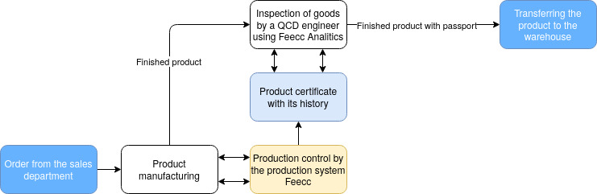

Feecc is a platform developed by [Multi-Agent Systems](http://multi-agent.io) that allows companies to create and customize their own quality control systems for products or services according to business objectives

## Main Idea
Using web3 technology and a set of flexible software modules, the Feecc platform allows you to organize the production process of any type of product, audit employee access to the workplace and retrieve all workflow data. Information is stored in an unchanged and secure distributed IPFS storage, data hashes are saved in the robonomics.network datalog with access for the quality control department via Feecc Analytics. With Feecc, a company can not only digitize its processes and get rid of paperwork and lawsuits, but also attract the attention of new customers to the product, increasing trust in it.

The platform is a set of software for controlling the production process and collecting information for subsequent analysis by the QCD or other participants. Globally, the scheme of platform integration into the business process can be represented as follows:

## Platform Opportunities

### Reliable and secure data storage
Feecc uses a secure data storage based on a content-addressable architecture and a distributed registry to ensure the reliability and validity of collected workflow data.

### A clear link between the employee and the product
Feecc monitors all phases of the workflow with video recording, data logging from peripheral devices and employee access authorization. The platform supports any sequential workflow, including long-term or interrupted operations.

### Digital product certificate
All digital traces of the workflow are summarized in a single product certificate with a unique identifier which is then attached as a QR code to the product. Feecc can add custom process parameters to the certificate and automate its creation even for composite parts.

### Extensive support for peripheral devices
Feccc supports standard digital I/O interfaces for connecting various devices (video cameras, scanners, printers, etc.).

## Video Demonstration of the Feecc Engineer Workplace
https://www.youtube.com/watch?v=WhtOJtGjAok