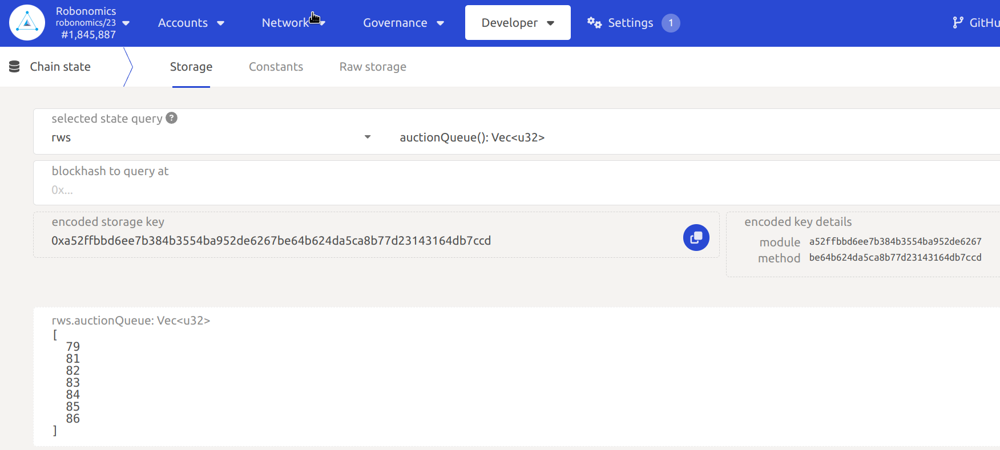
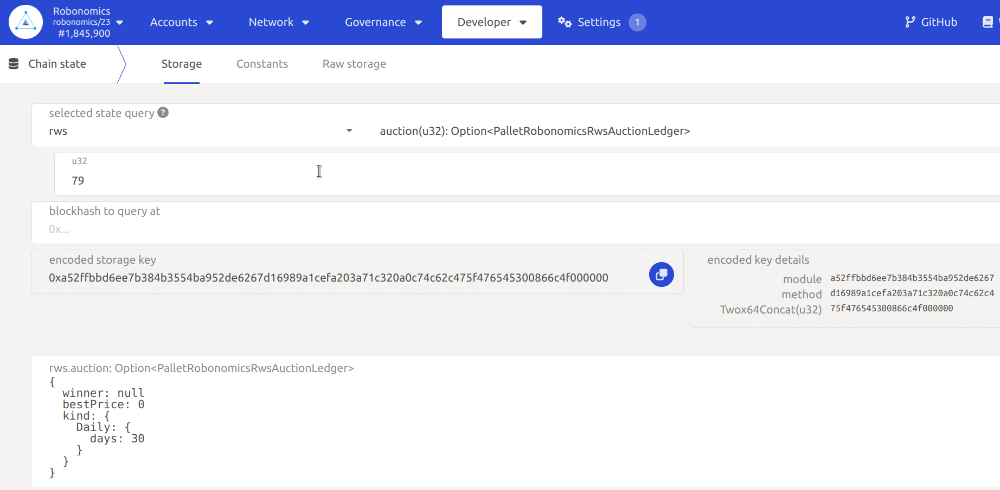
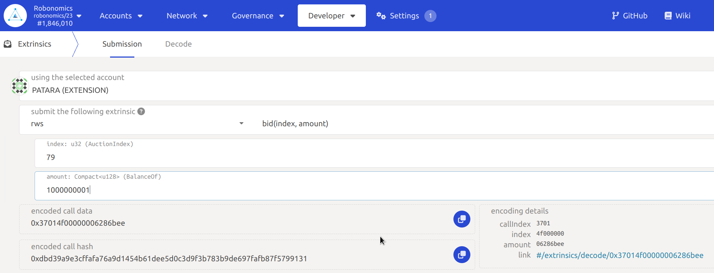
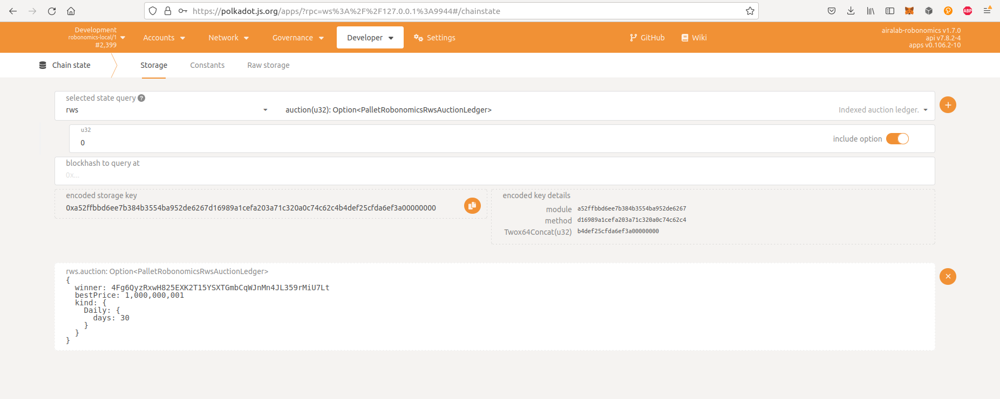
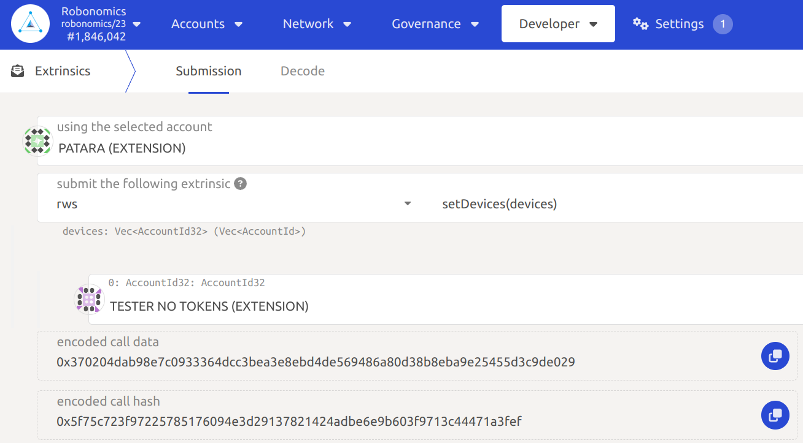
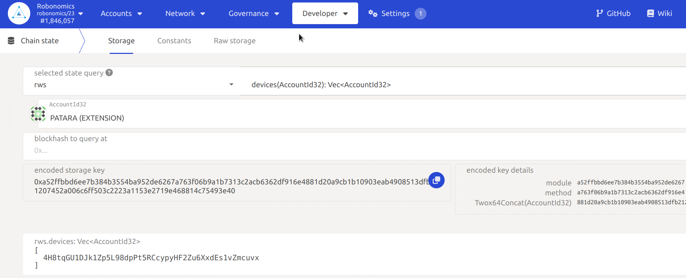

https://youtu.be/EsUiG_4ZGcw

We will use [Robonomics dev node](/docs/run-dev-node) to try the subscription, but in the production network everything works the same. 

In `Developer/Chain state` you can see auctions for subscriptions (to get a subscription you need to win a fast auction). Choose `rws` and `auctionQueue` and press `+` button, you will see IDs of available auctions:

You can see an information about any subscription with `rws` `auction` and ID of auction (the auction's ID in the picture is 0):

In the information about the auction you can see `winner` field, at the moment it is `null` so nobody has this subscription and we can get it. For that go to `Developer/Extrinsic`, choose your account and `rws -> bid`. Also set auction ID (0) and the amount of units to bid (more than 1000000000 Wn):

Submit the transaction and check the information about the auction with ID 0 (in `Chain state` choose `rws -> auction` and ID 0):

Now in `winner` field you will see your account address, it means that this account has the subscription 0. An auction starts with the first bid and lasts a few blocks, so if somebody bids more tokens than you in the next few blocks one will be the winner and one will take the subscription.

Now you can add devices. Devices are accounts that are able to use this subscription and send extrinsics with no fee. To test it lets create a new account with no tokens and add it to devices. 

To add devices choose `rws -> setDevices` in `Developer/Extrinsic`. Then press `Add Item` button and choose recently created account with no tokens:

Submit the transaction. Now you can check the list of devices in `Chain state` with `rws -> devices`. There you will see the address of your account without tokens. Choose the account that has bought the subscription and press `+`:

Now you can try to [send launch](/docs/subscription-launch) extrinsic using the subscription.