Video with an example of work can be found here:

[https://youtu.be/Fhf9LIt6zXQ](https://youtu.be/Fhf9LIt6zXQ)
***
## Requirements
* ROS melodic, Gazebo (installation instraction [here](http://wiki.ros.org/melodic/Installation/Ubuntu))
* Some extra packages
```bash
sudo apt-get install ros-melodic-gazebo-ros-control ros-melodic-effort-controllers ros-melodic-joint-state-controller
```
* IPFS 0.4.22 (download from [here](https://www.npackd.org/p/ipfs/0.4.22) and install)
```bash
tar -xvzf go-ipfs_v0.4.22_linux-386.tar.gz
cd go-ipfs/
sudo bash install.sh
ipfs init
```
* pip
```bash
sudo apt install python-pip
```
* ipfshttpclient
```bash
pip install ipfshttpclient
```
* Robonomics node (binary file) (download latest release [here](https://github.com/airalab/robonomics/releases))
* IPFS browser extension (not necessary)
***
## Installation
Install Kuka manipulator and control packages
```bash
cd catkin_ws/src/
git clone https://github.com/orsalmon/kuka_manipulator_gazebo
git clone https://github.com/LoSk-p/kuka_controller
cd ..
catkin_make
echo "source /home/$USER/catkin_ws/devel/setup.bash" >> ~/.bashrc
```
***
## Running gazebo model
```bash
roslaunch manipulator_gazebo manipulator_empty_world.launch
```
In a new window
```bash
rosrun manipulator_gazebo move_arm_server
```
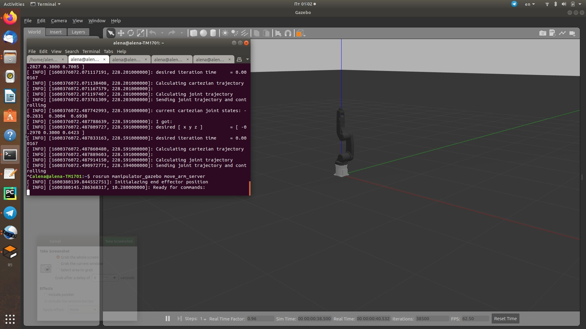
***
## Running robonomics
Go to the folder with robonomics file ad create a local robonomics network:
```bash
./robonomics --dev --rpc-cors all
```

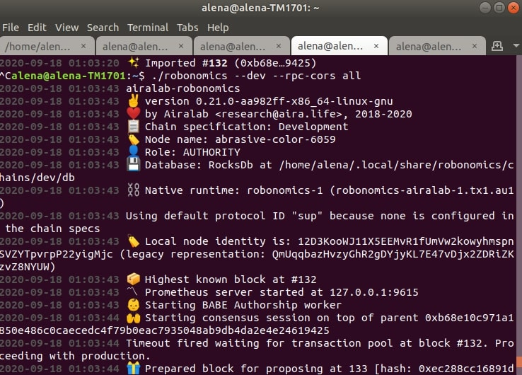

**Important!** Before next launches it is necessary to remove a directory `db` with

```
rm -rf /home/$USER/.local/share/robonomics/chains/dev/db
```

Go to https://parachain.robonomics.network and switch to local node

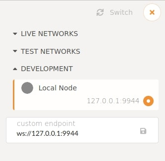

Then go to Accounts and create KUKA and WORK accounts. Save account's addresses and keys, you will need them later

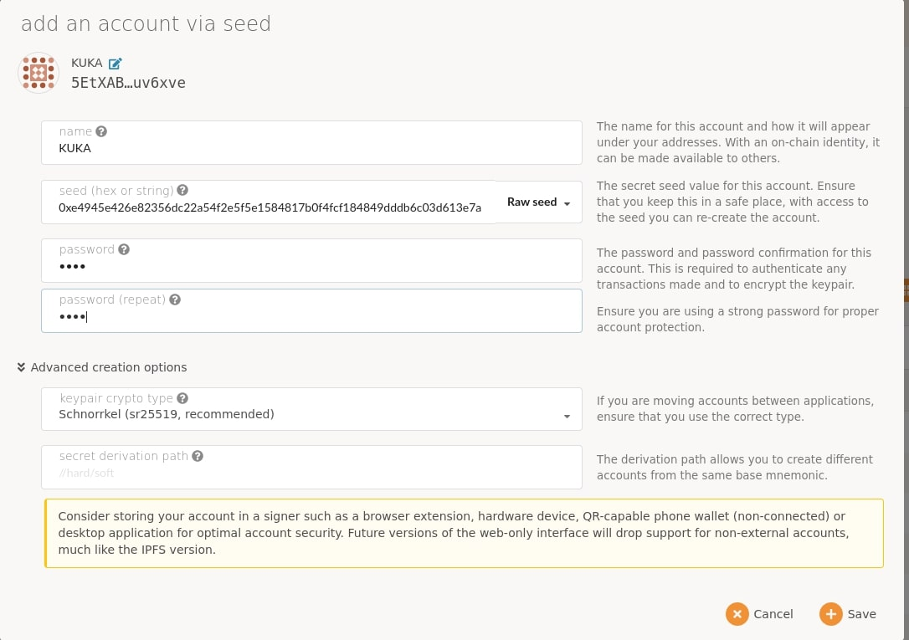

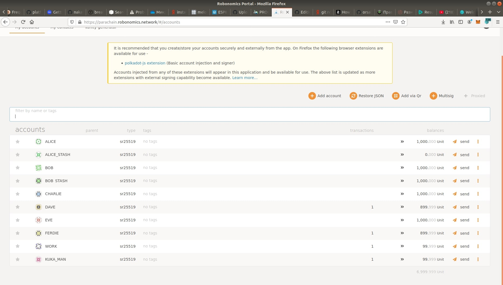
***
## Running ipfs
Run ipfs daemon:
```bash
ipfs daemon
```
***
## Running control package
In kuka_control package path you need to edit move_arm_client.py. 
```bash
cd src/
nano move_arm_client.py
```
Change kuka_address, kuka_key and work_address to you addresses and key, then change robonomics_path to your path to file robonomics.

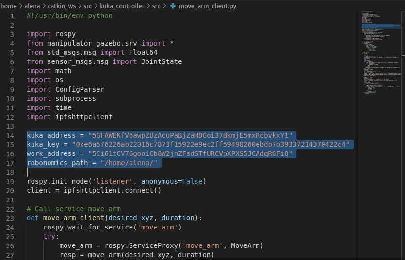

Now you can run control script:
```bash
python move_arm_client.py
```


Then in a new window send a transaction to make Kuka move:
```bash
echo "ON" | ./robonomics io write launch -r <KUKA_ADDRESS> -s <WORK_KEY>
```
Where <KUKA_ADDRESS> and <WORK_KEY> are address and key from your accounts:

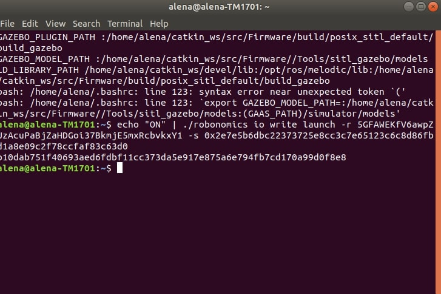

In the window with kuka_control package you will see:

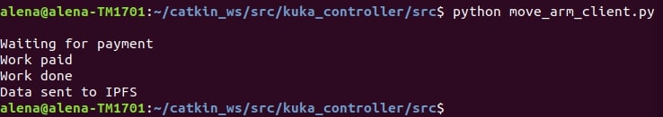

Then go Developer/Chain state on the Robonomics portal, select datalog in query and add KUKA datalog with button '+':

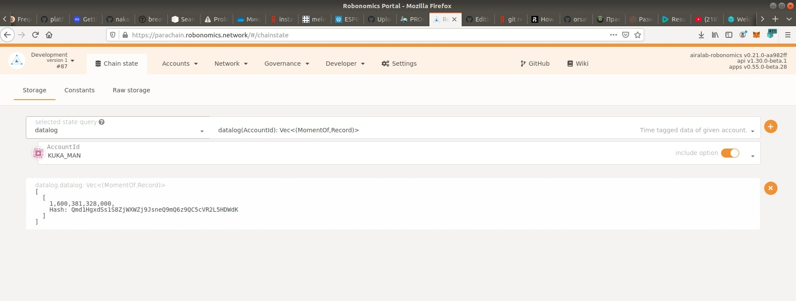

Now you can find Kuka's telemetry using this hash in IPFS Companion:

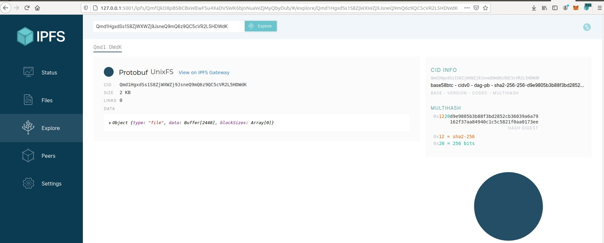

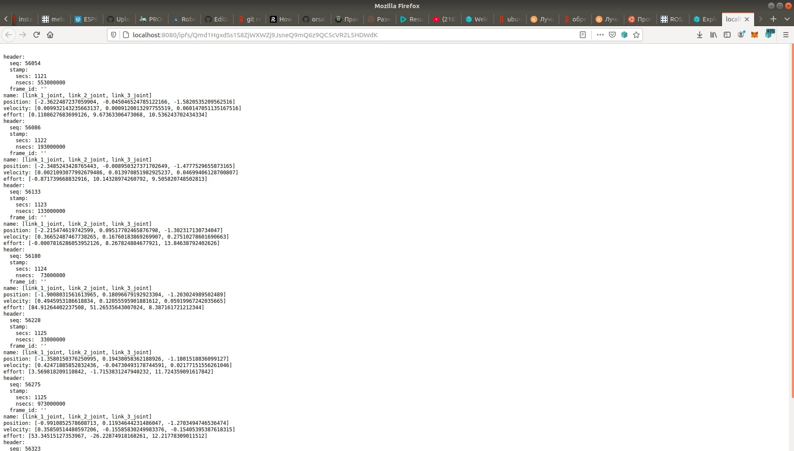

## Troubleshooting

If `catkin_make` doesn't work with the message that it can't find MoveArm.h, try to remove last four lines in CMakeLists.txt in kuka_manipulator_gazebo package:
```
include_directories(include ${catkin_INCLUDE_DIRS})

add_executable(move_arm_server src/move_arm_server.cpp)
target_link_libraries(move_arm_server ${catkin_LIBRARIES})
add_dependencies(move_arm_server beginner_tutorials_gencpp)
```
Do `catkin_make` without these lines, then returm them and do `catkin_make` again.


