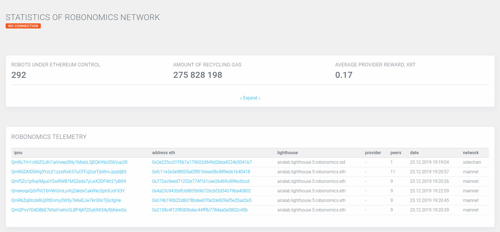

You can operate with Robonomics Network using the interface of [Robonomics Network Dapp (decentralized application)](https://dapp.robonomics.network/#/). It is available in browsers with [Metamask extension](https://metamask.io). On the first page you will see the statistics of the network:

Let's have a look at the bottom table "Robonomics Telemetry".

Every time an instance of AIRA is launched it broadcasts a piece of information about itself. Usually it takes some time for the Dapp to receive data from an instance of AIRA.

Have a brief look at the page ["AIRA installation"](/docs/aira-installation) to understand where `IPNS` and `Address Eth` came from.

## IPNS

You can treat it as a unique identifier of your instance in IPFS network. Under that name AIRA publishes metadata about itself.

## Address Eth

By default AIRA generates new Ethereum address for you (it's [possible](/docs/aira-faq#how-to-change-ethereum-address-of-aira) to generate new one).

It's mainly used to sign all the outcoming messages.

## Lighthouse

In Robonomics Network an agent must choose a lighthouse to work on. By default it's `airalab.lighthouse.5.robonomics.eth`.

You can choose existing one or create your own on [Lighthouses](https://dapp.robonomics.network/#/lighthouse) page.

## Peers

The amount of IPFS pubsub [peers](/docs/aira-faq#how-to-check-the-quantity-of-ipfs-peers).

## Date

The date and time of last update

## Network

Robonomics Network officially works in Ethereum Mainnet.
There is also [Sidechain](https://github.com/airalab/airalab-sidechain) which is mostly for testing purpose.

