Note: The screenshots contained in this article were taken using v1.9.0 of Robonomics node implementation, launched in **dev** mode.

The Robonomics Technical Committee can use the **fast-track** function to speed up the proposals enacting in the Democracy module.

If you want to learn more about how Polkadot ecosystem Governance works, then we strongly recommend reading [this article](https://polkadot.network/blog/polkadot-governance/) on the Polkadot blog.

There are six members who make up the Technical Committee for the Robonomics parachain. For our example, let's create the same setup in our dev mode environment:

Briefly, the process of fast-tracking a proposal involves a few steps:
1. Creating the proposal preimage
2. Creating the proposal using the created preimage hash
3. Technical committee votes on the created proposal
4. Initiating proposal fast-tracking 
5. Technical committee votes regarding fast-tracking the proposal
6. Voting on enacted proposal in the Democracy pallet

For example, let's set the free balance for the account *4EnEc9ZD1jpA1H3HpVzr1v6SGGYGrue2k9Ny5KzFHhti5xQv* to 10 XRT

## 1. Creating the proposal preimage
Open the **Governance -> Democracy** page and click the **Submit preimage** button, and then input the required parameters:
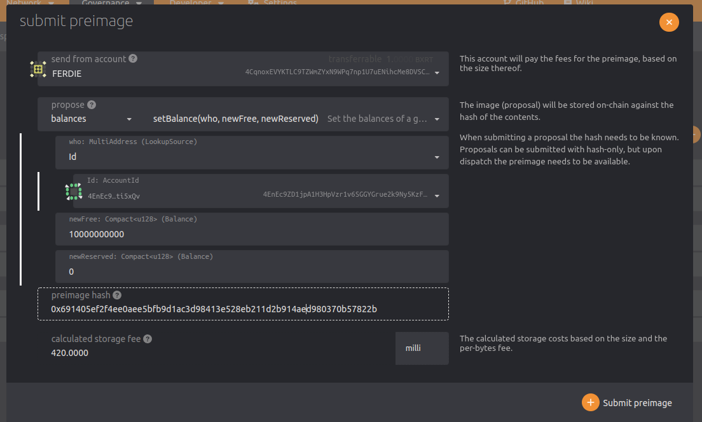

After all fields are filled, then we need to save generated preimage hash (*0x691405ef2f4ee0aee5bfb9d1ac3d98413e528eb211d2b914aed980370b57822b* in this example). As we will need it in the next step.

After saving the preimage hash we can click the **Submit preimage** button in this window and sign the transaction:
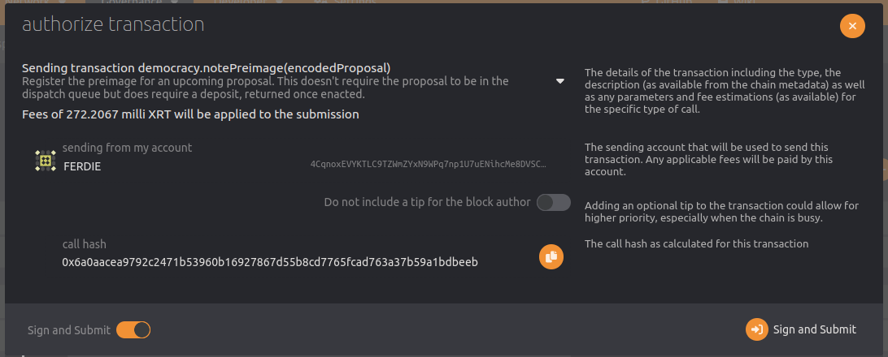

## 2. Creating proposal using created preimage hash
Open the **Governance -> Tech. comm.** page and go to the **Proposals** tab:
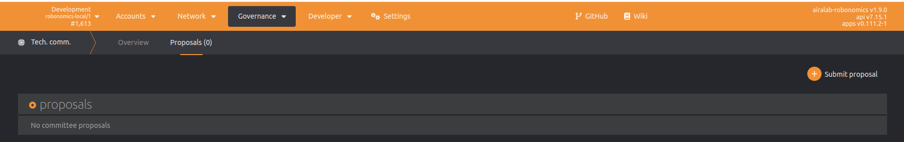

Then click **"Submit proposal"** button and create *democracy.externalProposeMajority(0x691405ef2f4ee0aee5bfb9d1ac3d98413e528eb211d2b914aed980370b57822b)* using your technical committee account and the preimage hash from earlier:
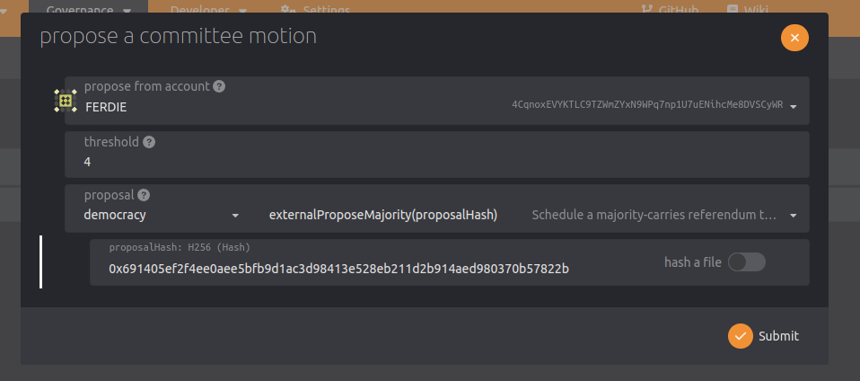

After signing transaction, the proposal will appear on this page:
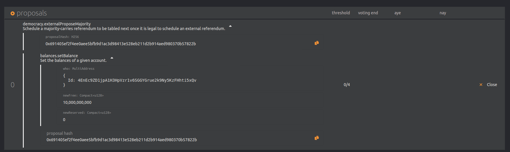

## 3. Technical committee voting for created proposal
On this step the majority of the technical committee members need to vote **Aye** in this poll. For example:
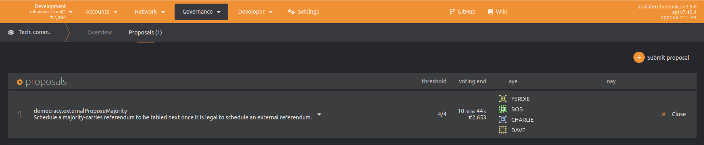

Then we can decide to close this vote/poll using the **Close** button. After this action the proposal will appear on the **Democracy** page on the **external** table. You may wonder how can you see the **Fast track** button. This button appears and is active ONLY if we used the **democracy.externalProposeMajority** function:
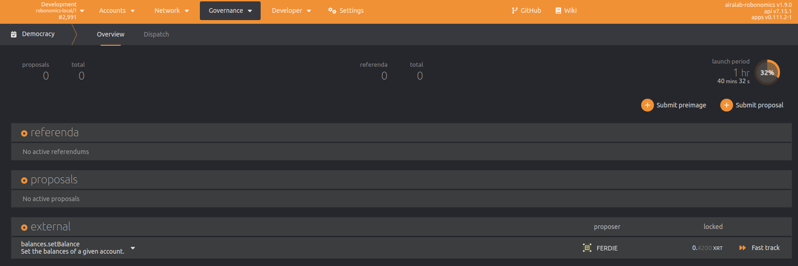

## 4. Initiating proposal fast-tracking
Go to the **Governance -> Democracy** page and click on the **Fast track** button. In this newly opened window set the required parameters and click **Fast track**.
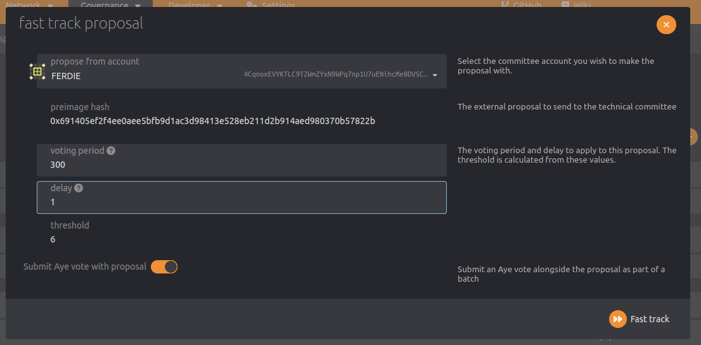

After this, the fast-track proposal should now appear on the Technical Committee proposals page:
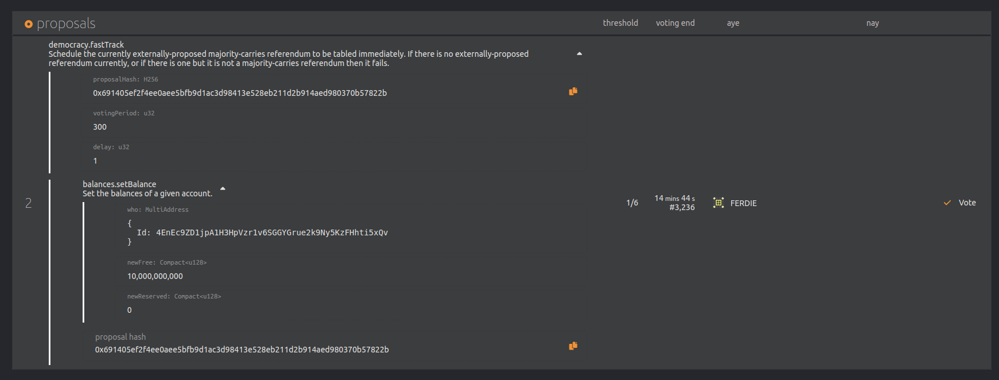

## 5. Technical committee voting for fast-track the proposal
Now the technical committee need to vote unanimously for fast-tracking the earlier created proposal. It means that all six members need to vote **Aye**:
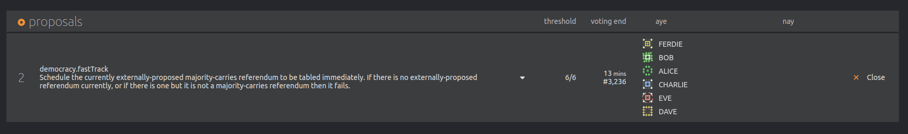

After this anyone can **Close** this voting, and the proposal will be enacted and moved from **external** table to active **referenda**:
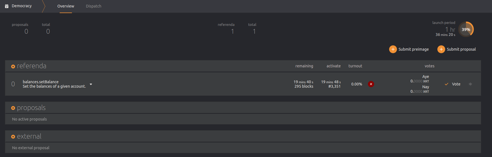

## 6. Voting on enacted proposal in Democracy
Now at least one account needs to vote **Aye** on the referenda:
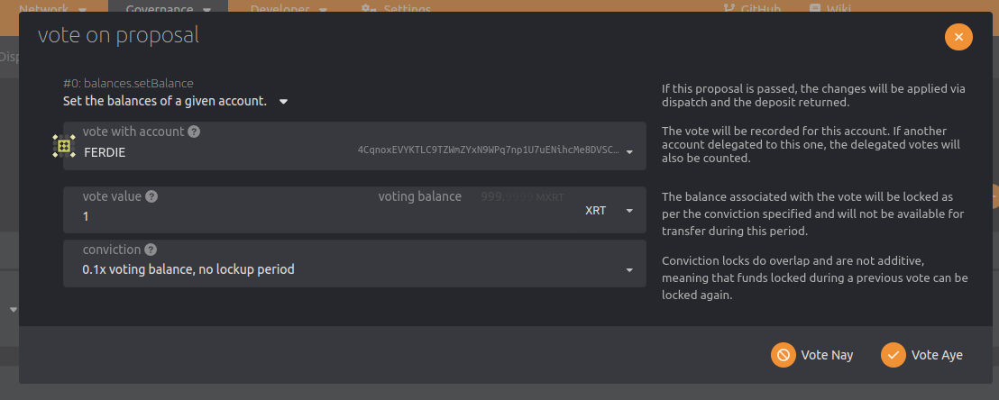

As a result we'll get the active referenda with one positive vote on it:
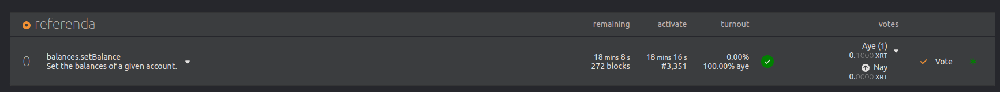

After the voting period ends, this democracy proposal will be executed. In current example this will be happen in block #3351. Let's wait for this block and check it:
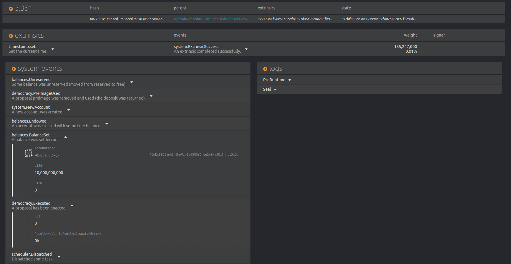
