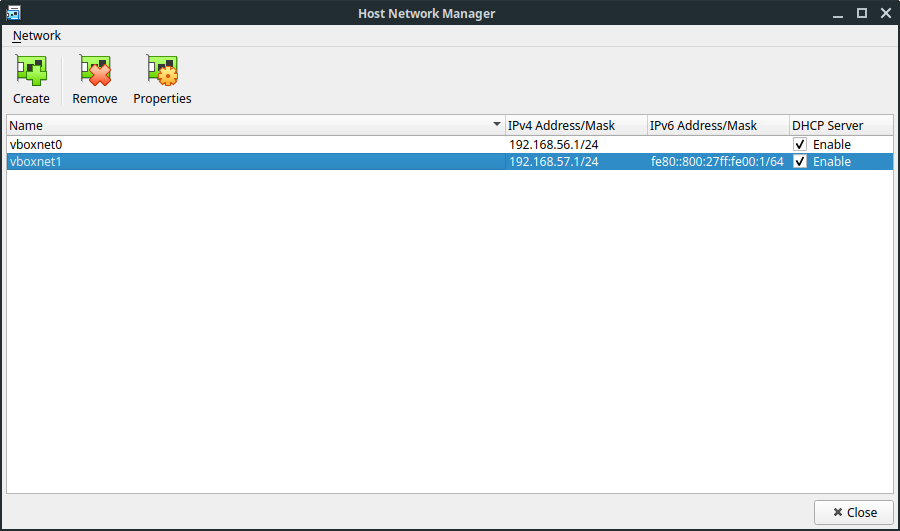

It is more convenient to work with virtual machine via ssh connection. In this section we will configure VM.

> **It's required to have your ssh public key on Github. In case you don't have one, please follow the [link](https://help.github.com/articles/adding-a-new-ssh-key-to-your-github-account/)**

Below is the walkthrough video:

https://www.youtube.com/embed/R6waDG5iwm0

## Add Host Adapter

Go to `File` -> `Host Network Manager...` or press `Ctrl+H`



Click `Create` button.

## Add the Second Adapter to the VM

Select imported VM and click `Settings`. Go to `Network` tab and enable the second adapter


## Populate Authorized Keys

Launch the VM and run the following command replacing `<username>` with your Github user name:

```
mkdir .ssh
chmod 700 .ssh
curl -sSL https://github.com/<username>.keys >> .ssh/authorized_keys
```

Find out the VM's IP address by running:

```
ip a
```

You should look for an address which starts with `192.168.xx.xx`

## Log in via SSH

Now open your terminal and log in via SSH as usual using the address from the previous step:

```
ssh root@192.168.xx.xx
```
