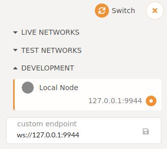
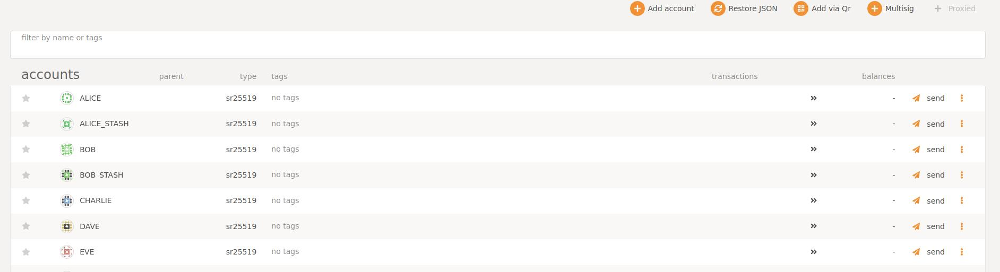
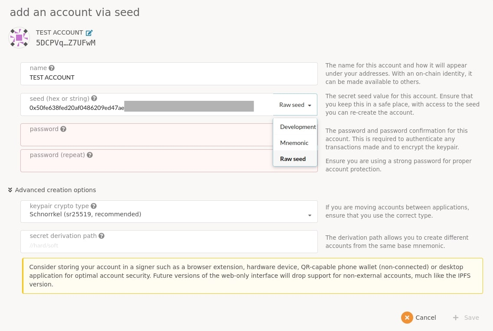

**In order to be able to complete all the playground tutorials below, one should have several accounts on Robonomics portal. These accounts do not contain any personal data, neither they are anyhow valuable (if you play on a local dev network or on a self-owned test one). But still their keys, both public and private, are necessary for launching any demo.**

## 1. Choose your network and navigate to Robonomics portal
Globally, there are 3 different ways to work with Robonomics:
- Launch your own local network with [robonomics binary](https://github.com/airalab/robonomics/releases/) by `./robonomics --dev`. This method is used in all playground tutorials. (_tip: to avoid failures on next launches clean chain data by `rm -rf /home/$USER/.local/share/robonomics/chains/dev/db` after each session_)
- Launch your own test network following [this](/docs/robonomics-test-network-manual/) manual
- Connect to an existing network on a portal (more information on this below)

Regardless of method chosen, go to [parachain.robonomics.network](https://parachain.robonomics.network) and draw your attention to the top-left corner:

Press on the current network icon and choose you network:
- **Development -> Local Node** if you have launched local network
- **Custom Endpoint -> insert endpoint** if you have created a test network on a remote server
- **Live Networks** or **Test Networks** if you are operating in a public one
Don't forget to press `Switch` button to confirm network choice. In all the playgrounds we will use local networks.

## 2. Create accounts
Now that you have chosen your network, go to **Accounts -> Accounts** and press `Add account` button

You should see the following panel:

- *Name* is just you account's name in this exact browser. It makes no sense but convenience.
- *Seed*. Each transaction must be signed by account's unique seed. It has two forms: *Mnemonic* (human-readable) and *Raw* (a sequence of digits and letters). Change *Mnemonic* to *Raw* and copy the seed. **It's very important to store it somewhere securely** since secret seeds are used for transactions in [Robonomics IO](/docs/rio-overview/) module. If you have created an account before, you can insert its secret seed here to restore its balance and history.
- *Password* is used to sign transactions on a portal (in GUI). Create one and remember it.

Click `Save`, `Create and backup account`. A downloaded JSON-file is another way to restore account's data on the portal.

## 3. Manage your accounts
Now you can fully operate with your fresh-created account. Send and receive tokens, messages, write datalog and more. You can forget this account for this exact browser by clicking three dots in opposite of your account's name and choosing *Forget this account*. Feel free to explore all the features of portal. To copy your account's address simply click on its icon, address will be copied to clipboard.

## 4. Some notes before proceeding to playground
Most of the playground demos require "Control" account and one or several "Worker" accounts. Transfer units to both before starting, since "Control" needs to send "ON"/"OFF" transactions and "Worker" publishes datalog. Also, each "ON"/"OFF" transaction requires target address, so don't forget to copy it from the portal.
