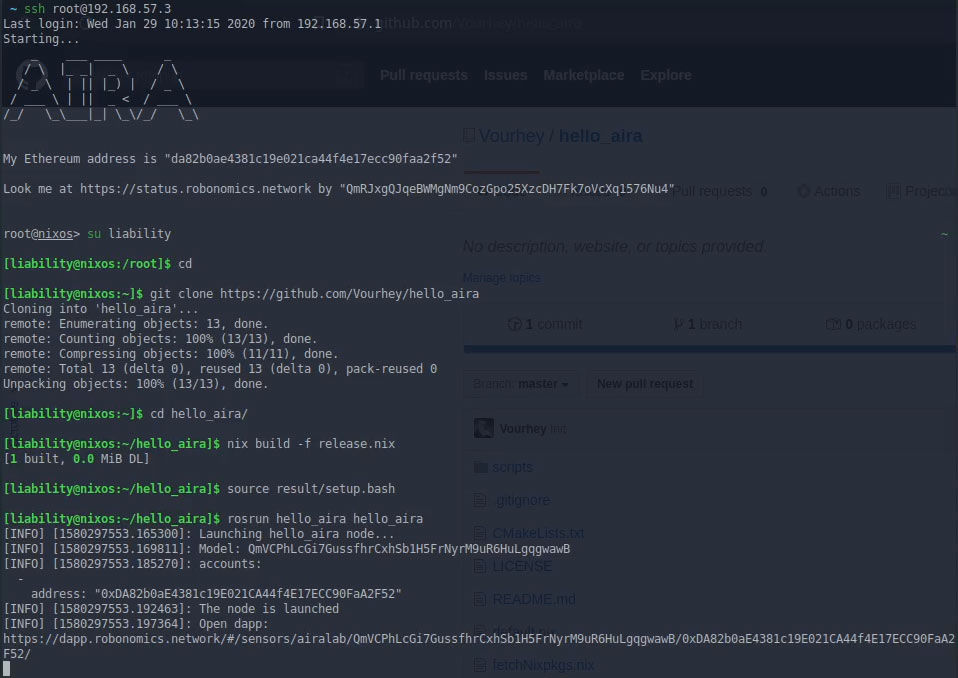
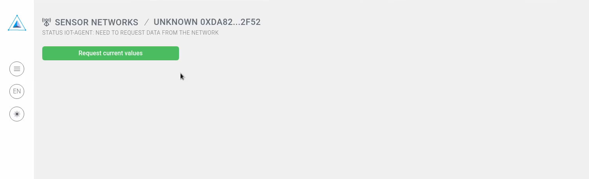
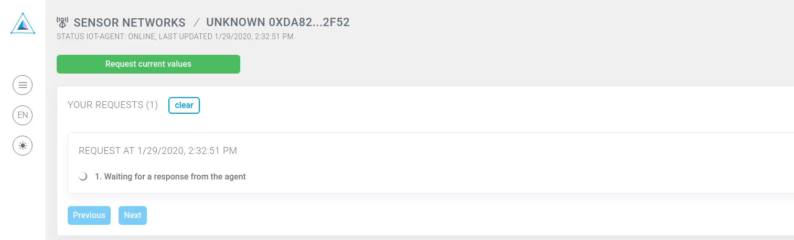
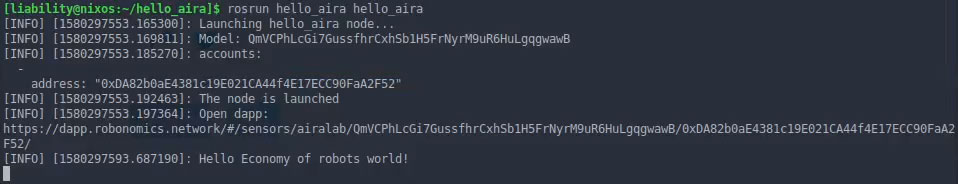

At this point you should be familiar with a [DApp](/docs/get-weather-on-fuji-mountain/) and how to launch [AIRA image](/docs/aira-installation-on-vb/).
Now you are ready to do more complicated stuff like installing a package and interacting with it via DApp.

> **Important:**
> Make sure you have covered previous lessons before you continue.


> **Tip:**
> During the lesson you will type a few commands in terminal. AIRA image doesn't support clipboard, so to make life easier have a look at [Connect via SSH](/docs/aira-connecting-via-ssh/) and log in via SSH to the VM.

Walkthrough video:

https://www.youtube.com/embed/QM06l07_wuA

## Package installation

After you launched AIRA and logged in using your terminal do the following:

```
su liability && cd
git clone https://github.com/vourhey/hello_aira
cd hello_aira
nix build -f release.nix
source result/setup.bash
rosrun hello_aira hello_aira
```

Run one by one commands above. After the last one you should see a link to DApp generated specifically for your instance.



Click on the link, the DApp should be shown.

## DApp 

Connect [MetaMask](http://metamask.io/) if prompted and click on the button



Sign the message as usual and wait for the result



Meanwhile have a look at the terminal. You should see the greeting



In the end the greeting will appear in the DApp


## Troubleshooting

### You click "Request current values" but see no greeting

Probably you have just launched AIRA and IPFS hasn't finished initialization. Wait a minute or so and try again.

### I see response hash but the data doesn't appear

Again most probably the issue comes from IPFS connection. Click and the hash and you'll see the result. It's not necessary to download the file.

## Home Task (optional)

If you are familiar with [Python](https://www.python.org/) change the shown text to something different and complete the lesson with your version of `hello_aira`

- Make a fork of the [repository](https://github.com/vourhey/hello_aira)
- The output text is located [here](https://github.com/Vourhey/hello_aira/blob/master/scripts/hello_aira#L45)
