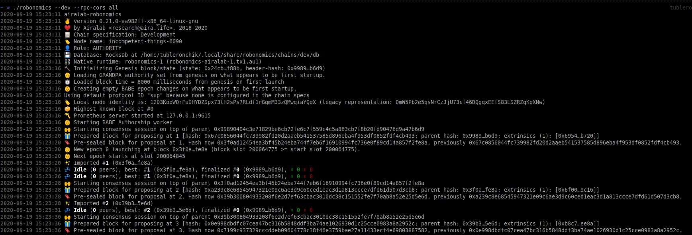
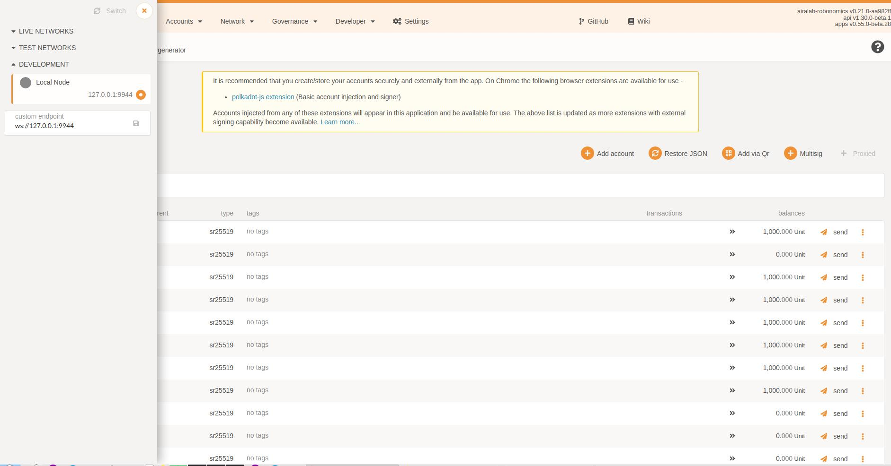
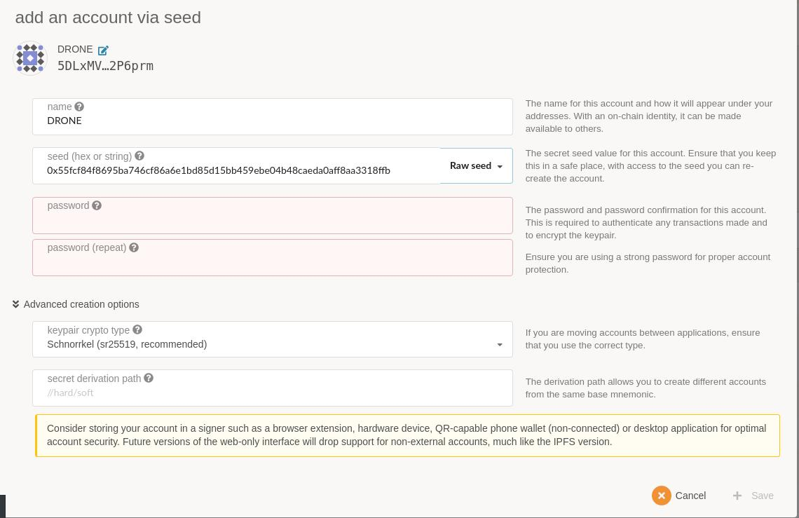
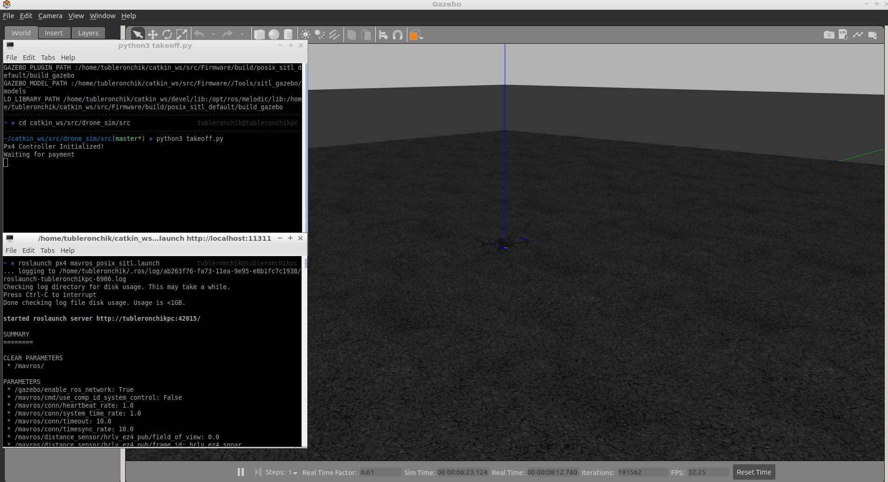
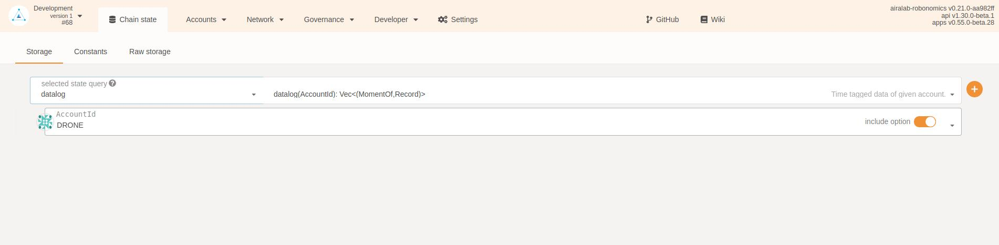

**Drone starts moving after transcation and store file with the coordinates in IPFS. The control script is based on the [GAAS demo script](https://github.com/generalized-intelligence/GAAS)**  

https://youtu.be/4CwtGAX1OwM

## Requirements
* dependencies for control:
``` sh
sudo apt install -y \
	python3-pip \
	ninja-build \
	exiftool \
	python-argparse \
	python-empy \
	python-toml \
	python-numpy \
	python-yaml \
	python-dev \
	python-pip \
	ninja-build \
	protobuf-compiler \
	libeigen3-dev \
	genromfs
```
```sh 
pip3 install \
	pandas \
	jinja2 \
	pyserial \
	cerberus \
	pyulog \
	numpy \
	toml \
	pyquaternion
```
* ROS Melodic + Gazebo [installation tutorial](http://wiki.ros.org/melodic/Installation)
* extra packages: 
``` bash 
sudo apt-get install ros-melodic-gazebo-ros-control ros-melodic-effort-controllers ros-melodic-joint-state-controller
sudo apt-get install python-jinja2
sudo apt-get install python-catkin-pkg
sudo apt-get install python3-catkin-pkg-modules
```
* IPFS verson 0.4.22
```bash
wget https://dist.ipfs.io/go-ipfs/v0.4.22/go-ipfs_v0.4.22_linux-amd64.tar.gz
tar -xvzf go-ipfs_v0.4.22_linux-amd64.tar.gz
cd go-ipfs
sudo bash install.sh
ipfs init
```
* ipfshttpclient
```sh
pip3 install ipfshttpclient
```
* Robonomics node (binary file) (download latest release [here](https://github.com/airalab/robonomics/releases))
## Environment Setup
```bash 
sudo apt-get install ros-melodic-mavros ros-melodic-mavros-extras
wget https://raw.githubusercontent.com/mavlink/mavros/master/mavros/scripts/install_geographiclib_datasets.sh
sudo ./install_geographiclib_datasets.sh
cd ~/catkin_ws/src
git clone https://github.com/PX4/Firmware.git
cd Firmware
git checkout v1.9.0
bash ./Tools/setup/ubuntu.sh
```
```bash
cd ~/catkin_ws/src
git clone https://github.com/generalized-intelligence/GAAS.git
cp -r ~/catkin_ws/src/GAAS/simulator/models/* ~/catkin_ws/src/Firmware/Tools/sitl_gazebo/models/
cp -r ~/catkin_ws/src/GAAS/simulator/worlds/* ~/catkin_ws/src/Firmware/Tools/sitl_gazebo/worlds/
cp -r ~/catkin_ws/src/GAAS/simulator/posix-config/* ~/catkin_ws/src/Firmware/posix-configs/SITL/init/ekf2/
```

Modifying your `.bashrc` file, adding the following lines to the bottom:  

`source ~/catkin_ws/devel/setup.bash `  
`source ~/catkin_ws/src/Firmware/Tools/setup_gazebo.bash ~/catkin_ws/src/Firmware/ ~/catkin_ws/src/Firmware/build posix_sitl_default `   
`export GAZEBO_MODEL_PATH=:~/catkin_ws/src/simulator/models`  
`export ROS_PACKAGE_PATH=$ROS_PACKAGE_PATH:~/catkin_ws/src/Firmware`  
`export ROS_PACKAGE_PATH=$ROS_PACKAGE_PATH:~/catkin_ws/src/Firmware/Tools/sitl_gazebo`  
`export GAZEBO_MODEL_PATH=:~/catkin_ws/src/simulator/models:~/catkin_ws/src/GAAS/simulator/models`  

  
## Control Package Installation
In a new Terminal:
```bash
cd catkin_ws/src
git clone https://github.com/tubleronchik/robonomics_drone_sim.git
cd ..
catkin build
```
## Robonomics Network
To create a local robonomics network go to the folder with the robonomic binary file and run:  
`./robonomics --dev --rpc-cors all`  

Add robonomic's path to `config.py`



Go to the [Robonomics Parachain portal](https://polkadot.js.org/apps/?rpc=wss%3A%2F%2Fkusama.rpc.robonomics.network%2F#/) and switch to local node.


Go to **Accounts** and create **DRONE** and **EMPLOYER** accounts. Save the account names and keys and path to **robonomics** to `~/catkin_ws/src/drone_sim/src/config.py`. Transfer some money into the accounts.



## Running Simulation
Run IPFS daemon
```bash
cd go-ipfs
ipfs daemon
```
In another terminal launch the simulation:
```bash
roslaunch px4 mavros_posix_sitl.launch
cd ~/catkin_ws/src/robonomics_drone_sim/src
python3 takeoff.py
```
Waiting till "Waiting for payment" 



To send a transaction run in another window:
`echo "ON" | ./robonomics io write launch -r <drone_addres> -s <employer_key>` - where **<drone_address>** and **<employer_key>** should be replaced with the strings from `config.py` accordingly.

After data was pushed to IPFS, go to the **Chain State** in [Robonomics Parachain portal](https://polkadot.js.org/apps/?rpc=wss%3A%2F%2Fkusama.rpc.robonomics.network%2F#/). Select **datalog** in query and add DRONE datalog using `+` button.



You can find drone's telemetry running `https://gateway.ipfs.io/ipfs/<hash>` inserting the hash from above.


It's important to remove `db` derictory before next launches using  
` rm -rf ~/.local/share/robonomics/chains/dev/db`
