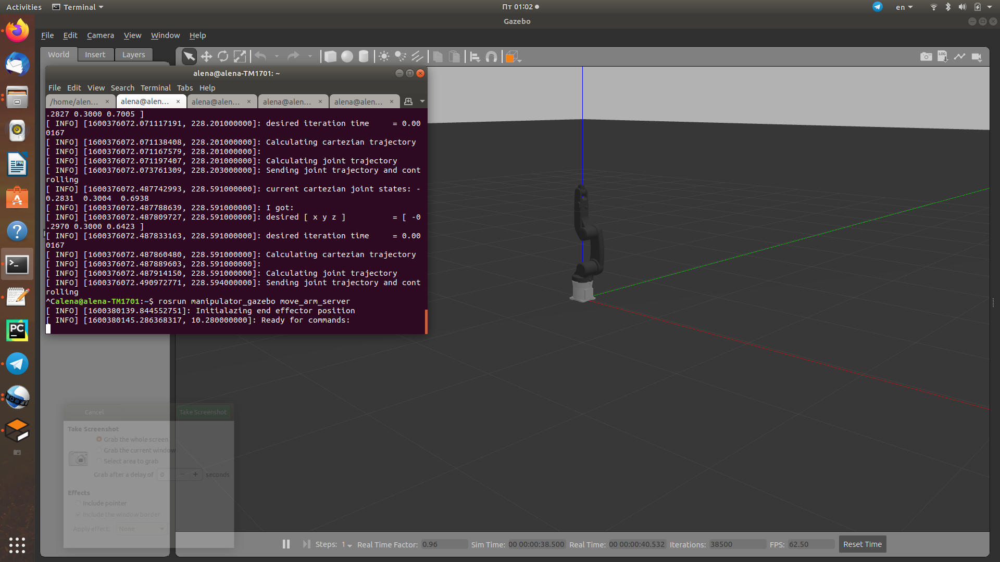
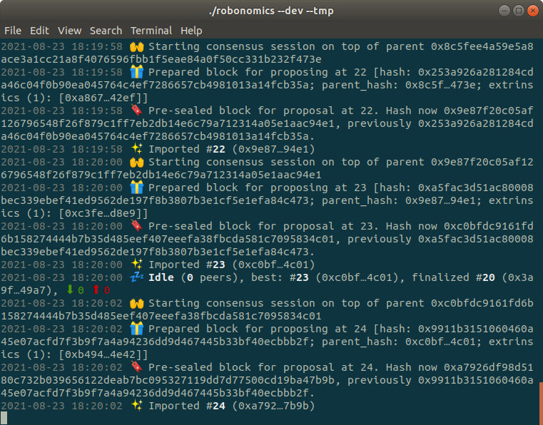
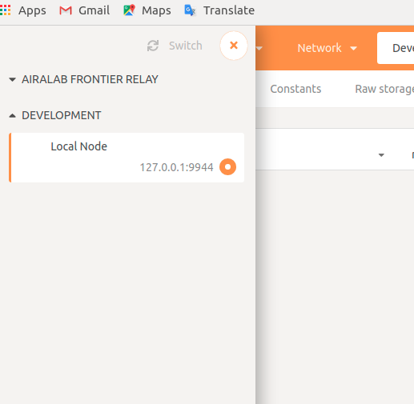
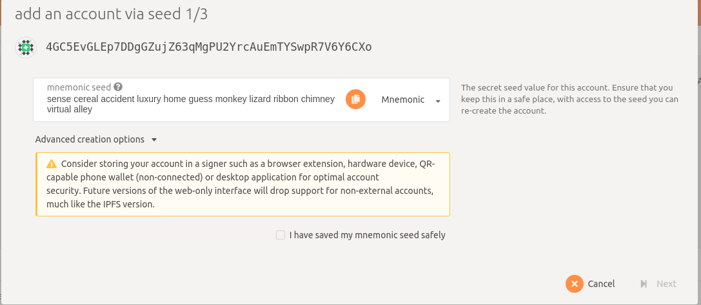
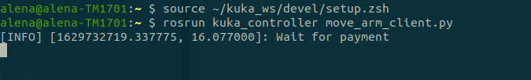
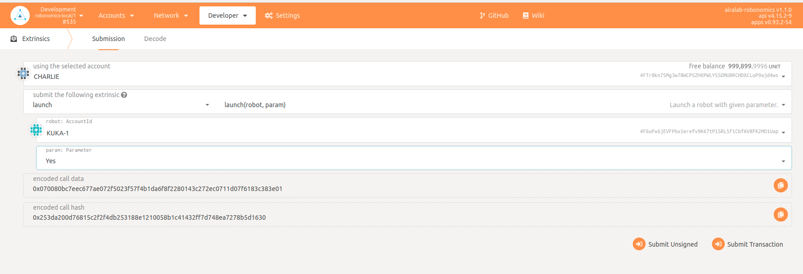
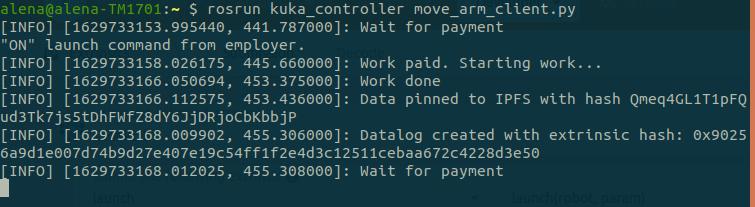
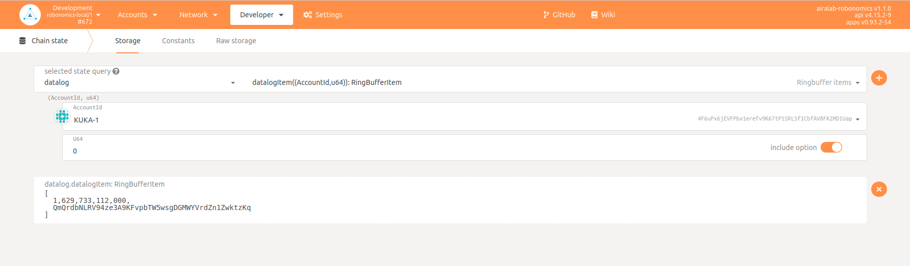

Video with an example of work can be found here:

https://youtu.be/z55HepXbHr8

***

## Requirements
* ROS melodic, Gazebo (installation instraction [here](http://wiki.ros.org/melodic/Installation/Ubuntu))
* Some extra packages
```bash
sudo apt-get install ros-melodic-gazebo-ros-control ros-melodic-effort-controllers ros-melodic-joint-state-controller
```
* IPFS 0.4.22 (download from [here](https://www.npackd.org/p/ipfs/0.4.22) and install)
```bash
tar -xvzf go-ipfs_v0.4.22_linux-386.tar.gz
cd go-ipfs/
sudo bash install.sh
ipfs init
```
* pip3
```bash
sudo apt-get install python3-pip
```
* ipfshttpclient
```bash
pip3 install ipfshttpclient
```
* substrate-interface
```bash
pip3 install substrate-interface
```
* Robonomics node (binary file) (download latest release [here](https://github.com/airalab/robonomics/releases))
* IPFS browser extension (not necessary)
***
## Installation
Install Kuka manipulator and control packages
```bash
cd catkin_wc/src/
git clone https://github.com/orsalmon/kuka_manipulator_gazebo
git clone https://github.com/LoSk-p/kuka_controller
cd ..
catkin_make
```
***
## Running gazebo model
```bash
source ~/catkin_ws/devel/setup.bash
roslaunch manipulator_gazebo manipulator_empty_world.launch
```
In a new window
```bash
source ~/catkin_ws/devel/setup.bash
rosrun manipulator_gazebo move_arm_server
```

***
## Running robonomics
Go to the folder with robonomics file ad create a local robonomics network:
```bash
./robonomics --dev --tmp
```



Go to [Robonomics Parachain portal](https://polkadot.js.org/apps/?rpc=wss%3A%2F%2Fkusama.rpc.robonomics.network%2F#/) and switch to local node



Then go to Accounts and create `KUKA` account. Save account's mnemonic key, you will need it later. 



Send some units to the new account from one of default accounts.


***
## Running ipfs
Run ipfs daemon:
```bash
ipfs daemon
```
***
## Running control package
In config directory in kuka_control package you need to create config file with this lines, where `<your_mnemonic>` is saved mnemonic seed:
```bash
{
    "kuka_mnemonic": "<your_mnemonic>",
    "node": "ws://127.0.0.1:9944"
}
```

Now you can run control script:
```bash
source ~/catkin_ws/devel/setup.bash
rosrun kuka_controller move_arm_client.py
```


## Sending transaction
In [Robonomics Parachain portal](https://polkadot.js.org/apps/?rpc=wss%3A%2F%2Fkusama.rpc.robonomics.network%2F#/) go to `Developer/Extrinsics`, change `extrinsic` to `launch`. Chose your `KUKA` account in `robot` and change `param` to `Yes`. The press `Submit Transaction`



In the window with kuka_control package you will see:



Then go `Developer/Chain State` on the Robonomics portal, select `datalog` and `datalogItem((AccountId,u64)): RingBufferItem` in query and add `KUKA` datalog with button '+':



Now you can find robot's telemetry in IPFS via this link with your hash `https://gateway.ipfs.io/ipfs/<hash>`.

## Troubleshooting

If `catkin_make` doesn't work with the message that it can't find MoveArm.h, try to remove last four lines in CMakeLists.txt in kuka_manipulator_gazebo package:
```
include_directories(include ${catkin_INCLUDE_DIRS})

add_executable(move_arm_server src/move_arm_server.cpp)
target_link_libraries(move_arm_server ${catkin_LIBRARIES})
add_dependencies(move_arm_server beginner_tutorials_gencpp)
```
Do `catkin_make` without these lines, then returm them and do `catkin_make` again.
