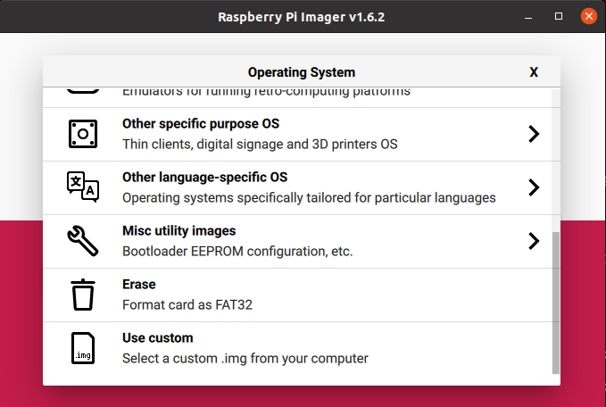
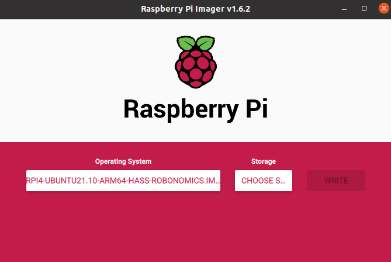

## Image
We prepared an image to make it easier to use the Home Assistant with Xiaomi Miio and Robonomics with the Raspberry Pi.

You can get it here: [download image](https://ipfs.io/ipfs/bafybeihzzqoyycflxzxlxy2aplkzxo537ggqatdlbr24b4dnlyrtpkp2eu)

SHA256 checksum: `7ec5ea99d7e339b54cbeaaae58c8295411769d27732ec2b5464dbb495ba24120`

What preinstalled in the image:
- Ubuntu Server 21.10 (3/4/400): 64-bit server OS for arm64 archtectures
- Python 3.9.7
- Home Assistant Core 2021.11.5
- rustc 1.59.0-nightly (efec54529 2021-12-04)
- substrate-interface 1.1.2
- python-miio 0.5.8

## How To Use The Prepared Image
Install [Raspberry Pi Imager](https://www.raspberrypi.com/software/) on your computer. Insert SD card into your PC and run the Imager program. In `Operating System` select `Use custom` and choose the previously downloaded `.img.gz` file. Then select your SD card in the `Storage` dropdown and click `WRITE`.




After writing is comleted, open the SD card's files on your computer and navigate inside the root folder of the card. The name should be something similar to `system-boot`.

Find the file named `network-config` and open it in a text editor. Write this to the file:
```
version: 2
ethernets:
  eth0:
    dhcp4: true
    optional: true
wifis:
  wlan0:
    dhcp4: true
    optional: true
    access-points:
      "YOUR_WIFI_NAME":
        password: "YOUR_WIFI_PASSWORD"
```
**Make sure that you input your actual wifi name and your wifi password.** Then you need to save the file, and insert the SD card to the Raspberry Pi and turn it on. It must connect to your wi-fi network, now you need to find its address. Firstly find your address in the local network with:

```bash
ip a
```
It must look like `192.168.xx.xx` or `172.xx.xx.xx`.

Then scan the network with your address and zero in the end:

```bash 
$ sudo nmap -sP 192.168.xx.0/24
Starting Nmap 7.80 ( https://nmap.org ) at 2020-06-26 13:50 CEST
Nmap scan report for _gateway (192.168.43.1)
Host is up (0.015s latency).
MAC Address: 8E:F5:A3:DB:03:27 (Unknown)
Nmap scan report for ubuntu (192.168.43.56)
Host is up (0.049s latency).
MAC Address: DC:A6:32:02:46:50 (Raspberry Pi Trading)
Nmap scan report for LAPTOP-27UBLNO7 (192.168.43.234)
Host is up (0.00057s latency).
MAC Address: 7C:B2:7D:9E:95:DA (Intel Corporate)
Nmap scan report for ed-vm (192.168.43.138)
Host is up.
Nmap done: 256 IP addresses (4 hosts up) scanned in 2.07 seconds
```
There raspberry's address is `192.168.43.56`. Now you can connect to it over ssh:
```bash
ssh ubuntu@192.168.43.56
```
Password is "ubuntu". Then follow the instructions to change the password.

Then you need to write the seed from your Robonomics account to config file. Open it:
```bash
sudo -u homeassistant -H -s
nano /srv/homeassistant/python_scripts/config.config
```
And add mnemonic:
```
[user]
SEED = <your mnemonic or raw seed>
```
Then restart Robonomics Control service:
```bash
systemctl restart robonomics-control@homeassistant.service
```

After that you can connect your devices:
- [Connection with zigbee2MQTT](/docs/zigbee2-mqtt/)
- [Connection through Xiaomi Gateway](/docs/xiaomi-gateway/)
- [Connect Vacuum Cleaner](/docs/vacuum-connect/)
