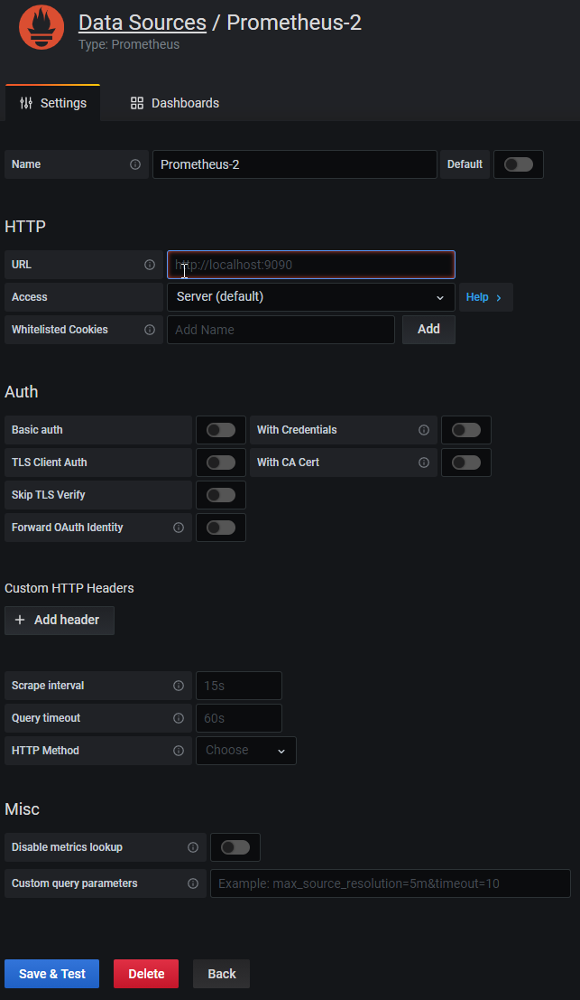

**The following instruction is provided by [Hubo Bubo](https://github.com/hubobubo)**

**The original article is located [here](https://github.com/hubobubo/robonomics/wiki/Robonomics-(XRT)-metrics-using-Prometheus-and-Grafana)**

## Introduction
To better monitor and maintain Robonomics node(s) it's good to setup a monitoring based on Prometheus Server and Grafana. This doc will show how to configure each one of it to fully monitor your node.

##  Prerequisites
* [Server Setup with Ubuntu 18.04](https://www.digitalocean.com/community/tutorials/initial-server-setup-with-ubuntu-18-04) 
* [Robonomics parachain collator installed](https://blog.aira.life/installing-and-running-the-robonomics-validator-in-the-polkadot-network-487ad4c1a567)
* Make sure you have robonomics.service working on your machine and port 9615 is reachable 

## Step 1 — Creating Service Users

For security purposes, we’ll begin by creating two new user accounts, prometheus and node_exporter. Create these two users, and use the _--no-create-home_ and _--shell /bin/false_ options so that these users can’t log into the server.
```
sudo useradd --no-create-home --shell /bin/false prometheus
sudo useradd --no-create-home --shell /bin/false node_exporter
```

Before we download the Prometheus binaries, create the necessary directories for storing Prometheus’ files and data. Following standard Linux conventions, we’ll create a directory in _/etc_ for Prometheus’ configuration files and a directory in _/var/lib_ for its data.
```
sudo mkdir /etc/prometheus
sudo mkdir /var/lib/prometheus
```
Now, set the user and group ownership on the new directories to the prometheus user.
```
sudo chown prometheus:prometheus /etc/prometheus
sudo chown prometheus:prometheus /var/lib/prometheus
```
## Step 2 — Downloading Prometheus

First, download and unpack the current stable version of Prometheus into your home directory. You can find the latest binaries on the [Prometheus download page.](https://prometheus.io/download/)

```
wget https://github.com/prometheus/prometheus/releases/download/v2.21.0/prometheus-2.21.0.linux-amd64.tar.gz

```
Now, unpack the downloaded archive.

```
tar xvf prometheus-2.21.0.linux-amd64.tar.gz

```
This will create a directory called prometheus-2.21.0.linux-amd64 containing two binary files (prometheus and promtool), _consoles_ and _console_libraries_ directories containing the web interface files, a license, a notice, and several example files.

Copy the two binaries to the _/usr/local/bin_ directory.

```
sudo cp prometheus-2.21.0.linux-amd64/prometheus /usr/local/bin/
sudo cp prometheus-2.21.0.linux-amd64/promtool /usr/local/bin/

```
Set the user and group ownership on the binaries to the prometheus user created in Step 1.

```
sudo chown prometheus:prometheus /usr/local/bin/prometheus
sudo chown prometheus:prometheus /usr/local/bin/promtool

```
Copy the consoles and _console_libraries_ directories to _/etc/prometheus_.

```
sudo cp -r prometheus-2.21.0.linux-amd64/consoles /etc/prometheus
sudo cp -r prometheus-2.21.0.linux-amd64/console_libraries /etc/prometheus

```
Set the user and group ownership on the directories to the prometheus user. Using the -R flag will ensure that ownership is set on the files inside the directory as well.

```
sudo chown -R prometheus:prometheus /etc/prometheus/consoles
sudo chown -R prometheus:prometheus /etc/prometheus/console_libraries

```
Now that Prometheus is installed, we’ll create its configuration and service files in preparation of its first run.

## Step 3 — Configuring Prometheus

In the _/etc/prometheus_ directory, use nano or your favorite text editor to create a configuration file named _prometheus.yml_.

```
sudo nano /etc/prometheus/prometheus.yml

```
In the global settings, define the default interval for scraping metrics. Note that Prometheus will apply these settings to every exporter unless an individual exporter’s own settings override the globals.

```
global:
  scrape_interval: 15s

```
This scrape_interval value tells Prometheus to collect metrics from its exporters every 15 seconds, which is long enough for most exporters.
Now, add Prometheus itself to the list of exporters to scrape from with the following scrape_configs directive:

```
...
scrape_configs:
  - job_name: 'prometheus'
    scrape_interval: 5s
    static_configs:
      - targets: ['localhost:9090']
```
Prometheus uses the _job_name_ to label exporters in queries and on graphs, so be sure to pick something descriptive here.

And, as Prometheus exports important data about itself that you can use for monitoring performance and debugging, we’ve overridden the global scrape_interval directive from 15 seconds to 5 seconds for more frequent updates.

Lastly, Prometheus uses the _static_configs_ and _targets_ directives to determine where exporters are running. Since this particular exporter is running on the same server as Prometheus itself, we can use localhost instead of an IP address along with the default port, 9090.

Your configuration file should now look like this:

```
global:
  scrape_interval: 15s

scrape_configs:
  - job_name: 'prometheus'
    scrape_interval: 5s
    static_configs:
      - targets: ['localhost:9090']
```
Save the file and exit your text editor.

Now, set the user and group ownership on the configuration file to the prometheus user created in Step 1.

```
sudo chown prometheus:prometheus /etc/prometheus/prometheus.yml

```
With the configuration complete, we’re ready to test Prometheus by running it for the first time.

## Step 4 — Running Prometheus

Start up Prometheus as the _prometheus_ user, providing the path to both the configuration file and the data directory.

```
sudo -u prometheus /usr/local/bin/prometheus \
    --config.file /etc/prometheus/prometheus.yml \
    --storage.tsdb.path /var/lib/prometheus/ \
    --web.console.templates=/etc/prometheus/consoles \
    --web.console.libraries=/etc/prometheus/console_libraries
```

The output contains information about Prometheus’ loading progress, configuration file, and related services. It also confirms that Prometheus is listening on port _9090_.

```
_log output_
Sep 14 17:55:53 robonomics systemd[1]: Started Prometheus.
Sep 14 17:55:53 robonomics prometheus[29488]: level=info ts=2020-09-14T15:55:53.347Z caller=main.go:310 msg="No time or size retention was set so using the default time retention" duration=15d
Sep 14 17:55:53 robonomics prometheus[29488]: level=info ts=2020-09-14T15:55:53.350Z caller=main.go:346 msg="Starting Prometheus" version="(version=2.21.0, branch=HEAD, revision=e83ef207b6c2398919b69cd87d2693cfc2fb4127)"
Sep 14 17:55:53 robonomics prometheus[29488]: level=info ts=2020-09-14T15:55:53.351Z caller=main.go:347 build_context="(go=go1.15.2, user=root@a4d9bea8479e, date=20200911-11:35:02)"
Sep 14 17:55:53 robonomics prometheus[29488]: level=info ts=2020-09-14T15:55:53.351Z caller=main.go:348 host_details="(Linux 4.15.0-112-generic #113-Ubuntu SMP Thu Jul 9 23:41:39 UTC 2020 x86_64 robonomics (none))"
Sep 14 17:55:53 robonomics prometheus[29488]: level=info ts=2020-09-14T15:55:53.351Z caller=main.go:349 fd_limits="(soft=1024, hard=4096)"
Sep 14 17:55:53 robonomics prometheus[29488]: level=info ts=2020-09-14T15:55:53.351Z caller=main.go:350 vm_limits="(soft=unlimited, hard=unlimited)"
Sep 14 17:55:53 robonomics prometheus[29488]: level=info ts=2020-09-14T15:55:53.357Z caller=main.go:701 msg="Starting TSDB ..."
Sep 14 17:55:53 robonomics prometheus[29488]: level=info ts=2020-09-14T15:55:53.368Z caller=web.go:523 component=web msg="Start listening for connections" address=0.0.0.0:9090
Sep 14 17:55:53 robonomics prometheus[29488]: level=info ts=2020-09-14T15:55:53.372Z caller=head.go:644 component=tsdb msg="Replaying on-disk memory mappable chunks if any"
Sep 14 17:55:53 robonomics prometheus[29488]: level=info ts=2020-09-14T15:55:53.373Z caller=head.go:658 component=tsdb msg="On-disk memory mappable chunks replay completed" duration=12.659µs
Sep 14 17:55:53 robonomics prometheus[29488]: level=info ts=2020-09-14T15:55:53.373Z caller=head.go:664 component=tsdb msg="Replaying WAL, this may take a while"
Sep 14 17:55:53 robonomics prometheus[29488]: level=info ts=2020-09-14T15:55:53.380Z caller=head.go:716 component=tsdb msg="WAL segment loaded" segment=0 maxSegment=1
Sep 14 17:55:53 robonomics prometheus[29488]: level=info ts=2020-09-14T15:55:53.381Z caller=head.go:716 component=tsdb msg="WAL segment loaded" segment=1 maxSegment=1
Sep 14 17:55:53 robonomics prometheus[29488]: level=info ts=2020-09-14T15:55:53.381Z caller=head.go:719 component=tsdb msg="WAL replay completed" checkpoint_replay_duration=48.125µs wal_replay_duration=8.253748ms total_replay_duration=8.343335ms
Sep 14 17:55:53 robonomics prometheus[29488]: level=info ts=2020-09-14T15:55:53.383Z caller=main.go:721 fs_type=EXT4_SUPER_MAGIC
Sep 14 17:55:53 robonomics prometheus[29488]: level=info ts=2020-09-14T15:55:53.384Z caller=main.go:724 msg="TSDB started"
Sep 14 17:55:53 robonomics prometheus[29488]: level=info ts=2020-09-14T15:55:53.384Z caller=main.go:850 msg="Loading configuration file" filename=/etc/prometheus/prometheus.yml
Sep 14 17:55:53 robonomics prometheus[29488]: level=info ts=2020-09-14T15:55:53.384Z caller=main.go:881 msg="Completed loading of configuration file" filename=/etc/prometheus/prometheus.yml totalDuration=908.135µs remote_storage=6.693µs web_handler=819ns query_engine=1.383µs scrape=400.232µs scrape_sd=41.679µs notify=1.1µs notify_sd=1.847µs rules=1.522µs
Sep 14 17:55:53 robonomics prometheus[29488]: level=info ts=2020-09-14T15:55:53.384Z caller=main.go:673 msg="Server is ready to receive web requests."
```
If you get an error message, double-check that you’ve used YAML syntax in your configuration file and then follow the on-screen instructions to resolve the problem.

Now, halt Prometheus by pressing _CTRL+C_, and then open a new _systemd_ service file.

```
sudo nano /etc/systemd/system/prometheus.service

```
The service file tells _systemd_ to run Prometheus as the prometheus user, with the configuration file located in the _/etc/prometheus/prometheus.yml_ directory and to store its data in the _/var/lib/prometheus_ directory.Copy the following content into the file:

```
[Unit]
Description=Prometheus
Wants=network-online.target
After=network-online.target

[Service]
User=prometheus
Group=prometheus
Type=simple
ExecStart=/usr/local/bin/prometheus \
    --config.file /etc/prometheus/prometheus.yml \
    --storage.tsdb.path /var/lib/prometheus/ \
    --web.console.templates=/etc/prometheus/consoles \
    --web.console.libraries=/etc/prometheus/console_libraries

[Install]
WantedBy=multi-user.target
```

Finally, save the file and close your text editor. To use the newly created service, reload systemd.

```
sudo systemctl daemon-reload

```
You can now start Prometheus using the following command:

```
sudo systemctl start prometheus

```
To make sure Prometheus is running, check the service’s status.

```
sudo systemctl status prometheus

```
The output tells you Prometheus’ status, main process identifier (PID), memory use, and more.

If the service’s status isn’t active, follow the on-screen instructions and re-trace the preceding steps to resolve the problem before continuing the tutorial.

```
* prometheus.service - Prometheus
   Loaded: loaded (/etc/systemd/system/prometheus.service; enabled; vendor preset: enabled)
   Active: active (running) since Mon 2020-09-14 17:59:48 CEST; 24h ago
 Main PID: 29650 (prometheus)
    Tasks: 9 (limit: 4915)
   CGroup: /system.slice/prometheus.service
           `-29650 /usr/local/bin/prometheus --config.file /etc/prometheus/prometheus.yml --storage.tsdb.path /var/lib/prometheus/ --web.console.templates=/etc/prometheus/consoles --web.console.libraries=/etc/prometheus/console_libraries
```

When you’re ready to move on, press _Q_ to quit the status command. Lastly, enable the service to start on boot.

```
sudo systemctl enable prometheus

```

Now that Prometheus is up and running, we can install an additional exporter to generate metrics about our server’s resources.

## Step 5 — Downloading Node Exporter

To expand Prometheus beyond metrics about itself only, we’ll install an additional exporter called Node Exporter. Node Exporter provides detailed information about the system, including CPU, disk, and memory usage. Download the current stable version of Node Exporter into your home directory. You can find the latest binaries on [Prometheus download page.](https://prometheus.io/download/)

```
wget https://github.com/prometheus/node_exporter/releases/download/v1.0.1/node_exporter-1.0.1.linux-amd64.tar.gz

```
Now, unpack the downloaded archive.

```
tar xvf node_exporter-1.0.1.linux-amd64.tar.gz

```
This will create a directory called _node_exporter-1.0.1.linux-amd64_ containing a binary file named _node_exporter_, a license, and a notice.

Copy the binary to the _/usr/local/bin_ directory and set the user and group ownership to the node_exporter user that you created in Step 1.

```
sudo cp node_exporter-1.0.1.linux-amd64/node_exporter /usr/local/bin
sudo chown node_exporter:node_exporter /usr/local/bin/node_exporter

```
Now that you’ve installed Node Exporter, let’s test it out by running it before creating a service file for it so that it starts on boot.

## Step 6 — Running Node Exporter

The steps for running Node Exporter are similar to those for running Prometheus itself. Start by creating the Systemd service file for Node Exporter.

```
sudo nano /etc/systemd/system/node_exporter.service

```
Copy the following content into the service file:

```
[Unit]
Description=Node Exporter
Wants=network-online.target
After=network-online.target

[Service]
User=node_exporter
Group=node_exporter
Type=simple
ExecStart=/usr/local/bin/node_exporter --collector.systemd

[Install]
WantedBy=multi-user.target
```

Save the file and close your text editor. Finally, reload systemd to use the newly created service.

```
sudo systemctl daemon-reload

```
You can now run Node Exporter using the following command:

```
sudo systemctl start node_exporter

```
Verify that Node Exporter’s running correctly with the status command.

```
sudo systemctl status node_exporter

```
Like before, this output tells you Node Exporter’s status, main process identifier (PID), memory usage, and more. If the service’s status isn’t active, follow the on-screen messages and re-trace the preceding steps to resolve the problem before continuing.

```
_Output_
* node_exporter.service - Node Exporter
   Loaded: loaded (/etc/systemd/system/node_exporter.service; enabled; vendor preset: enabled)
   Active: active (running) since Mon 2020-09-14 17:58:25 CEST; 1 day 1h ago
 Main PID: 29612 (node_exporter)
    Tasks: 7 (limit: 4915)
   CGroup: /system.slice/node_exporter.service
           `-29612 /usr/local/bin/node_exporter --collector.systemd
```
Lastly, enable Node Exporter to start on boot.

```
sudo systemctl enable node_exporter

```
With Node Exporter fully configured and running as expected, we’ll tell Prometheus to start scraping the new metrics.

## Step 7 — Configuring Prometheus to Scrape Node Exporter

Because Prometheus only scrapes exporters which are defined in the scrape_configs portion of its configuration file, we’ll need to add an entry for Node Exporter, just like we did for Prometheus itself. Open the configuration file.

```
sudo nano /etc/prometheus/prometheus.yml

```
At the end of the scrape_configs block, add a new entry called node_exporter.

```
...
  - job_name: 'node_exporter'
    scrape_interval: 5s
    static_configs:
      - targets: ['localhost:9100']
```
Because this exporter is also running on the same server as Prometheus itself, we can use localhost instead of an IP address again along with Node Exporter’s default port, 9100. Your whole configuration file should look like this:

```
global:
  scrape_interval: 15s

scrape_configs:
  - job_name: 'prometheus'
    scrape_interval: 5s
    static_configs:
      - targets: ['localhost:9090']
  - job_name: 'node_exporter'
    scrape_interval: 5s
    static_configs:
      - targets: ['localhost:9100']
```
Save the file and exit your text editor when you’re ready to continue. Finally, restart Prometheus to put the changes into effect.

```
sudo systemctl restart prometheus

```
Once again, verify that everything is running correctly with the status command.

```
sudo systemctl status prometheus

```
If the service’s status isn’t set to active, follow the on screen instructions and re-trace your previous steps before moving on.

```
Output
* prometheus.service - Prometheus
   Loaded: loaded (/etc/systemd/system/prometheus.service; enabled; vendor preset: enabled)
   Active: active (running) since Tue 2020-09-15 19:06:56 CEST; 2s ago
 Main PID: 19725 (prometheus)
    Tasks: 8 (limit: 4915)
   CGroup: /system.slice/prometheus.service
           `-19725 /usr/local/bin/prometheus --config.file /etc/prometheus/prometheus.yml --storage.tsdb.path /var/lib/prometheus/ --web.console.templates=/etc/prometheus/consoles --web.console.libraries=/etc/prometheus/console_libraries
```

We now have Prometheus and Node Exporter installed, configured, and running.

## Step 8 - Adding Robonomic build in node_exporter

After successfully installed Prometheus and node_exporter we will have to use build in prometheus exporter in every substrate project. To make this happen we have to add additional entry to _/etc/prometheus/prometheus.yml_. 
Open the configuration file.

```
sudo nano /etc/prometheus/prometheus.yml

```
At the end of the scrape_configs block, add a new entry called robonomic_exporter.

``` 
  - job_name: 'robonomics_exporter'
    scrape_interval: 5s
    static_configs:
      - targets: ['localhost:9615']
```
Save the file and exit your text editor. Your whole configuration file should look like this:

```
global:
  scrape_interval: 15s

scrape_configs:
  - job_name: 'prometheus'
    scrape_interval: 5s
    static_configs:
      - targets: ['localhost:9090']
  - job_name: 'node_exporter'
    scrape_interval: 5s
    static_configs:
      - targets: ['localhost:9100']
  - job_name: 'robonomics_exporter'
    scrape_interval: 5s
    static_configs:
      - targets: ['localhost:9615']
```

Finally, restart Prometheus to put the changes into effect.

```
sudo systemctl restart prometheus

```
Once again, verify that everything is running correctly with the status command.

```
sudo systemctl status prometheus

```
We now have _Prometheus_ and _Node Exporter_ as well as _Robonomic Exporter_ installed, configured, and running. Now move on to Grafana

## Step 9 - Setting up Grafana

The last step is to connect Prometheus as a Data Source in Grafana. For purpose of this tutorial we will use free cloud-based grafana which allow to have up to 5 dashboards as well as dedicated [Robonomics dashboard](https://grafana.com/grafana/dashboards/13015). Simply go to [grafana.com](https://grafana.com/) create new account and login to your newly created grafana instance.

At the beginning we must add to Grafana new _**Data Source**_ which in our case will be Prometheus server.
Go to Data Source:

>

Then click **_Add data source_**

>

Next select _**Prometheus**_

>

In new screen put your **_Prometheus server IP adress with 9090 port_**

> 

After that _**Save & Test**_ if you did all steps you should be green and ready to go for importing dashboard. On the main site click to **+** and then **Import** as shown on the pic below:

> 

Then you should see Import page:

> 

In the _Grafana.com dashboard url or id_ write _**13015**_ (as this is ID of the Robonomic dashboard)

> 

After loading external dashboard you will get this screen:

> 

The last step is to choose previously created **_Data Source_** and click _**Import**_

> 

THAT'S IT ! At this point you should see imported dashboard. 


## References

* [How To Install Prometheus on Ubuntu 16.04](https://www.digitalocean.com/community/tutorials/how-to-install-prometheus-on-ubuntu-16-04)
* [Build A Monitoring Dashboard by Prometheus + Grafana](https://medium.com/htc-research-engineering-blog/build-a-monitoring-dashboard-by-prometheus-grafana-741a7d949ec2)
* [Grafana support for Prometheus](https://prometheus.io/docs/visualization/grafana/)
* [Monitoring Linux host metrics with the node exporter](https://prometheus.io/docs/guides/node-exporter/)
* [Querying Prometheus](https://prometheus.io/docs/prometheus/latest/querying/basics/)
* [Visualizing Node Metrics](https://substrate.dev/docs/en/tutorials/visualize-node-metrics/)
* [Substrate Prometheus Exporter](https://github.com/paritytech/substrate/tree/master/utils/prometheus)
* [polkadot-dashboard](https://github.com/w3f/polkadot-dashboard)
* [Polkadot node metric](https://grafana.com/grafana/dashboards/12425)
* [Node Exporter for Prometheus Dashboard](https://grafana.com/grafana/dashboards/11074)
* [Grafana ROBONOMICS (XRT) Metrics](https://grafana.com/grafana/dashboards/13015)

