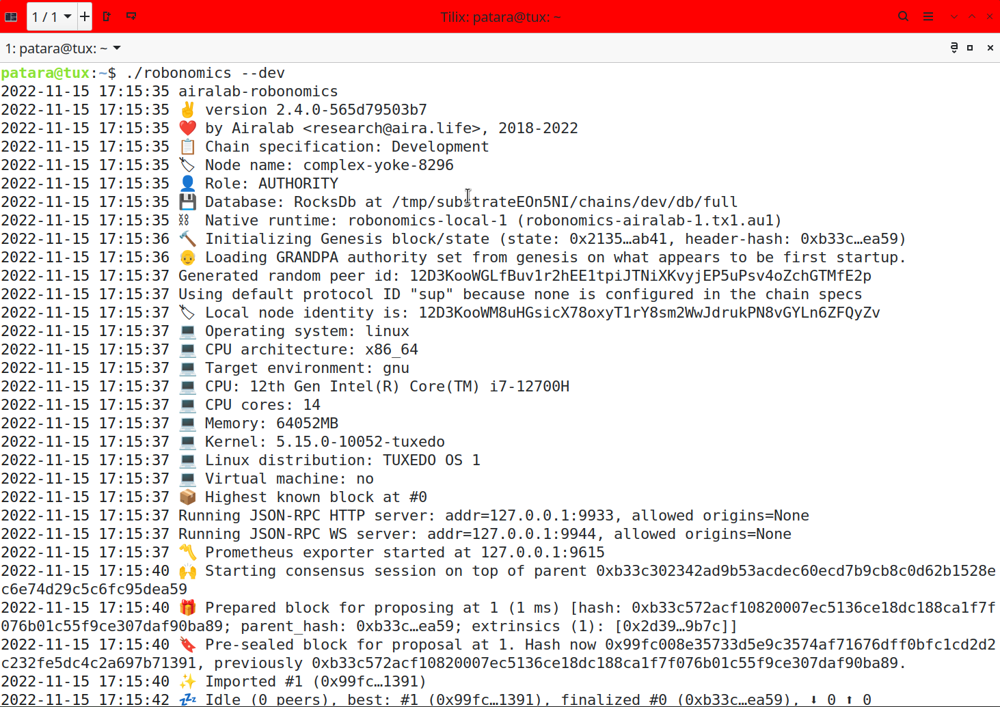
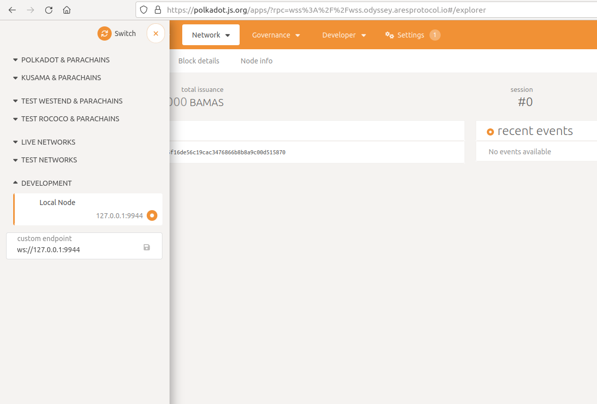
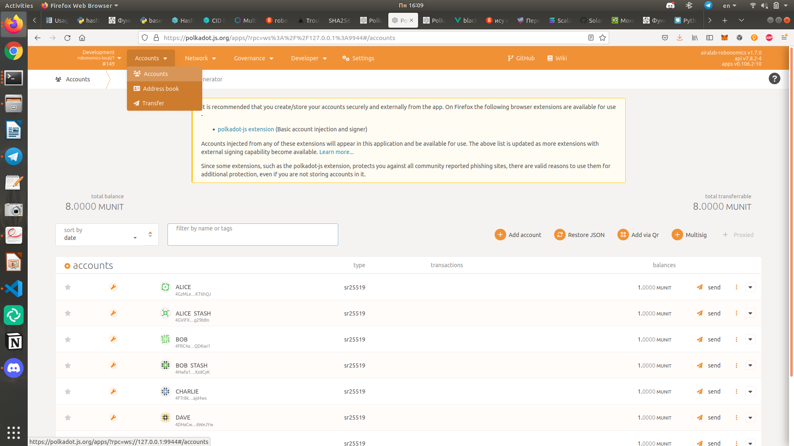
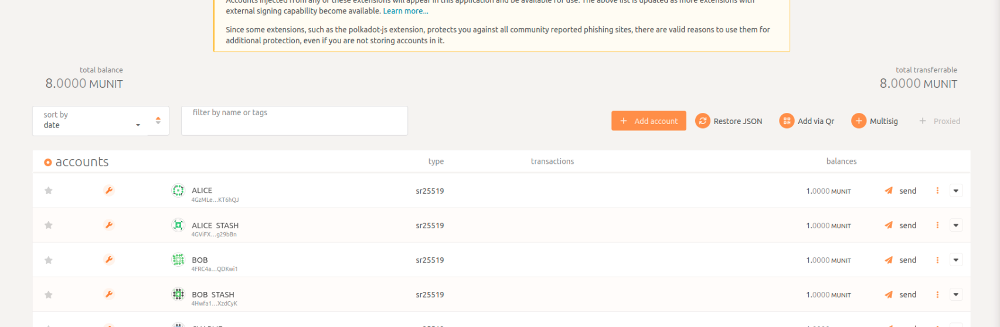
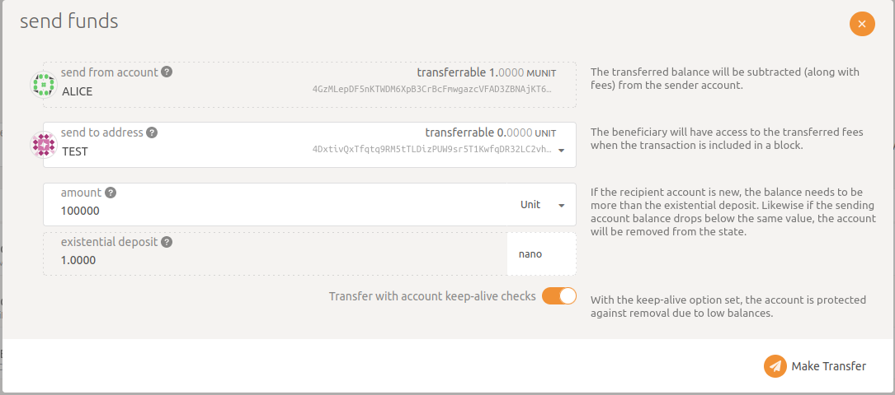

For testing your applications on Robonomics you may want to need to run it in the dev mode.

https://youtu.be/04GsVkZ7aVg

## Run

1. First, you need a binary file, download the archive with it from the latest [release](https://github.com/airalab/robonomics/releases).

2. Unpack it and change permissions:

```bash
tar xf robonomics-1.7.0-x86_64-unknown-linux-gnu.tar.gz
chmod +x robonomics
```

3. And run in the dev mode:

```bash
./robonomics --dev
```
You will see the following output:



## Get tokens

Now you can connect to your local node through the [Polkadot Portal](https://polkadot.js.org/apps/#/explorer).

Change the network to `Local Node` in the upper left corner and press `Switch`.



Then go to `Accounts`:



You can create a new account with the button `Add Account`.



Don't forget to save your seed phrase somewhere.

And use one of existing accounts to send tokens to your new one. Choose for example Alice and press `Send`. Then choose your new account and write the amount of units you want to send and press `Make Transfer`:

