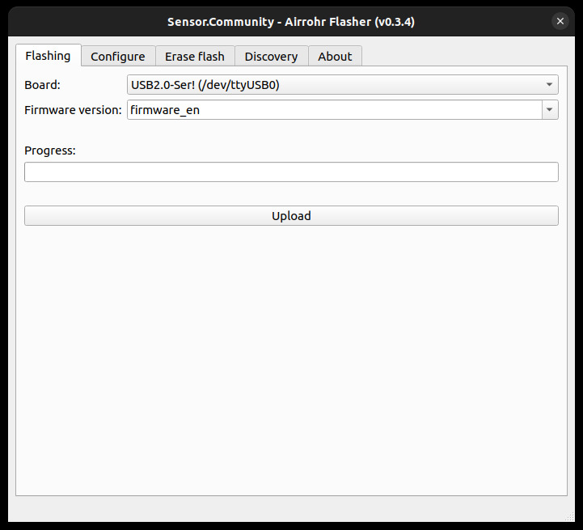

After assembling board, now it's time to set up it.

Robonomics firmware is extended version of the Sensor.Community firmware, with some sensors added and the data sending scheme changed. The source code can be found [at the link.](https://github.com/LoSk-p/sensors-software/tree/master/airrohr-firmware) 

## Requirements 

### Linux

First you need to add a user to the `dialout` group (for Ubuntu) to gain access to the USB port:

```bash
sudo usermod -a -G dialout $USER
```

After that, reboot the computer. 
Next, Download Robonomics  flasher `airrohr-flasher`. Download the executable from [releases](https://github.com/airalab/sensors-connectivity/releases). 

Then change the permissions of the file and run it:

```bash
chmod +x airrohr-flasher-linux
./airrohr-flasher-linux
```

### Windows

You need to install drivers for USB2serial (Windows 10 should start automatically):

* Drivers for NodeMCU v3 (CH340): [Windows](http://www.wch.cn/downloads/file/5.html), alternative ([mirror.](https://d.inf.re/luftdaten/CH341SER.ZIP))

Then download [Robonomics  flasher `airrohr-flasher`](https://github.com/airalab/sensors-connectivity/releases) and unzip the flasher and double-click to run it.

### MacOS

You need to install the drivers for USB2serial:
* Drivers for NodeMCU v3 (CH340): [macOS](http://www.wch.cn/downloads/file/178.html), alternative ([mirror](https://d.inf.re/luftdaten/CH341SER_MAC.ZIP))

Then download [Robonomics  flasher `airrohr-flasher`](https://github.com/airalab/sensors-connectivity/releases) and run it.

## Setup

Connect sensor to PC and run `airrohr-flasher` program. After opening program you will see next:



**Board** field should automatically select port with board. If it is not happened, choose required port form drop-down list.
 > If `airrohr-flasher` can't find your board, check that you have done **Requirements** part property.

Next select the firmware (in English or Russian) and click `Upload`. Uploading the firmware will take some time.

> If you later decided change language or make "clear installation"(need to reset configuration), go to "Erase flash" page and press button to erase the 
> flash memory of sensor. 

After downloading the firmware, reboot the ESP (just disconnect and reconnect the USB).

A few time after the reboot, ESP will create a Wi-Fi network called RobonomicsSensor-xxxxxxxxx. 
Connect to it from your phone or computer, then an authorization window will open (if it doesn't, open browser and go to `192.168.4.1`). 
Select your Wi-Fi network from the list (or write it yourself if it's not on the list) and fill in the password field. Also write the coordinates of the place where the sensor will be installed in the field below:


Click `Save configuration and restart`.

The board will reboot and connect to the specified Wi-Fi network. Open [Robonomics sensors map](https://sensors.robonomics.network/#/) and find your home. In a couple of minutes you will be able to see your sensor with data on map.


That's all with default installation. Here is  a video with full path of board assembling and setting up:

https://www.youtube.com/watch?v=OdTd1sacCso


For a more detailed setup - connect additional sensors or send data to your own server, read next section.

## Additional configuration

First, you need to find the address of the sensor in your Wi-Fi network. To do this, you can use `airrohr-flasher` 
(your computer must be on the same network as the sensor is connected to). Start it and go to the `Discovery` tab, then press `Refresh`, 
wait a moment and your sensor address will appear.


Double-click on this address (or type it into your browser), you will get to the sensor menu:


### add sensor 

Under the `Configuration` tab you can configure the sensors:


Choose sensor, which you connect to board and click `Save configuration and restart`.

### custom API
Also, you can set up sending to your own server. To do this, in the tab `APIs` check `Send to own API` and specify the server address and port (65 for sensors connectivity):


Click `Save and restart` to save the settings.
