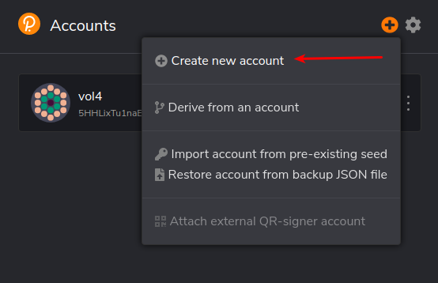
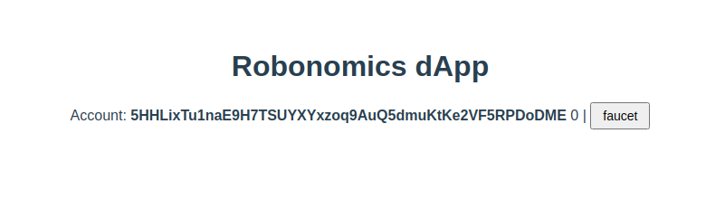
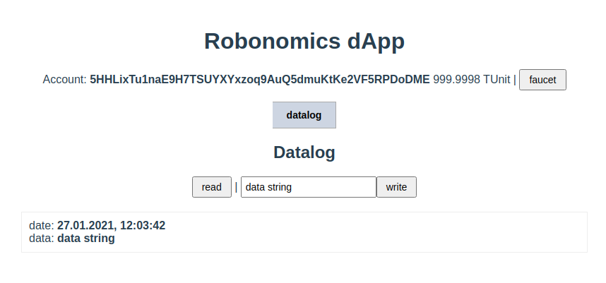
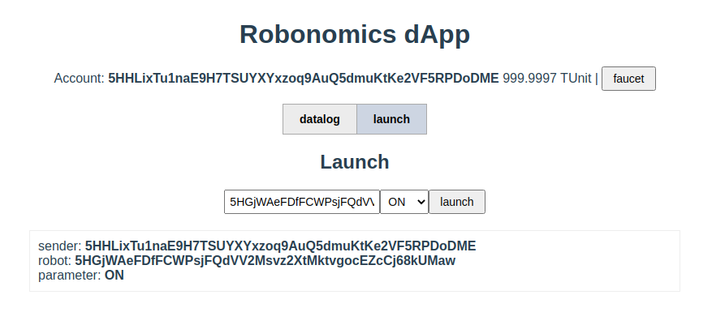
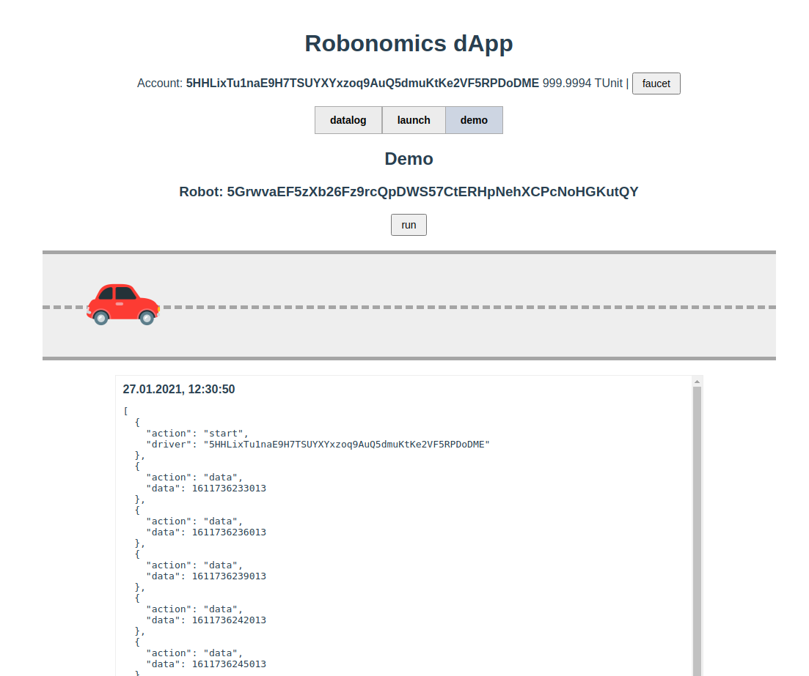

## 준비하기

### Robonomics 노드 출시

dApp 개발 및 테스트를 위해 로컬 Robonomics 노드를 사용합니다. 이렇게하려면 컴파일 된 바이너리 파일 https://github.com/airalab/robonomics/releases를 다운로드해야합니다. Ubuntu를 사용할 예정이므로 적절한 버전을 다운로드합니다.

아카이브 압축 풀기
```sh
wget https://github.com/airalab/robonomics/releases/download/v0.24.0/robonomics-ubuntu-0.24.0-x86_64.tar.xz
tar -xvf robonomics-ubuntu-0.24.0-x86_64.tar.xz
chmod +x robonomics
```

이제 개발 모드에서 노드를 시작할 수 있습니다. 이렇게하려면 --dev 플래그를 사용하십시오.
```sh
./robonomics --dev --tmp
```

> 문제 해결
```sh
./robonomics purge-chain --dev
```

### 브라우저 확장

브라우저에 키를 저장하기위한 `polkadot {.js}` 확장자가 있습니다. dApp에서는이를 사용하여 거래에 서명합니다.

확장 `구글 크롬`과 `Firefox` 현재로 볼 수 있습니다 : https://polkadot.js.org/extension/

확장 프로그램을 설치 한 후 새 계정을 만듭니다.


> 첫 번째 단계가 완료되었습니다.

## DAPP 개발

### 1 단계

> 우리는 vue.js framework를 사용하여 dApp을 작성할 것입니다.하지만 당신이 좋아하거나 할 수있는 것은 무엇이든 사용할 수 있습니다.

vue.js로 시작 애플리케이션을 생성하여 dApp 개발을 시작하겠습니다. 여기서 두 가지 방법으로 수행 할 수 있습니다.

방법 1 :

`Vue cli` 콘솔 유틸리티 사용.
이렇게하려면 https://cli.vuejs.org/guide/installation.html을 설치해야합니다.
Also we will need `yarn`. Install it from [here](https://yarnpkg.com)

설치 후 터미널에서 명령을 실행할 수 있습니다.

```sh
vue create mydapp
```

Setupwizard의 몇 가지 질문에 답하십시오. 버전 Vue 2를 사용하므로 기본 버전 `디폴트 ([Vue 2] babel, eslint)`을 유지합니다. 

방법 2 :

예제와 함께 준비된 git 저장소를 복제하고 1 단계로 전환합니다.

```sh
git clone https://github.com/airalab/example-robonomics-dapp.git mydapp
cd mydapp
git checkout step-1
```

결과적으로 이미 시작되어 브라우저에서 열 수있는 시작 응용 프로그램이 설치된 디렉토리를 얻게됩니다.

```sh
yarn
yarn serve
```

### 2 단계. POLKADOT.JS 시작하기

#### 종속성 설치

dApp을 Robonomics 체인에 연결하려면 `@polkadot/api` 라이브러리가 있습니다. 그리고 키가있는 확장과 dApp의 상호 작용을 위해 `@polkadot/extension-dapp` 라이브러리가 있습니다. 애플리케이션에 설치해야합니다
이 라이브러리 사용에 대한 자세한 내용은 https://polkadot.js.org/docs/ 문서에서 찾을 수 있습니다. 

방법 1 :

```sh
yarn add @polkadot/api @polkadot/extension-dapp
```

`mjs` 확장을 지원하려면 `vue.config.js` 파일도 추가해야합니다.

`vue.config.js`
```js
module.exports = {
  publicPath: "",
  configureWebpack: {
    resolve: {
      extensions: ["*", ".mjs", ".js", ".vue", ".json", ".gql", ".graphql"]
    },
    module: {
      rules: [
        {
          test: /\.mjs$/,
          include: /node_modules/,
          type: "javascript/auto"
        }
      ]
    }
  }
};
```

#### Robonomics에 연결

먼저 Robonomics 노드에 연결하기위한 매개 변수가있는 구성 파일을 생성 해 보겠습니다. 데모 저장소에는이 파일 `config.template.json`의 예가 있습니다.

`src/config.json`
```json
{
  "endpoint": "ws://localhost:9944",
  "types": {
    "Record": "Vec<u8>",
    "Parameter": "Bool",
    "Address": "AccountId",
    "LookupSource": "AccountId"
  }
}
```

이 파일에서는 연결할 노드와 사용자 지정 유형을 나타냅니다.

이제 실행중인 노드에 연결하는 스크립트를 작성해야합니다.

`src/utils/api.js`
```js
import { ApiPromise, WsProvider } from "@polkadot/api";
import config from "../config.json";

let api;
export async function initApi() {
  const provider = new WsProvider(config.endpoint);
  api = await ApiPromise.create({
    provider,
    types: config.types
  });
  return api;
}

export function getApi() {
  return api;
}
```

확장 프로그램의 키로 거래에 서명 할 수 있도록 확장 프로그램에 연결하는 두 가지 기능과 계정을 초기화하는 기능을 추가해 보겠습니다.

`src/utils/api.js`
```js
...OTHER_CODE...

import {
  web3Accounts,
  web3Enable,
  web3FromAddress
} from "@polkadot/extension-dapp";

async function getExtension() {
  const extensions = await web3Enable("demo");
  if (extensions.length === 0) throw new Error("no extension");
  return extensions[0];
}

export async function initAccount(index = 0) {
  const timeout = new Promise(resolve => {
    setTimeout(resolve, 300);
  });
  await timeout;
  await getExtension();
  const accounts = await web3Accounts();
  if (accounts.length > 0) {
    const injector = await web3FromAddress(accounts[index].address);
    api.setSigner(injector.signer);
    return accounts[index].address;
  }
  throw new Error("no accounts");
}

...OTHER_CODE...
```

우리 계좌는 잔액이 0이되지만 약간의 자금이 필요합니다. 그래서 우리는 또 다른 수도꼭지 기능을 만들어야합니다. `--dev` 플래그로 Robonomics를 시작함에 따라 잔액이 많은 `Alice` 계정이 있으므로 거기에서 자금을 요청합니다.

`src/utils/api.js`
```js
...OTHER_CODE...

import { Keyring } from "@polkadot/keyring";

export function getBalance(account, cb) {
  api.query.system.account(account, ({ data: { free: currentFree } }) => {
    cb(currentFree);
  });
}

export const keyring = new Keyring({ type: "sr25519" });

export async function faucet(address) {
  keyring.setSS58Format(api.registry.chainSS58);
  const account = keyring.addFromUri("//Alice");
  const tx = api.tx.balances.transfer(address, 1000000000000000);
  await tx.signAndSend(account);
}

...OTHER_CODE...
```

스크립트 https://github.com/airalab/example-robonomics-dapp/blob/master/src/utils/api.js의 전체 버전

앱 실행

```sh
yarn serve
```

방법 2 :

리포지토리를 복제하여 응용 프로그램을 시작하는 경우이 단계를 완료하려면 2 단계로 전환하고 나머지 종속성을 설치하는 것으로 충분합니다.

```sh
git checkout step-2
cp src/config.template.json src/config.json
yarn
yarn serve
```

### 3 단계. VUE 연결 구성 요소

#### 연결

우리는 이미 연결을위한 스크립트를 작성했습니다. 이제 인터페이스에서 사용할 수 있습니다. 루트 컴포넌트 `App.vue`에서 작성된 `initApi` 함수를 호출하는 것으로 충분합니다. 그리고 사용자가 연결을 기다리는 동안 지금은 줄임표 형태로 작은 로더를 보여줍니다.

방법 1 :

구성 요소 템플릿 및 기본 스타일.

`src/App.vue`
```js
<template>
  <div id="app">
    <h1>Robonomics dApp</h1>
    <div v-if="load">...</div>
    <template v-else>
      <div v-if="error" class="error">{{ error }}</div>
      <template v-else-if="api">
        connected
      </template>
    </template>
  </div>
</template>

...OTHER_CODE...

<style>
#app {
  font-family: Avenir, Helvetica, Arial, sans-serif;
  -webkit-font-smoothing: antialiased;
  -moz-osx-font-smoothing: grayscale;
  text-align: center;
  color: #2c3e50;
  margin-top: 60px;
}
button {
  font-size: 14px;
  padding: 5px 12px;
}
button:hover {
  cursor: pointer;
}
input {
  font-size: 14px;
  padding: 5px;
}
select {
  font-size: 14px;
  padding: 5px;
}
button:focus,
input:focus {
  outline: none;
}
.error {
  color: rgb(151, 31, 31);
  font-weight: bold;
  text-align: center;
  margin: 10px 0;
}
</style>
```

`initApi` 함수가 호출되는 컴포넌트 코드가 있습니다.

`src/App.vue`
```js
<script>
import { initApi } from "./utils/api";

export default {
  name: "App",
  data() {
    return {
      load: false,
      api: null,
      error: null
    };
  },
  created() {
    this.init();
  },
  methods: {
    async init() {
      try {
        this.load = true;
        this.api = await initApi();
        this.load = false;
      } catch (error) {
        this.error = error.message;
        this.load = false;
      }
    }
  }
};
</script>
```

#### 잔액이있는 계정

이제 계정을 사용하여 잔액을 충전하고 인터페이스에 표시 할 수 있습니다

템플릿에 적절한 마크 업을 추가하겠습니다

`src/App.vue`
```js
<template>

  ...OTHER_CODE...

    <template v-else>
      <div v-if="error" class="error">{{ error }}</div>
      <template v-else-if="api && account">
        <p>
          Account: <b>{{ account }}</b> {{ balance }} |
          <button @click="faucet">
            faucet
          </button>
        </p>
      </template>
    </template>

  ...OTHER_CODE...

</template>
```

계정 주소 및 잔액에 대한 새 필드를 추가하겠습니다

`src/App.vue`
```js

...OTHER_CODE...

data() {
  return {

    ...OTHER_CODE...

    account: null,
    balance: 0,

    ...OTHER_CODE...

  };
}

...OTHER_CODE...
```

계정 초기화를 `init` 함수에 추가하고 잔액을 가져와야합니다

`src/App.vue`
```js
<script>
import { initApi, initAccount, getBalance, faucet } from "./utils/api";
import { formatBalance } from "@polkadot/util";

...OTHER_CODE...

async init() {

  ...OTHER_CODE...

  this.api = await initApi();
  this.account = await initAccount();
  getBalance(this.account, balance => {
    this.balance = formatBalance(balance);
  });

  ...OTHER_CODE...

}

...OTHER_CODE...
</script>
```

버튼을 클릭하면 잔액 보충 기능이 추가됩니다

`src/App.vue`
```js

...OTHER_CODE...

  methods: {
    faucet() {
      faucet(this.account);
    },

...OTHER_CODE...
```

https://github.com/airalab/example-robonomics-dapp/blob/step-3/src/App.vue

앱 실행

```sh
yarn serve
```

방법 2:

리포지토리를 복제하여 애플리케이션을 시작한 경우이 단계를 완료하려면 3 단계로 전환하기 만하면됩니다.

```sh
git checkout step-3
yarn serve
```

결과적으로 브라우저에이 사진이 표시됩니다



### 4 단계. 데이터로그

체인의 모든 데이터를 저장하고 읽으려면 `datalog` 모듈을 사용합니다

이 모듈을 사용하는 방법의 예를 들어 `Datalog.vue` 구성 요소를 만들어 보겠습니다.

방법 1 :

마크 업에는 블록으로`읽`은 데이터를 읽는 것이 표시됩니다. 그리고 확장 형태로 데이터를 입력 할 수있는 텍스트 입력 양식과 `쓰기` 버튼이 있습니다.

`src/components/Datalog.vue`
```js
<template>
  <div>
    <h2>Datalog</h2>
    <button @click="read">read</button> |
    <input v-model="data" :disabled="isWrite" />
    <button @click="write" :disabled="isWrite">write</button>
    <div v-if="error" class="error">{{ error }}</div>
    <div v-if="log" class="log">
      <p v-if="log.length === 0" class="error">Not found</p>
      <div v-for="(item, k) in log" :key="k" class="row">
        date: <b>{{ item[0] | dateFormat }}</b>
        <br />
        data: <b>{{ item[1] | dataFormat }}</b>
      </div>
    </div>
  </div>
</template>

...OTHER_CODE...

<style scoped>
.log {
  border: 1px solid #eee;
  text-align: left;
  width: 800px;
  margin: 20px auto;
}
.log .row {
  margin: 10px;
}
</style>
```

구성 요소 코드. 여기서 트랜잭션을 보내는 주요 포인트는 API를 통해 데이터를 전송하고 계정으로 서명하는 함수를 호출하는 것입니다. `this.api.tx.datalog.record(stringToHex(this.data)).signAsync(this.account);`

`src/components/Datalog.vue`
```js
<script>
import { stringToHex, u8aToString } from "@polkadot/util";

export default {
  props: ["api", "account"],
  data() {
    return {
      data: "data string",
      log: null,
      isWrite: false,
      error: ""
    };
  },
  filters: {
    dateFormat: function(v) {
      return new Date(Number(v)).toLocaleString();
    },
    dataFormat: function(v) {
      return u8aToString(v);
    }
  },
  methods: {
    async read() {
      this.log = (await this.api.query.datalog.datalog(this.account)).toArray();
    },
    async write() {
      try {
        this.error = "";
        this.isWrite = true;
        const tx = await this.api.tx.datalog
          .record(stringToHex(this.data))
          .signAsync(this.account);
        await tx.send(result => {
          if (result.status.isInBlock) {
            this.read();
            this.isWrite = false;
          }
        });
      } catch (error) {
        this.error = error.message;
        this.isWrite = false;
      }
    }
  }
};
</script>
```

https://github.com/airalab/example-robonomics-dapp/blob/master/src/components/Datalog.vue

컴포넌트 간 전환을 위해 컴포넌트 출력을 `App.vue`에 추가했습니다.

`src/App.vue`
```js
...OTHER_CODE...

<template v-else-if="api && account">
  <p>
    Account: <b>{{ account }}</b> {{ balance }} |
    <button @click="faucet">faucet</button>
  </p>

  <div>
    <div class="tabs">
      <button
        @click="tab = 'datalog'"
        :class="{ active: tab === 'datalog' }"
      >
        datalog
      </button>
    </div>
    <Datalog v-if="tab === 'datalog'" :api="api" :account="account" />
  </div>
</template>

...OTHER_CODE...

<script>
import Datalog from "./components/Datalog";

...OTHER_CODE...

export default {
  name: "App",
  components: {
    Datalog
  },
  data() {
    return {
      tab: "datalog"

...OTHER_CODE...
</script>

<style>
...OTHER_CODE...

.tabs button {
  font-size: 14px;
  padding: 10px 20px;
  font-weight: bold;
  background: #ececec;
  border: 1px solid #aaa;
}
.tabs button:hover {
  background: #bfbfbf;
}
.tabs button:last-child {
  border-left: none;
}
.tabs button.active {
  background: #ced5e2;
}
</style>
```

앱 실행

```sh
yarn serve
```

방법 2:

리포지토리를 복제하여 애플리케이션을 시작한 경우이 단계를 완료하려면 4 단계로 전환하기 만하면됩니다

```sh
git checkout step-4
yarn serve
```

결과적으로 브라우저에이 사진이 표시됩니다



### 5 단계. 시작

이 기능은 로봇을 시작하고 중지하는 데 사용됩니다. 이 모듈을 사용하는 방법을 보여주기 위해 `Launch.vue` 구성 요소를 작성해 보겠습니다.

방법 1 :

컴포넌트 템플릿에는 로봇의 주소, ON / OFF 클리 커, 보내기 버튼을 지정할 수있는 양식이 있습니다.

`src/components/Launch.vue`
```js
<template>
  <div>
    <h2>Launch</h2>
    <input v-model="robot" :disabled="isWrite" placeholder="Robot address" />
    <select v-model="parameter" :disabled="isWrite">
      <option value="ON">ON</option>
      <option value="OFF">OFF</option>
    </select>
    <button @click="launch" :disabled="isWrite">launch</button>
    <div v-if="error" class="error">{{ error }}</div>
    <div v-if="log.length > 0" class="log">
      <div v-for="(item, k) in log" :key="k" class="row">
        sender: <b>{{ item.sender }}</b>
        <br />
        robot: <b>{{ item.robot }}</b>
        <br />
        parameter: <b>{{ item.parameter ? "ON" : "OFF" }}</b>
      </div>
    </div>
  </div>
</template>

...OTHER_CODE...

<style scoped>
.log {
  border: 1px solid #eee;
  text-align: left;
  width: 800px;
  margin: 20px auto;
}
.log .row {
  margin: 10px;
}
</style>
```

코드는 `Datalog.vue` 구성 요소와 유사합니다. 차이점은 독서에 있습니다. 로봇은 이벤트를 통해 명령을받습니다.

`src/components/Launch.vue`
```js
<script>
export default {
  props: ["api", "account"],
  data() {
    return {
      robot: this.account,
      parameter: "ON",
      log: [],
      isWrite: false,
      error: "",
      unsubscribe: null
    };
  },
  async created() {
    this.unsubscribe = await this.api.query.system.events(events => {
      events.forEach(record => {
        const { event } = record;
        if (event.section === "launch" && event.method === "NewLaunch") {
          const sender = event.data[0].toString();
          const robot = event.data[1].toString();
          const parameter = event.data[2].toHuman();
          this.log.push({
            sender,
            robot,
            parameter
          });
        }
      });
    });
  },
  destroyed() {
    if (this.unsubscribe) {
      this.unsubscribe();
    }
  },
  methods: {
    async launch() {
      try {
        this.error = "";
        this.isWrite = true;
        const tx = await this.api.tx.launch
          .launch(this.robot, this.parameter === "ON")
          .signAsync(this.account);
        await tx.send(result => {
          if (result.status.isInBlock) {
            this.isWrite = false;
          }
        });
      } catch (error) {
        this.error = error.message;
        this.isWrite = false;
      }
    }
  }
};
</script>
```

https://github.com/airalab/example-robonomics-dapp/blob/master/src/components/Launch.vue

표시를 위해 `App.vue`에 새 구성 요소 추가

`src/App.vue`
```js
<template>
...OTHER_CODE...

  <div>
    <div class="tabs">
      <button
        @click="tab = 'datalog'"
        :class="{ active: tab === 'datalog' }"
      >
        datalog
      </button>
      <button
        @click="tab = 'launch'"
        :class="{ active: tab === 'launch' }"
      >
        launch
      </button>
    </div>
    <Datalog v-if="tab === 'datalog'" :api="api" :account="account" />
    <Launch v-if="tab === 'launch'" :api="api" :account="account" />
  </div>

...OTHER_CODE...
</template>

...OTHER_CODE...

<script>
import Datalog from "./components/Datalog";
import Launch from "./components/Launch";

...OTHER_CODE...

components: {
  Datalog,
  Launch
},

...OTHER_CODE...
```

앱 실행

```sh
yarn serve
```

방법 2:

리포지토리를 복제하여 애플리케이션을 시작한 경우이 단계를 완료하려면 5 단계로 전환하기 만하면됩니다

```sh
git checkout step-5
yarn serve
```

결과적으로 브라우저에이 사진이 표시됩니다



### 6 단계. 데모

이 데모에서는 dApp을 통해 시작 및 중지 할 수있는 자동차가 있습니다. 자동차는 여행 중에 통나무를 수집하고 정지 한 후 체인에 저장합니다. 여기서는 별도로 시도한 두 모듈을 함께 사용합니다.

로봇 (자동차)의 동작을 모방하기 위해 Robot 클래스를 작성합니다.이 로봇의 계정으로 `Alice` 키를 사용합니다. `Robot` 클래스는 `NewLaunch` 이벤트를 감시하여 스스로 켜고 끕니다. 전원을 켠 후 데이터를 로그에 수집하기 시작하며 데이터 측면에서는 타임 스탬프 일뿐입니다. 그리고 종료 후에는이 로그를 `데이터 로그` 모듈에 저장합니다.

방법 1 :

`src/utils/robot.js` 파일을 생성합니다. https://github.com/airalab/example-robonomics-dapp/blob/master/src/utils/robot.js 파일의 전체 코드.

시각화를 위해 시작 버튼, 자동차 애니메이션 및 로그 출력이있는 `Demo.vue` 구성 요소를 만듭니다.

`src/components/Demo.vue`
```js
<template>
  <div>
    <h2>Demo</h2>
    <template v-if="robot">
      <h3>Robot: {{ robot.address }}</h3>
      <p v-if="robot.state">Driver: {{ robot.driver }}</p>
      <button @click="run" :disabled="isWrite">
        <template v-if="!robot.state">run</template>
        <template v-else>stop</template>
      </button>
      <div class="road">
        <div
          class="robot"
          :class="[robot.state ? 'robot-play' : 'robot-stop']"
        ></div>
      </div>
      <div v-if="error" class="error">{{ error }}</div>
      <div v-if="log" class="log">
        <p v-if="log.length === 0" class="error">Not found</p>
        <div v-for="(item, k) in log" :key="k" class="row">
          <b>{{ item[0] | dateFormat }}</b>
          <pre>{{ item[1] | dataFormat }}</pre>
        </div>
      </div>
    </template>
  </div>
</template>

...OTHER_CODE...

<style scoped>
.log {
  border: 1px solid #eee;
  text-align: left;
  width: 800px;
  margin: 20px auto;
  height: 500px;
  overflow-y: auto;
}
.log .row {
  margin: 10px;
  border-bottom: 1px solid #eee;
}
.road {
  width: 1000px;
  margin: 20px auto;
  background-color: #eee;
  padding: 20px 0;
  border: 5px solid #a5a5a5;
  border-left: 0;
  border-right: 0;
  position: relative;
}
.road::before {
  content: " ";
  width: 1000px;
  border-top: 5px dashed #a5a5a5;
  position: absolute;
  top: 50%;
  left: 0;
}
@keyframes move {
  from {
    transform: translateX(0);
  }
  to {
    transform: translateX(100%);
  }
}
.robot {
  height: 100px;
  width: 100px;
  color: #fff;
  font-weight: bold;
  font-style: 14px;
  animation: move 30s linear infinite;
  border-radius: 0 10px 10px 0;
  background: url("../images/build-iot-dapps/car.png") no-repeat 0 0;
  background-size: cover;
}
.robot-play {
  animation-play-state: running;
}
.robot-stop {
  animation-play-state: paused;
}
</style>
```

구성 요소 코드. 여기에서 `Robot` 클래스의 인스턴스와 시작 / 중지 기능을 만들어야합니다.

`src/components/Demo.vue`
```js
...OTHER_CODE...

<script>
import { u8aToString } from "@polkadot/util";
import Robot from "../utils/robot";

export default {
  props: ["api", "account"],
  data() {
    return {
      isWrite: false,
      error: "",
      robot: null,
      log: []
    };
  },
  filters: {
    dateFormat: function(v) {
      return new Date(Number(v)).toLocaleString();
    },
    dataFormat: function(v) {
      return JSON.parse(u8aToString(v));
    }
  },
  async created() {
    this.robot = new Robot("//Alice", this.api);
    await this.robot.subscribeLog(r => {
      this.log = r.reverse().map(item => {
        return [item[0], item[1]];
      });
    });
  },
  destroyed() {
    this.robot.destroy();
  },
  methods: {
    async run() {
      try {
        this.error = "";
        this.isWrite = true;
        const tx = await this.api.tx.launch
          .launch(this.robot.account.address, !this.robot.state)
          .signAsync(this.account);
        await tx.send(result => {
          if (result.status.isInBlock) {
            this.isWrite = false;
          }
        });
      } catch (error) {
        this.error = error.message;
        this.isWrite = false;
      }
    }
  }
};
</script>

...OTHER_CODE...
```

https://github.com/airalab/example-robonomics-dapp/blob/master/src/components/Demo.vue

`src/images/build-iot-dapps/car.png`, `src/assets/car.png` 에 다른 차 사진을 추가해 보겠습니다. 예 https://github.com/airalab/example-robonomics-dapp/blob/master/src/assets/car.png

표시를 위해 `App.vue`에 새 구성 요소 추가

`src/App.vue`
```js
<template>

...OTHER_CODE...

  <div>
    <div class="tabs">
      <button
        @click="tab = 'datalog'"
        :class="{ active: tab === 'datalog' }"
      >
        datalog
      </button>
      <button
        @click="tab = 'launch'"
        :class="{ active: tab === 'launch' }"
      >
        launch
      </button>
      <button @click="tab = 'demo'" :class="{ active: tab === 'demo' }">
        demo
      </button>
    </div>
    <Datalog v-if="tab === 'datalog'" :api="api" :account="account" />
    <Launch v-if="tab === 'launch'" :api="api" :account="account" />
    <Demo v-if="tab === 'demo'" :api="api" :account="account" />
  </div>

...OTHER_CODE...

</template>

...OTHER_CODE...

<script>
import Datalog from "./components/Datalog";
import Launch from "./components/Launch";
import Demo from "./components/Demo";

...OTHER_CODE...

components: {
  Datalog,
  Launch,
  Demo
},

...OTHER_CODE...
```

앱 실행

```sh
yarn serve
```

방법 2:

리포지토리를 복제하여 애플리케이션을 시작한 경우이 단계를 완료하려면 6 단계로 전환하면됩니다.

```sh
git checkout step-6
yarn serve
```

결과적으로 브라우저에이 사진이 표시됩니다



이것으로 강의를 마칩니다.

감사합니다!