<!-- 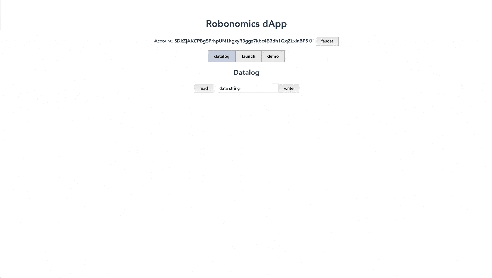 -->


## 서론

이 자습서는 이전 단원을 계속합니다. 이미 간단한 애플리케이션을 구축했으며 계정을 노드에 연결하고 트랜잭션을 전송하고 dapp의 기타 중요한 기능에 집중했습니다. 이제이 애플리케이션을위한 사용자 친화적 인 인터페이스를 구축 할 것입니다.

## 전제 조건

이 튜토리얼은 **HTML, CSS, JavaScript**에 약간 익숙하고 이러한 기술을 분산 응용 프로그램에 적용하는 방법을 배우려는 사람들을 위해 설계되었습니다.

dapp의 인터페이스를 구축하려면 자신에게 편안한 JavaScript 프레임 워크를 선택하거나 프레임 워크없이 인터페이스를 구축 할 수도 있습니다. Robonomics 2021에서는 확장 성이 뛰어나고 사용하기 쉬운 [Vue.js](https://vuejs.org)를 사용합니다.

## 이 튜토리얼을위한 설정

이 단계로 시작하고 학습을 선호하는 경우 다음 할 일 목록을 따라 이전 강의에서 얻은 결과 dapp을 시작하십시오 :

1. [릴리스 페이지에서](https://github.com/airalab/robonomics/releases/tag/v0.22.0) OS에 맞는 로컬 Robonomics v0.22 노드를 다운로드하십시오. 최신 릴리스에서 시스템을 찾지 못한 경우 이전 릴리스에서 최신 버전을 찾으십시오.

2. 터미널에 `./robonomics --dev --tmp`를 입력하여 개발자 모드에서 Robonomics 노드를 시작합니다. 

3. [여기](https://polkadot.js.org/extension/)에서 Chrome 또는 Firefox 용 Polkadot 프로그램을 다운로드하십시오. 

4. [이 저장소를 복제하시시오](https://github.com/vol4tim/example-robonomics-dapp/).

5. [Yarn](https://yarnpkg.com)을 설치하십시오.

6. [@vue/cli](https://cli.vuejs.org/guide/installation.html) 설치하십시오/.

7. 터미널에서 명령으로 dapp 개발을 시작하십시오.
```shell
cp src/config.template.json src/config.json
yarn
yarn serve
```


**브라우저에 다음 화면이 표시되어야합니다 :**

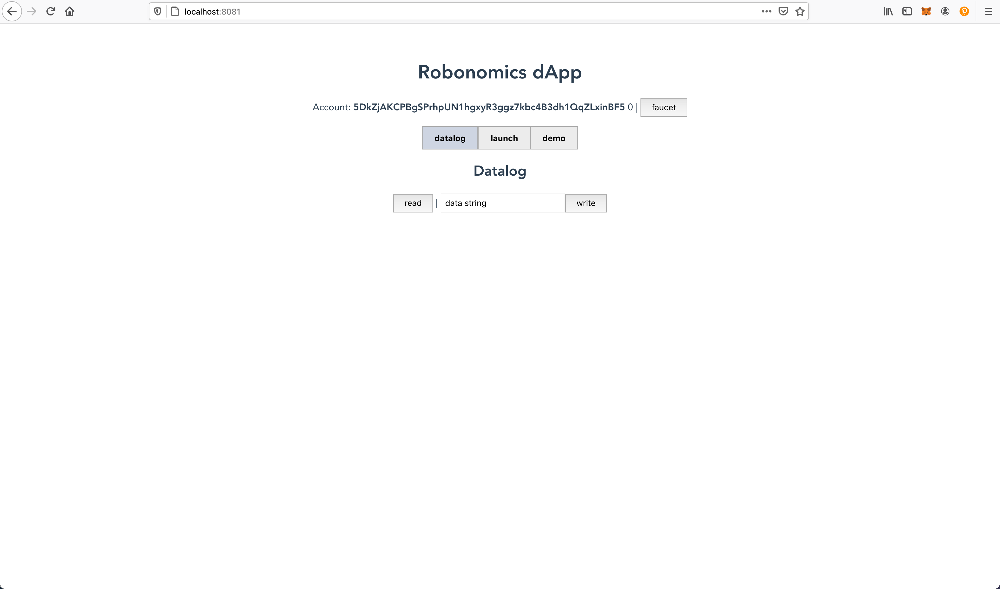


<details>

  <summary>시작을위한 몇 가지 추가 팁</summary>

  - **노드가 실행 중인지** 확인합니다.:
    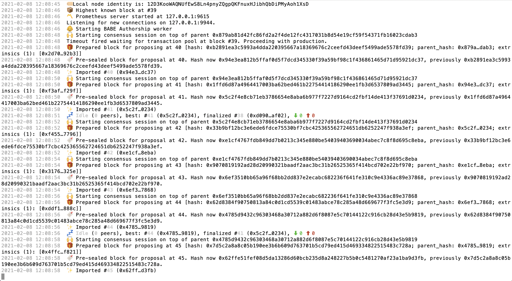

  - **macOS**에서는 **접근 권한**`chmod + x robonomics`를 변경해야 할 수 있습니다. 

  - **Polkadot Extension에 대한 액세스**를 허용했는지 확인합니다 :
    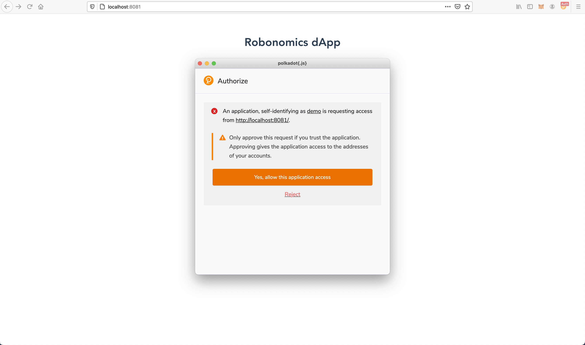

  - 실행중인 노드의 로그에 오류가 있고 dapp이 올바르게로드되지 않는 경우 dev chain의 데이터베이스를 삭제 해보십시오.`sudo rm -rf <YOUR LOCAL PATH>/robonomics/chains/dev/db/`및 재시작 노드. 도움이되지 않으면 컴퓨터를 다시 시작하십시오. 

</details>

## 코드 검사

UI를 변경하기 위해 dapp의 구조를 살펴보고 수정할 수있는 항목과 위치를 정리해 보겠습니다.

```
.
├── public/
│   ├── favicon.ico           # Icon for your dapp
│   └── index.html            # The template file (injects icons links, JavaScript and CSS files for the app)
├── src/
│   ├── assets/               # Folder for images and global styles
│   ├── components/           # Folder with components
│   │   ├── Datalog.vue       # Tab 'Datalog' in dapp
│   │   ├── Demo.vue          # Tab 'Demo' in dapp
│   │   ├── Launch.vue        # Tab 'Launch' in dapp
│   ├── utils/                # Folder with important for app js functions (we will touch api.js in this tutorial)
│   ├── App.vue               # The root of our app, contains HTML, CSS, JS for the whole page. In fact it is Vue Component also
│   ├── main.js               # The app’s entry file, we will import here global styles
├── ...                       # There are config files and dependencies files, that we will not change mannually
├── README.md                 # You can write here any instructions for your dapp

```

> **이 튜토리얼의 코드는이 저장소에 [있습니다](https://github.com/positivecrash/wscool21-ui-dapp)**

## CSS-in-JS VS. Global stylesheets

이 튜토리얼에서는 안정적인 UI 컴포넌트 라이브러리없이 처음부터 작은 dapp의 인터페이스를 변경하는 방법을 보여줍니다. 그래서 다른 Vue 컴포넌트를 가져 와서 생성 할뿐만 아니라 나만의 스타일도 작성하겠습니다.

애플리케이션이 크거나 프로젝트에 여러 dapp이있는 경우 향후에는 UI를보다 체계적이고 효율적으로 만들기 위해 특별히 프로젝트 용 구성 요소 라이브러리를 구축하는 것이 좋습니다 ([예 : 구성 요소 구성](https://storybook.js.org)).또는 표준 인터페이스 테마에 문제가없는 경우 타사의 모든 UI 라이브러리를 사용할 수 있습니다 ([예 :](https://vuetifyjs.com/)).

## 첫 번째 가져 오기 또는 시작 지점

이 dapp에 대한 특정 디자인은 없지만 [Brandbook](https://static.robonomics.network/assets/Robonomics-Visual-Identity.pdf)과  [잘 정립](https://robonomics.network) 된 타이포그래피, 글꼴, 버튼 스타일 등이 있습니다. 처음에는 다음 CSS 파일을 전역으로 가져옵니다 :

```
...
├── src/
│   ├── assets/
│   │   ├── styles/
│   │   │   ├── reset.css         # The goal is to reduce browser inconsistencies
│   │   │   ├── variables.css     # Contains specific values to be reused such as colors, font-names, space values etc.
│   │   │   ├── typography.css    # Global typography for the whole dapp
│   │   │   ├── animation.css     # Keyframe animations used throughout the dapp
...

```

이러한 파일의 내용은 사용자의 인식에 더 적합하다면 App.vue에서 작성할 수 있습니다. 그러나 App.vue를 좀 더 명확하게 유지하려면이 예제에서 일부 CSS 파일을 전역으로 가져 오는 것이 좋습니다.

**main.js** 파일을 편집하여 다음 CSS 파일을 앱으로 가져옵니다 :


```JS
import './assets/styles/reset.css'
import './assets/styles/variables.css'
import './assets/styles/typography.css'
import './assets/styles/animation.css'
```

**dapp에서 글꼴이 변경되었는지 확인하십시오 :**


## 레이아웃 변경 및 제목 꾸미기

응용 프로그램의 레이아웃을 변경해 보겠습니다. 앞서 언급했듯이 App.vue에서 직접 스타일을 작성할 수 있지만이 예제에서는이 프로세스를 분리하는 것을 선호합니다.

- **App.vue**의 `<style>` 태그에서 스타일 주석 처리 또는 삭제합니다 

- 이 애플리케이션의 스타일 폴더에 css 파일 **app.css**를 만들고 **main.js**로 가져옵니다.

```JS
import './assets/styles/app.css'
```

<details>

<summary>앱의 첫 번째 기본 스타일 app.css 작성 :</summary>

```css
#app {
  display: grid;
  grid-template-rows: auto 1fr;
  align-items: stretch;

  text-align: center;
}

body {
  background-color: var(--color-gray-light);
}
```

</details>


<details>

<summary>앱 제목 변경 [App.vue]</summary>

```html
<div class="top">
    <h1>dApp Robonomics Demo</h1>
    <i>Winter School 2021</i>
    
</div>
```

</details>


<details>

<summary>제목 [app.css]의 스타일 작성</summary>

```css
.top {
  position: relative;
  padding-top: var(--space);
  padding-bottom: calc(var(--space)*2);

  border-bottom: 2px solid var(--color-dark);
  background-color: var(--color-light);
}

.top h1 {
  font-size: 1.8rem;
}

.top i {
  display: block;
}

.top .loader-label {
  display: block;
  margin: calc(var(--space)/3) auto;
  max-width: 150px;

  visibility: hidden;
  opacity: 0;
  animation: 0.5s FadeIn 0.3s ease forwards, 0.5s ScaleDown 0.1s ease forwards;
}

.top .label {
  position: absolute;
  width: 100px;
  bottom: -50px;
  left: calc(50% - 50px);
  display: block;

  transform: translateY(1rem);
  visibility: hidden;
  opacity: 0;
  animation: 0.7s FadeIn 0.5s ease forwards, 1s ScaleUp 0.5s ease forwards;
}
```

</details>

- Robonomics 겨울 학교 2021 로고가있는 파일을 **./src/assets/images** 폴더에 넣으십시오.

**다음 화면이 표시됩니다 :**
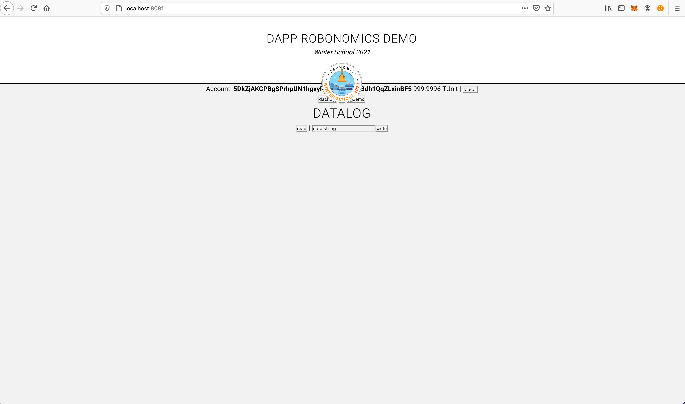

## DAPP 데이터에 따른 스타일 정의

이제 `<div>` 요소에 앱의 콘텐츠를 래핑합니다. 또한 dapp의 다양한 상태 (로드 됨 또는로드되지 않음)에 대해 다른 스타일이 필요합니다.

- **App.vue**를 열고 래핑 요소를 작성합니다 :
```html
<div class="content">
  <!--here is everything going after the title-->
</div>
```
- 변수 `load`를 찾으십시오. 이미 `<script>`에 정의되어 있습니다.
- 객체를 `v-bind:class`에 전달하여 클래스를 동적으로 토글합니다 (축약 된 버전 `:class` 사용).
```html
<div class="content" :class="{ load: load }">
  <!--here is everything going after the title-->
</div>
```
이렇게하면 얻은 데이터에 따라 앱에서 스타일을 쉽게 전환 할 수 있습니다. 아래에서이 클래스의 사용법을 볼 수 있습니다.

## DAPP 데이터에 따른 뷰 정의

앱의 로더를 변경해 보겠습니다.
- 이를 위해 다른 Robonomics 프로젝트에서 내 구성 요소를 가져옵니다

<details>

<summary>./src/components/AnimatedRobonomicsLogo.vue</summary>

```HTML
<template>
  <div class="logo-animated" :style="{transform: 'scale('+scale+')'}">
      <svg version="1.1" xmlns="http://www.w3.org/2000/svg" xmlns:xlink="http://www.w3.org/1999/xlink" x="0px" y="0px" width="196.9px" height="170.3px" viewBox="0 0 196.9 170.3" style="enable-background:new 0 0 196.9 170.3;" xml:space="preserve">
		<g transform="translate(2530 155)">
            <path class="line" d="M-2523.4,7.9l184.2,0.5l-91.7-158.1L-2523.4,7.9z"/>

            <circle class="dot" cx="-2339.7" cy="8.7" r="6.6"/>
            <circle class="dot" cx="-2523.4" cy="8.2" r="6.6"/>
            <circle class="dot" cx="-2430.8" cy="-148.4" r="6.6"/>
            
            <path class="triangle-1" d="M-2477.3-18.3l92.1,0.3l-45.8-79L-2477.3-18.3z"/>
            <path class="triangle-2" d="M-2431.2-18.1l46,0.1l-45.8-79L-2431.2-18.1z"/>
            <path class="triangle-3" d="M-2477.3-18.3l92.1,0.3l-46-20.3L-2477.3-18.3z"/>
          </g>
	</svg>
  </div>
</template>

<script>

export default {

  props: {
    scale: {
      type: String,
      default: '1'
    },
  },

};
</script>

<style scoped>
    /*
    Global styles required:
    FadeIn - keyframe animation from animation: .css
    all --color- variables from variables.css
    */

    .logo-animated {
        transform-origin: 0 0;
    }

    .logo-animated .dot {
        fill: var(--color-blue);
        visibility: hidden;
        opacity: 0;
        animation: 1s FadeIn 0.3s ease forwards;
    }

    .logo-animated .line {
        fill: transparent;
        stroke: var(--color-blue);
        stroke-miterlimit:10;
        stroke-dasharray: 700;
        stroke-dashoffset: 700;
        animation: 1s DrawSvgPath 0.5s ease-in-out forwards; 
    }

    .logo-animated .triangle-1 {
        fill: var(--color-blue);
        visibility: hidden;
        opacity: 0;
        animation: 0.5s FadeIn 0.3s ease forwards, 5s logo-triangle-1 0.1s linear infinite;
    }

    .triangle-2 {
        fill: var(--color-violet-light);
        visibility: hidden;
        opacity: 0;
        animation: 0.5s FadeIn 0.3s ease forwards, 5s logo-triangle-2 0.1s linear infinite;
    }

    .triangle-3 {
        fill: var(--color-violet-mid);
        visibility: hidden;
        opacity: 0;
        animation: 0.5s FadeIn 0.3s ease forwards, 5s logo-triangle-3 0.1s linear infinite;
    }


    @keyframes DrawSvgPath
        {
        to {
            stroke-dashoffset: 0;
        }
        }

    @keyframes logo-triangle-1
    {
        0% { fill: var(--color-blue); }
        25% { fill: var(--color-blue); }
        50% { fill: var(--color-blue); }
        75% { fill: var(--color-violet-light); }
        100% { fill: var(--color-blue); }
    }

    @keyframes logo-triangle-2
    {
        0% { fill: var(--color-violet-light); }
        25% { fill: #E0BDED; }
        50% { fill: var(--color-blue); }
        75% { fill: var(--color-blue); }
        100% { fill: var(--color-violet-light); }
    }

    @keyframes logo-triangle-3
    {
        0% { fill: var(--color-violet-mid); }
        25% { fill: var(--color-violet-light); }
        50% { fill: var(--color-violet-light); }
        75% { fill: var(--color-violet-dark); }
        100% { fill: var(--color-violet-mid); }
    }
</style>
```

</details>

-이 구성 요소를 **App.vue**에 등록합니다
```JS
export default {
  components: {
    Loader: () => import("./components/AnimatedRobonomicsLogo")
  }
}
```
- 이미 알려진 변수`로드를` 사용하여 조건부 Vue 지시문 `v-if`와 함께 삽입합니다 :
```HTML
<div class="content" :class="{ load: load }">
  <Loader v-if="load" />
  <template v-else>
    <!-- here will be main content of loaded dapp -->
  </template>
</div>
```
- 브라우저에서 결과를 확인하십시오. 지금 수정할 몇 가지 문제가 있습니다 :

1. 로더가 제목에 팝업됩니다 (가운데에 있어야 함). 다음 줄을 **app.css**에 삽입 해 보겠습니다 :
```css
body, html, #app {
  height: 100%;
  position: relative;
}
```
2. 연결 속도가 너무 빠르면 잠시 동안 로더 만 깜박입니다. 혼란 스러울 수 있습니다. 앱의 응답에 대한 시간 제한을 설정해 보겠습니다. 그렇게하려면 **api.js**를 열고 `initAccount` 함수에서이 코드를 찾으십시오 :
```JS
const timeout = new Promise(resolve => {
  setTimeout(resolve, 300);
});
```
`300` 대신 `1700`을 설정하고 결과를 확인합니다 :

<!--  -->


## 재사용 가능한 구성 요소 사용

Loader에 대한 이전 섹션에서 구성 요소를 등록하고 사용하는 방법을 이미 살펴 봤지만 이제는 더주의 깊게 살펴 보겠습니다.

계정 섹션을 변경해 보겠습니다. 여기서는 자체 작성 구성 요소 (상자, 버튼, 아이콘)와 타사 구성 요소 ([Vue Polkadot 라이브러리에서 제공](https://vue-polkadot.js.org/vue-ui/vue-identicon/#vue-polkadot-vue-identicon ))를 사용합니다.

### The Box 추가

<details>

<summary>./src/components/Box.vue 파일에 Box 구성 요소 만듭니다 </summary>

```HTML
<template>
    <section class="box" :class="classList">
        <slot />
    </section>
</template>

<script>

export default {

  props: {
    classList: {
      type: String
    },
  },

};
</script>

<style>
    /*
    Global styles required for css variables from variables.css
    */

    .box {
        background-color: var(--color-light);
        border: 1px solid var(--color-dark);
        padding: calc(var(--space)*0.5) var(--space);
        box-shadow: 2px 2px 0 var(--color-dark);
        margin-bottom: calc(var(--space)*1.5);
    }
</style>
```
</details>

이제 dapp 전체에서 여러 번 사용할 수 있습니다. 계정 섹션 예제에서 이것을 보겠습니다 :

- 구성 요소 등록 (**App.vue**):

```JS
export default {
  components: {
    Box: () => import("./components/Box")
  }
}
```

- prop `classList`와 함께 전달 된 추가 클래스가있는 계정 섹션에 사용하십시오 :

```HTML
<Box :classList="'account'">
  Account: <b>{{ account }}</b> {{ balance }} |
  <button @click="faucet">
    faucet
  </button>
</Box>
```

**결과 확인하십시오 :**
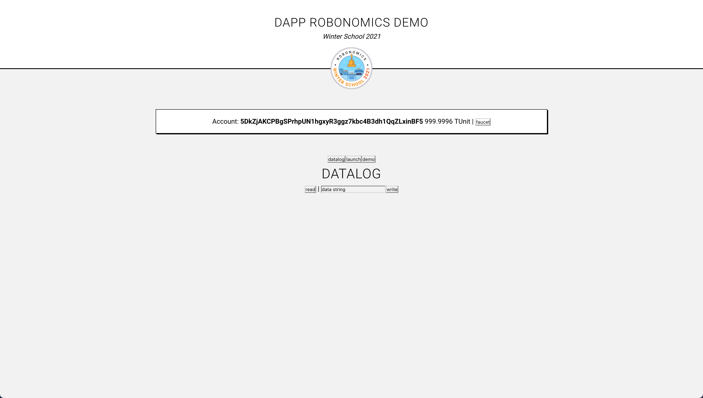

### 버튼 추가

우리가 추가 한 상자의 버튼을 눈치 채지 못할 수도 있습니다. 앱에서 유일한 버튼이 아니므로이를 수정하고 버튼에 대한 구성 요소를 추가해 보겠습니다.

<details>

<summary>./src/components/Button.vue 파일에 Button 구성 요소 만듭니다 </summary>

```HTML
<template>
  <button type="button" :class="classList" @click="onClick" :disabled="disabled" class="inline-block">
    {{ label }}
  </button>
</template>

<script>

export default {

  components: {
    Icon: () => import("./Icon")
  },

  props: {
    label: {
      type: String,
    },
    type: {
      type: String,
      default: 'primary',
      validator: function (value) {
        return ['primary', 'secondary'].indexOf(value) !== -1;
      }
    },
    disabled: {
      type: Boolean,
      default: false,
    },
    size: {
      type: String,
      default: 'medium',
      validator: function (value) {
        return ['small', 'medium', 'large'].indexOf(value) !== -1;
      }
    }
  },

  computed: {
    classList() {
      return {
        'button': true,
        [`${this.type}`]: true,
        [`button__${this.size}`]: true,
      };
    },
  },

  methods: {
    onClick() {
      this.$emit('onClick');
    },
  },

};
</script>

<style>
    /*
    Global styles required for css variables from variables.css
    */

    .button {
        appearance: none;
        -webkit-appearance: none;
        outline: 0;
        border: 0;

        transition: 0.1s all linear;

        padding: .15rem 0.6rem;
        border-width: 1px;
        border-style: solid;
        border-radius: .25rem;
  
        cursor: pointer;

        font-family: var(--font-family);
        font-size: calc(var(--font-size)*0.9);
        line-height: 1;
        font-weight: 500;

        text-transform: uppercase;
        letter-spacing: 1px;
    }   

    .button:not([disabled]):hover {
    filter: saturate(1.5);
    }

    .button[disabled] {
        cursor: default;
        opacity: 0.6;
    }

    button.primary {
        border-color: var(--color-green);
        background-color: var(--color-green);
        color: var(--color-light);
    }

    button.secondary {
        border-color: var(--color-blue);
        color: var(--color-blue);
    }

    button.secondary:not([disabled]):hover {
        background-color: var(--color-blue);
        color: var(--color-light);
    }

    .button__small {
        font-size: .85rem;
        padding: .1rem 0.45rem;
    }

    .button__large {
        font-size: 1.2rem;
        padding: .5rem 1.7rem;
    }

</style>
```
</details>


- 구성 요소 등록합니다 (**App.vue**):

```JS
export default {
  components: {
    Button: () => import("./components/Button")
  }
}
```

- 'Button'구성 요소에 정의 된 소품이있는 'Faucet'버튼에 사용합니다.

```HTML
<Box :classList="'account'">
  Account: <b>{{ account }}</b> {{ balance }}
  <Button label="Faucet" size="large" @onClick="faucet" />
</Box>
```

**우리는 다음과 같은 입장을 얻습니다 :**


Button 구성 요소의 경우 `@onClick`을 사용하여 prop에서 클릭을 내보냈으므로 이제 수도꼭지 기능이 올바르게 작동하는지 확인하겠습니다 (클릭시 잔액이 변경되어야 함).

<!--  -->


### 아이콘 추가

사용자가 유닛과이 버튼을 클릭하지 않고는 디앱과 제대로 상호 작용할 수 없기 때문에 인터페이스의이 요소에 더 많은 관심을 끌기 위해이 버튼에 아이콘을 추가합시다.

이를 위해 준비된 Vue 라이브러리를 아이콘으로 사용할 수 있습니다. 아이콘으로 나만의 구성 요소를 만들겠습니다.

- [큰 온라인 아이콘 아카이브에서](https://www.flaticon.com) 적절한 아이콘을 찾았습니다. 
- .svg 파일을 다운로드하고 벡터 그래픽 편집기에서 적절한 크기로 편집합니다.
- Icon.vue 구성 요소에 svg를 텍스트로 삽입합니다

<details>

<summary>Icon.vue 구성 요소로 얻은 것은 다음과 같습니다</summary>

```JS
<template>
  <div class="icon inline-block" :class="classList">
    <svg v-if="icon == 'faucet'" class="icon-fill" version="1.1" xmlns="http://www.w3.org/2000/svg" xmlns:xlink="http://www.w3.org/1999/xlink" x="0px" y="0px" :width="SvgWidth(20)"  viewBox="0 0 20 24.9" style="enable-background:new 0 0 20 24.9;" xml:space="preserve">
      <path d="M2.7,24.9c0.2,0,2.4,0,2.4-2.4c0-2-2.2-5.2-2.2-5.2s-2.5,3.3-2.5,5.3C0.4,24.6,2.4,24.9,2.7,24.9z M20,10.8V7.2V3.1h-2.6v2.6h-3.1V1.5h2.6c0.4,0,0.8-0.3,0.8-0.8S17.3,0,16.9,0h-6.7C9.8,0,9.5,0.3,9.5,0.8s0.3,0.8,0.8,0.8h2.6v4.1H7.9c-4.7,0-6.2,3.2-6.3,4.8c0,0,0,0.1,0,0.1v2.8H0v2.1h6.2v-2.1H4.6v-2.7c0-0.3,0.4-1.9,3.3-1.9h9.6v2.1L20,10.8L20,10.8z"/>
    </svg>

  </div>
</template>

<script>

export default {
  props: {
    icon: {
      type: String
    },
    classList: {
      type: String
    },
    scale: {
      type: String,
      default: '1'
    },
  },

  methods: {
    SvgWidth(SvgWidth) {
      return `${SvgWidth * this.scale}px`;
    }
  }
};
</script>

<style>
.icon {
    line-height: 1;
}
</style>

```

</details>

버튼과 함께 사용하려면 Button 구성 요소를 편집합니다.

**Button.vue**에서 아이콘 가져 오기 :

```JS
components: {
    Icon: () => import("./Icon")
}
```

소품 등록 :

```JS
props: {
  icon: {
    type: String,
    default: 'none'
  }
}
```

버튼에 아이콘을 추가합니다 (`v-if` 조건으로 다른 템플릿을 지정할 수 있음) :

```HTML
<template v-if="icon != 'none'">
  <Icon :icon="icon" />
  <span v-if="label != ''" class="inline-block">{{ label }}</span>
</template>
<template v-if="icon == 'none' & label != ''">
  {{ label }}
</template>
```

스타일 추가 :

```CSS
.button .icon-fill path {
  fill: var(--color-light);
}

.button > *:not(:last-child) {
  margin-right: calc(var(--space)/2);
}

```

**App.vue**의 버튼에 아이콘 소품을 추가합니다 :

```HTML
<Button label="Faucet" size="large" icon="faucet" @onClick="faucet" />
```

**확인 :**


### Polcadot 아바타 추가

- [@vue-polkadot/vue-identicon](https://vue-polkadot.js.org/vue-ui/vue-identicon/#vue-polkadot-vue-identicon) 설치

- App.vue로 가져 오기 :
```JS
components: {
    Identicon: () => import("@vue-polkadot/vue-identicon")
}
```

- `계정`이라는 단어 대신 아바타를 삽입하고 문서에 따라 소품을 전달하고 계정 데이터를 값 소품으로 사용합니다.
```HTML
<Identicon
  :value="account"
  :theme="'polkadot'"
  :size="40"
  :class="'inline-block'"
/>
```

**확인 :**


## 더 나은보기를위한 데이터 조작

계정 주소를 잘라 봅시다 :

- 계산 된 속성에서 변수 `계정`을 래핑합니다 :

```JS
computed: {
  AccountAddress() {
    return this.account.slice(0, 6) + "..." + this.account.slice(-4);
  }
}
```

- 템플릿에서 변수 `계정`을 `AccountAddress`로 바꿉니다.

**확인 :**

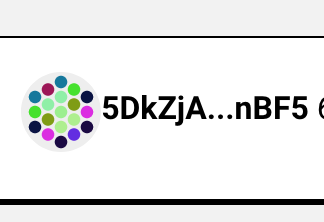

## CSS magic

계정 섹션을 좀 더 예쁘게 만들어 보겠습니다 :

<details>

<summary>주형</summary>

```HTML
<Box :classList="'account'">
              
  <div class="account__address">
    <Identicon
      :value="account"
      :theme="'polkadot'"
      :size="40"
      :class="'inline-block'"
    />

    <code class="inline-block">{{ AccountAddress }}</code>
  </div>
  
  <div class="account__balance">{{ balance }}</div>

  <Button label="Faucet" size="large" @onClick="faucet" />
  
</Box>
```

</details>


<details>

<summary>스타일 (app.css)</summary>

```CSS
.account {
  display: grid;
  grid-template-columns: repeat(3, 1fr);
  align-items: center;
  justify-items: stretch;
  column-gap: var(--space);
}

.account__balance {
    font-size: 150%;
    font-weight: 500;
    font-family: var(--font-family-code);
    white-space: nowrap;
}

.account__address > *:not(:last-child) {
    margin-right: calc(var(--space)/2);
}
```

</details>

<!--  -->


탭의 스타일을 편집 해 보겠습니다.

<details>

<summary>스타일 (app.css)</summary>

```CSS
.tabs {
  display: grid;
  grid-template-columns: repeat(3, 1fr);
  margin-top: calc(var(--space)*2.5);
}

.tabs button {
  text-transform: uppercase;
  letter-spacing: 1px;
  border-width: 0 0 1px;
  font-family: var(--font-family);
  font-size: calc(var(--font-size)*1.5);
  font-weight: 300;
  cursor: pointer;
  transition: 0.2s all linear;
}

.tabs button:not(.active) {
  opacity: 0.5;
  border-color: var(--color-gray)
}

.tabs-content {
  padding-top: var(--space);
}
```

</details>

<details>

<summary>최소한의 템플릿 변경 :</summary>

```HTML
<div class="tabs-content">
  <Demo v-if="tab === 'demo'" :api="api" :account="account" />
  <Launch v-if="tab === 'launch'" :api="api" :account="account" />
  <Datalog v-if="tab === 'datalog'" :api="api" :account="account" /> 
</div>
```

</details>

<!--  -->


> 이 튜토리얼의 완성 된 코드가이 [저장소에 있음을](https://github.com/positivecrash/wscool21-ui-dapp) 상기시켜 드리겠습니다. 다음 단계로 이동하겠습니다 :)

## 데이터 로그

dapp : 버튼에 이미 알려진 UI 요소를 수정하는 것부터 시작합니다 ( '수도꼭지'에 대해 수행 한 것과 동일하지만 소품이 다릅니다).

그런 다음 이러한 요소를 의미별로 구분하기 위해 `<fieldset>`에 래핑합니다. 그리고 fieldset 및 input 요소에 대한 고유 한 스타일을 작성합니다.

<details>

<summary>Dialogue.vue의 템플릿 :</summary>

```HTML
<div class="tools">
  <fieldset>
    <Button label="Read data" size="large" type="secondary" @onClick="read" />
  </fieldset>

  <fieldset>
    <input v-model="data" :disabled="isWrite" class="large" />
    <Button label="Write" :disabled="isWrite" size="large" type="secondary" @onClick="write" />
  </fieldset>
</div>
```

</details>


<details>

<summary>app.css의 입력 요소에 대한 스타일-전역이어야합니다 :</summary>

```CSS
input, select{
  padding: .3rem 0.6rem;
  border: 1px solid var(--color-gray);
  background-color: var(--color-light);
  border-radius: var(--radius);
  font-size: var(--font-size);
  font-family: var(--font-family-code);
  border-radius: .25rem;
  transition: 0.2s ease all;
}

input:focus {
  border-color: var(--color-dark);
}

input.large, select.large {
  font-size: 1.2rem;
  padding: .35rem 1rem;
}


.tools *, .tools fieldset:not(:last-child):after {
  display: inline-block;
  vertical-align: middle;
  vertical-align: -moz-middle-with-baseline;
  vertical-align: -webkit-baseline-middle;
}

.tools fieldset {
  border: 0;
}

.tools fieldset:not(:last-child):after {
  content: "•";
}

.tools fieldset > *,  .tools > * {
  margin-right: calc(var(--space)/2)
}
```

</details>

**업데이트 후 모든 것이 잘 작동하는지 확인합시다 :**

<!-- 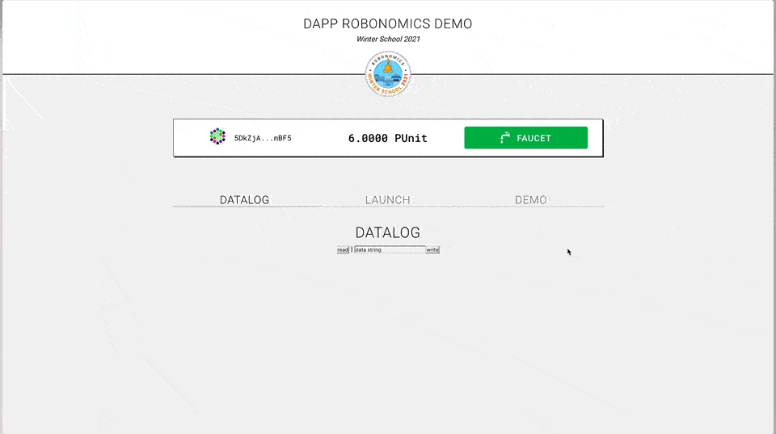 -->


dapp 전체에 데이터 로그 섹션이 있으므로 구성 요소를 만들겠습니다

<details>

<summary>새 구성 요소 DatalogSection.vue에 대한 다음 코드가 있습니다.</summary>

```HTML
<template>
    <div v-if="log" class="log">
        <h4 class="log-title">Datalog</h4>

        <div class="log-content">

          <p v-if="log.length === 0" class="error">Not found</p>

          <details v-for="(item, k) in log" :key="k" class="box" :open="k === 0">
              <summary>{{ item[0] }}</summary>
              <pre>{{ item[1] }}</pre>
          </details>
        </div>
    </div>
</template>

<script>

export default {

  props: {
    log: {
      type: Array
    }
  },

}

</script>

<style>

.log {
  text-align: left;
  margin: var(--space) auto;
  width: 100%;
}

.log-content {
  border: 1px solid var(--color-gray);
  max-height: 500px;
  overflow-y: auto;
  padding: var(--space);
  background-color: var(--color-gray-middark);
  outline: 1px solid #fff;
  box-shadow: 0 0 60px 20px #fff inset;
}

.log-title {
  color: var(--color-gray-dark);
  font-weight: 300;
  font-family: var(--font-family-code);

  border-bottom: 1px solid var(--color-gray);
}

.log .box {
  margin-bottom: var(--space);
}

details {
  transition: 0.2s all ease;
}

details summary {
  cursor: pointer;
}

details.box {
  padding-top: 0;
  padding-bottom: 0;
}

details.box[open] {
  padding-bottom: calc(var(--space)*0.5);
}

details.box:focus {
  box-shadow: 0 0 5px var(--color-gray)
}

details.box summary {
  padding-top: calc(var(--space)*0.5);
  padding-bottom: calc(var(--space)*0.5);
}

details.box[open] summary {
  border-bottom: 1px solid var(--color-dark);
  margin-bottom: calc(var(--space)*0.5);
  font-weight: 500;
}

.log details.box summary {
  font-family: var(--font-family-code);
}

</style>
```

</details>

여기서주의해야 할 사항 : prop `log`를 배열로 전달합니다. 이 다차원 배열에는 항목 로그가 포함되고 모든 항목에는 제목 (dapp의 모든 로그에 대해 날짜를 썼습니다)과 내용이 있다고 가정합니다. **Datalog.vue** 및 **Launch.vue** 구성 요소의 배열을 다시 포맷해야합니다.

이제 **Datalog.vue**를 편집하십시오. 로그를 얻는 Find 메서드 :
```JS
async read() {
  this.log = (await this.api.query.datalog.datalog(this.account)).toArray();
}
```

이제 **Datalog.vue**의 데이터 형식을 지정하고 **DatalogSection.vue**에 대한 준비된 로그 배열을 전달해야합니다. 따라서 로그 배열을 매핑 해 보겠습니다 :
```JS
async read() {
  this.log = (await this.api.query.datalog.datalog(this.account)).toArray().map((item) => {
    return [new Date(Number(item[0])).toLocaleString(), u8aToString(item[1])]
  });
}
```

이 코드는 더 이상 필요하지 않습니다 :
```JS
filters: {
  dateFormat: function(v) {
    return new Date(Number(v)).toLocaleString();
  },
  dataFormat: function(v) {
    return u8aToString(v);
  }
}
```

**데이터 로그 탭에서 데이터 로그 섹션을 확인해 보겠습니다 :**

<!-- 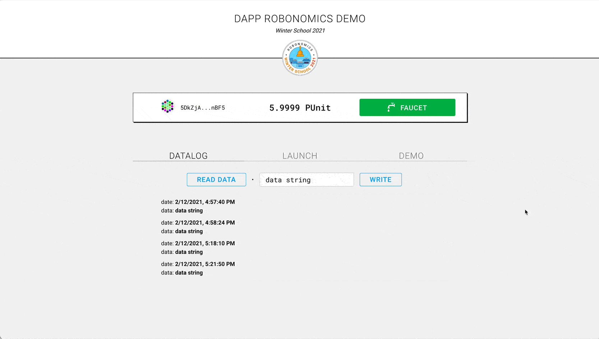 -->


## 시작

이 단계에서는 대부분의 개선이 이미 완료되었으므로 템플릿에 적용하기 만하면됩니다. Import Button 및 Datalog 구성 요소는 과도한 제목을 제거합니다 :

<!--  -->


`선택` `컨트롤` 요소를 확인란으로 대체하겠습니다 :

대신 :
```HTML
<select v-model="parameter" :disabled="isWrite">
  <option value="ON">ON</option>
  <option value="OFF">OFF</option>
</select>
```

이것을 쓰십시오 :
```HTML
<div class="toggler inline-block">
  <input v-model="parameter" :disabled="isWrite" type="checkbox" id="robot-switch" />
  <label for="robot-switch"><span></span></label>
</div>
```

<details>

<스타일 (app.css):</summary>

```CSS
.toggler input { display: none; }
.toggler label {
  position: relative;
  display: block;
  width: 60px;
  height: 40px;
  border-radius: 4px;
  font-weight: 500;
  text-transform: uppercase;
  letter-spacing: 1px;
  cursor: pointer;
  background-color: var(--color-gray);
  color: var(--color-light);
  text-align: center;
}

.toggler label:before {
  content: 'Off';
  width: 100%;
  text-align: center;
  line-height: 40px;
}

.toggler label:after {
  content: '';
  display: block;
  width: 6px;
  height: 100%;
  border-radius: 10px;
  background-color: var(--color-gray-dark);

  position: absolute;
  top: 0;
  left: 0;
  z-index: 10;

  transition: 0.3s ease-out all;
}

.toggler input:checked + label {
  background-color: var(--color-green);
}

.toggler input:checked + label:before {
  content: 'On';
}

.toggler input:checked + label:after {
  transform: translateX(54px);
  background-color: #007038;
}
```

</details>

<!-- 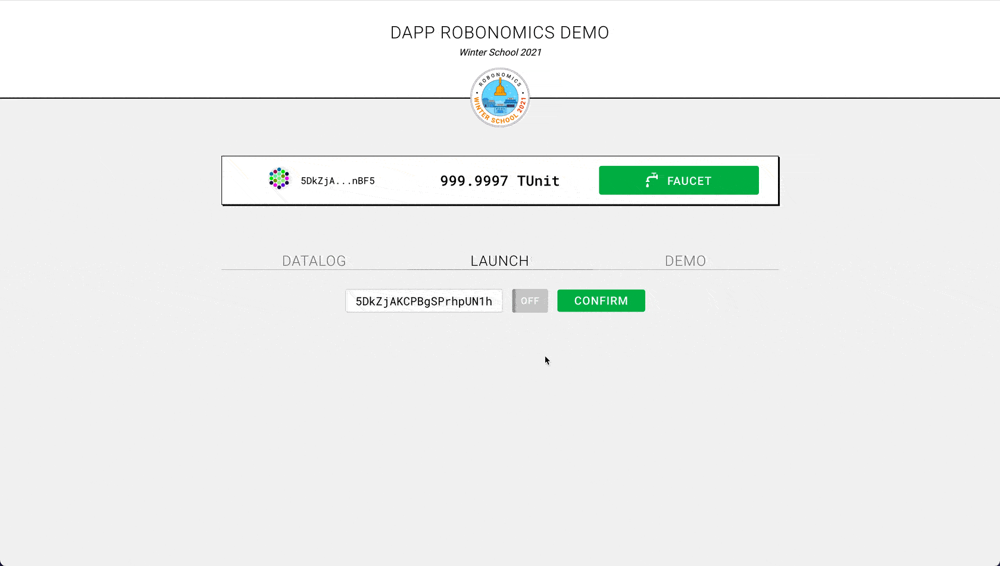 -->


인터페이스에 대해 명확히하고 싶습니다. 이러한 요소를 사용하여 일부 장치를 시작합니다. 시각화 해 봅시다. 드론을 선택 했으므로 `item.parameter`에 따라 클래스를 전환하겠습니다.

`데이터`에 새 속성을 만듭니다 :
```JS
data() {
  status: false
}
```

버튼을 클릭하고 tx가 블록으로 전송 된 후 상태에 매개 변수 값을 할당합니다 :
```JS
methods: {
    async launch() {
      try {
        this.error = "";
        this.isWrite = true;

        const tx = await this.api.tx.launch
          .launch(this.robot, this.parameter === "ON")
          .signAsync(this.account);

        await tx.send(result => {
          if (result.status.isInBlock) {
            this.isWrite = false;
            this.status = this.parameter; // new line here
          }
        });
      } catch (error) {
        this.error = error.message;
        this.isWrite = false;
      }
    }
  }
```

**Launch.vue**에서 드론의 스타일을 작성하십시오. 이 구성 요소에만 스타일을 적용하려면 `<style>` 태그의 범위를 지정하는 것을 잊지 마십시오.

<details>

<summary>드론 용 CSS :</summary>

```CSS
<style scoped>
.tools {
  position: relative;
  padding-left: 120px;
  text-align: left;
  display: inline-block;
}

.launch-drone {
  position: absolute;
  width: 100px;
  left: 0;
  filter: grayscale(1);
  transition: 1s all ease-in;
}

.launch-drone.on {
  filter: grayscale(0);
  animation: DroneLaunch 10s linear infinite;
}

@keyframes DroneLaunch {
  0%, 20%, 40%, 60%, 80%, 100% {
    transform: translateY(0);
  }
  10%, 30%, 50%, 70%, 90% {
    transform: translateY(-20%);
  }
}
</style>
```

</details>

<!--  -->


이제 **DatalogSection.vue** 구성 요소를 추가하겠습니다.

```JS
components: {
  DatalogSection: () => import("./DatalogSection")
}
```

다음에서 로그 배열을 다시 포맷하십시오 :

```JS
this.log.push({
  sender,
  robot,
  parameter
});
```

(`[[ "entry 1 date", "entry 1 content"], [ "entry 2 date", "entry 2 content"]]`와 같은 구조의 경우) :

```JS
this.log.push([new Date().toLocaleString(), {
  sender,
  robot,
  parameter
}]);
```

템플릿에서 코드를 바꿉니다 :

```HTML
<div v-if="log.length > 0" class="log">
  <div v-for="(item, k) in log" :key="k" class="row">
    sender: <b>{{ item.sender }}</b>
    <br />
    robot: <b>{{ item.robot }}</b>
    <br />
    parameter: <b>{{ item.parameter ? "ON" : "OFF" }}</b>
  </div>
</div>
```

이것으로 :

```HTML
<DatalogSection :log="log"/>
```

**확인 :**
<!--  -->


때로는 약간의 오류가 발생하지만 거의 불가피합니다. 연결에 문제가 생기거나 다른 일이 발생할 수 있습니다. 그래서 우리는 dapp을 통해 오류 메시지와 함께 폴백을 가지고 있으며, 코드는 다음과 같이 처음부터 변경하지 않았습니다 :

```HTML
<div v-if="error" class="error">{{ error }}</div>
```

인터페이스에서 오류는 다음과 같이 보입니다 :


**app.css**에서 `.error`에 대한 스타일을 추가합니다 :

```CSS
.error {
  font-weight: 400;
  text-transform: uppercase;
  letter-spacing: 1px;
  color: var(--color-red);
}
```

`.tools` 섹션과 하단의 다른 콘텐츠 사이의 공간도 **app.css**에서 수정합니다.

```CSS
.tools {
  margin-bottom: var(--space);
}
```

결과는 :

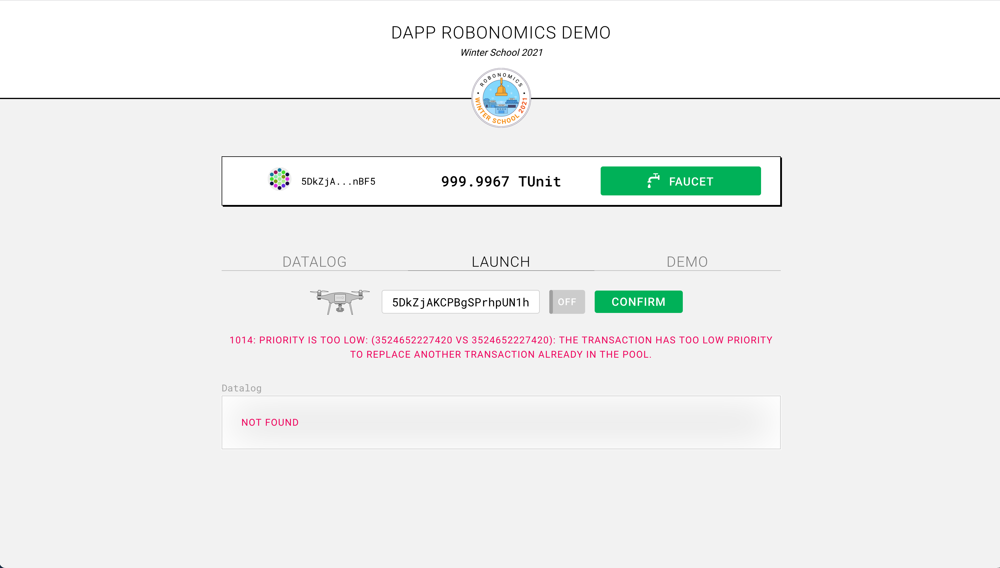

이제이 페이지에서 "기본"버튼이 필요합니다. 기술적으로는 괜찮지 만 위의 사용자 경험으로는 괜찮지 않습니다. 화면에서 하나 이상의 일반적인 버튼을 사용하지 않는 것이 좋습니다. 따라서이를 수정하고 속성 `type = "secondary"`로 **Launch.vue**에 `Button`을 추가해 보겠습니다. 

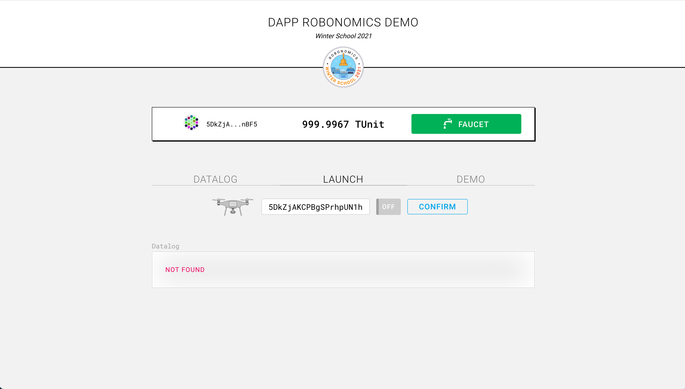

좋습니다. 이제 노드의 일부 문제를 수정하고 데모 단계로 이동하겠습니다.

## 데모

처음에는 가장 관련성이 높은 탭에 더 많은주의를 기울이기 위해 탭을 바꾸고 싶지만 이것이 우리가 연습하는 첫 번째 단계는 아닙니다. 먼저 **App.vue**에서 탭을 뒤집습니다.

기본 데이터를 바꾸는 것을 잊지 마십시오 :

```JS
data() {
    return {
      ...
      tab: "demo"
    };
},
```

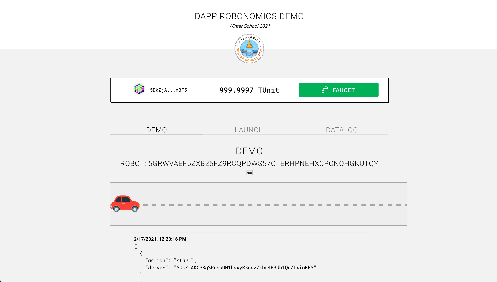

평소처럼 이미 가지고있는 것을 변경하는 것부터 시작합시다.

- 이전 단계에서와 같이 `<h2>Demo</h2>` 제목을 제거합니다.
- 이미 학습 한 UI 요소 (데이터 로그, 버튼, 계정 주소)를 찾습니다. 그러나 그렇게 빠르지는 않습니다. 이제 데이터 로그 만 변경하겠습니다.

**Demo.vue**에 구성 요소를 추가합니다.

```JS
components: {
  DatalogSection: () => import("./DatalogSection")
}
```

```HTML
<DatalogSection :log="log"/>
```

로그에 원시 데이터가 있으므로 이전 단계에서와 같이 구성 요소 준비보기 데이터를 전달하기 위해 로그로 배열을 다시 포맷해야합니다. 라인 `return [item [0], item [1]];`을 찾습니다 `async created()`에서 다음으로 바꿉니다 :

```JS
return [new Date(Number(item[0])).toLocaleString(), JSON.parse(u8aToString(item[1]))];
```

로그에서 사용하지 않는 코드를 제거하십시오 :

```HTML
<div v-if="log" class="log">
  <p v-if="log.length === 0" class="error">Not found</p>
  <div v-for="(item, k) in log" :key="k" class="row">
    <b>{{ item[0] | dateFormat }}</b>
    <pre>{{ item[1] | dataFormat }}</pre>
  </div>
</div>
```

또는:

```JS
filters: {
  dateFormat: function(v) {
    return new Date(Number(v)).toLocaleString();
  },
  dataFormat: function(v) {
    return JSON.parse(u8aToString(v));
  }
},
```

**확인:**
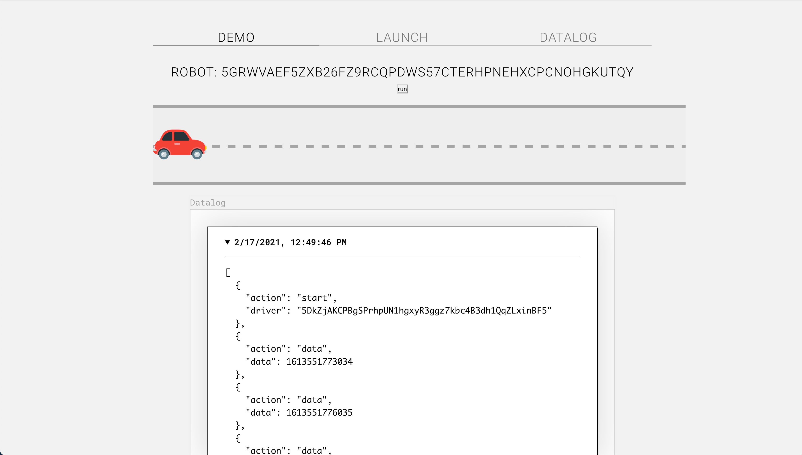

로봇을 시작하여이 데모 예제를 사용자 정의하려면 아이디어를 자유롭게 생각해 낼 수 있습니다. 개인적으로 저는이 도시에서 시작했습니다 :

<!--  -->


혼동하지 않도록 전체 코드를 보여주지는 않겠지 만 개략적으로 다음과 같은 내용이있을 것입니다 :

```HTML
<div class="demo" :class="[robot.state ? 'play' : 'stop']">
  <div class="demo-back"></div>
  <div class="demo-city"></div>
  <div class="demo-car"></div>
</div>
```

그런 다음 `.demo.play` 요소 내에 도시를 뒤로 이동하고 자동차를 앞으로 이동하는 스타일을 작성합니다.

이 작업을하면서 저는 CyberPunk 도시를 실현한다는 아이디어를 떠올 렸습니다. 특별한 작업이 없어서 차가 택시가되었고, 운전자가 승객이되었고, 이제 인터페이스에 승객을 맞이하는 AI 로봇 홀로그램이 있습니다 (모두 CSS와 그래픽 조정 및 트릭입니다).

**Cyberpunk 도시 데모 코드 :**

<details>

<summary>주형</summary>

```HTML
<div class="demo" :class="[robot.state ? 'play' : 'stop']">
  <div class="demo-back-1"></div>
  <div class="demo-back-2"></div>
  <div class="demo-city-1"></div>
  <div class="demo-car"></div>

  <div class="demo-data">
    <div class="demo-data-driver inline-block">
      
    </div>
    <div class="demo-data-lines inline-block">
      <div class="demo-data-line">
          <div>Robot</div>
          <div>[ {{ addressShort(robot.address) }} ]</div>
      </div>

      <div class="demo-data-line" v-if="robot.state">
          <div>Passenger</div>
          <div>[ {{ addressShort(robot.driver) }} ]</div>
      </div>

      <div class="demo-data-welcome" v-if="robot.state">
          <span>Hello, passenger. </span>
          <span>I've linked to the vehicle. </span>
          <span>Your ride begins, congrats! </span>
      </div>
    </div>

  </div>

  <Button :label="robot.state ? 'stop' : 'run'" :disabled="isWrite" size="large" @onClick="run" />
</div>
```

</details>

축약해야 할 해시 주소가 두 개 이상 있으므로 메서드를 추가했습니다 :

```JS
methods: {
  addressShort(address) {
    return address.slice(0, 6) + "..." + address.slice(-4);
  }
}
```

Button 구성 요소를 등록하는 것을 잊지 마십시오

```JS
components: {
  Button: () => import("./Button")
}
```

<details>

<summary>스타일</summary>

```CSS
<style scoped>
.demo {
    --h: 120px;
    --color-yellow: #F2F209;

    background-color: #AFCCD3;

    background: linear-gradient(#010123, #4baac7);

    position: relative;
    height: 500px;
    overflow: hidden;

    border-width: 2px 2px 2px 15px;
    border-style: solid;
    border-color: var(--color-yellow);
    
}

.demo:before {
    content: '[ Delamain cabs rental DEMO ]';
    background-color: var(--color-yellow);
    color: #000;

    position: absolute;
    top: 0;
    left: 0;
    padding: .5rem 1rem;

    text-transform: uppercase;
    letter-spacing: 1px;
    font-weight: 300;

    border-width: 0 6px 2px 0;
    border-style: solid;
    border-color: #7B186E;
}

div[class^=demo-back-], div[class^=demo-city-] {
    position: absolute;
    left: 0;
    width: 100%;
    z-index: 2;
}

div[class^=demo-back-]{
    border-top: 1px solid #364444;
}

div[class^=demo-city-] {
    background-repeat: repeat-x;
    background-size: cover;
    background-position: 100% 0;

    height: 300px;
    bottom: var(--h);

    animation: 50s MoveCity infinite linear 1.5s;
}

div.demo-back-1 {
    background-color: #060236;
    background: linear-gradient(#7B186E, #060236);
    height: var(--h);
    bottom: 0;
}

div.demo-back-2 {
    background-color: #c515ae;
    border-width: 2px 0;
    border-style: solid;
    border-color: #69045c;

    height: 20px;
    bottom: var(--h);
    z-index: 10;
}

div.demo-city-1 {
    background-image: url(../assets/images/city-1.png);
}

.demo-car {
    background-image: url(../assets/images/car.png);
    background-size: contain;
    background-repeat: no-repeat;
    background-position: 100% 0;

    width: calc(508px * 0.5);
    height: calc(257px * 0.5);
    position: absolute;
    bottom: calc(var(--h) + 4px);
    z-index: 10;

    transform: translateX(-100px);
    animation: MoveCar 50s infinite 1.5s linear;
}

.demo.play div[class^=demo-city-], .demo.play .demo-car { animation-play-state: running; }
.demo.stop div[class^=demo-city-], .demo.stop .demo-car { animation-play-state: paused; }

.demo.play .demo-car {
    background-image: url(../assets/images/car-ride.png);
}


.demo button {
    background-color: var(--color-yellow);
    border-color: var(--color-yellow);
    color: #000;

    position: absolute;
    bottom: 30px;
    right: 30px;
    z-index: 1000;
}

.demo-data {
    position: absolute;
    bottom: 30px;
    left: 30px;
    z-index: 1000;

    background-color: rgba(0, 0, 0, .5);
    color: #fff;
    padding: .5rem;
    font-family: var(--font-family-code);

    transition: 0.2s all ease;
}

.demo-data-lines {
    max-width: 400px;
}

.demo-data-line {
    display: grid;
    grid-template-columns: 100px auto;
    gap: .5rem;
    text-align: left;
}

.demo-data-line div:first-child {
    text-transform: uppercase;
    letter-spacing: 1px;
    font-weight: 700;
}

.demo-data-driver {
    margin-right: 1rem;
}

.demo-data-driver img {
    display: block;
    max-width: 100px;

    visibility: hidden;
    opacity: 0;
    animation: FadeInBlink .3s cubic-bezier(0.075, 0.82, 0.165, 1) 0.6s forwards;
}

.demo-data-welcome {
    text-align: left;
    padding-top: .5rem;
}

.demo-data-welcome span {
    visibility: hidden;
    opacity: 0;

    animation-name: FadeIn;
    animation-timing-function: cubic-bezier(0.075, 0.82, 0.165, 1);
    animation-duration: 0.6s;
    animation-fill-mode: forwards;
}

.demo-data-welcome span:nth-child(1) { animation-delay: 1.5s; }
.demo-data-welcome span:nth-child(2) { animation-delay: 2.5s; }
.demo-data-welcome span:nth-child(3) { animation-delay: 3.2s; }


@keyframes MoveCity
{
  100% {
    background-position: -1000px 0;
  }
}

@keyframes MoveCar
{
    0% {
        transform: translateX(-100px);
    }
    100% {
        transform: translateX(960px);
    }
}
</style>

```

</details>

**결과:**

<!--  -->


## 결론

축하합니다! 이제 dapp을 재 설계하고 애플리케이션 인터페이스 구축을 시작하는 방법에 대한 단서를 찾았습니다.

### 체크 아웃 링크

- [이 튜토리얼의 전체 코드](https://github.com/positivecrash/wscool21-ui-dapp)
- [Discord에서 소통](https://discord.gg/5UWNGNaAUf)
- [Robonomics Winter School 2021 일정 및 요약보기](https://robonomics.network/blog/winter-robonomics-school/)
- [기여자의 Github](https://github.com/positivecrash)

### 연습

시간이 더 있거나 기술을 연습하고 싶다면이 데모를 개선 할 수있는 몇 가지 아이디어가 있습니다 :

- 좁은 화면에 맞게 UI를 조정하고 dapp을 모바일 친화적으로 만듭니다
- **_variables.scss** 파일과 dapp의 템플릿 파일을 편집하여 '날/밤'모드를 추가합니다.
- 주소에 '클립 보드에 복사'버튼 추가하십시오
- 사용자에게 변경 사항을 알리기 위해 섬세한 팝업을 만듭니다 (예 : '수도꼭지'버튼을 클릭 한 후 단위가 수신되었다는 메시지를 팝업하거나 '실행'섹션에서 발생한 오류를 팝업에서 이동할 수 있음).

질문하고 [Discord](https://discord.gg/5UWNGNaAUf)에서 결과를 공유하십시오. `@positivecrash` 메시지에 저를 표시하십시오. 