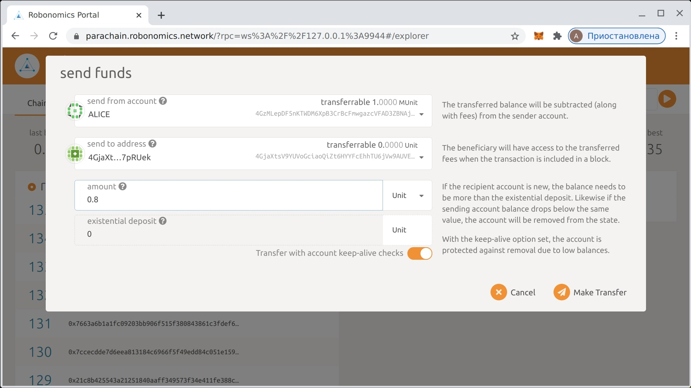
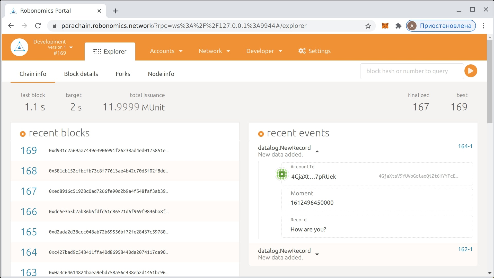
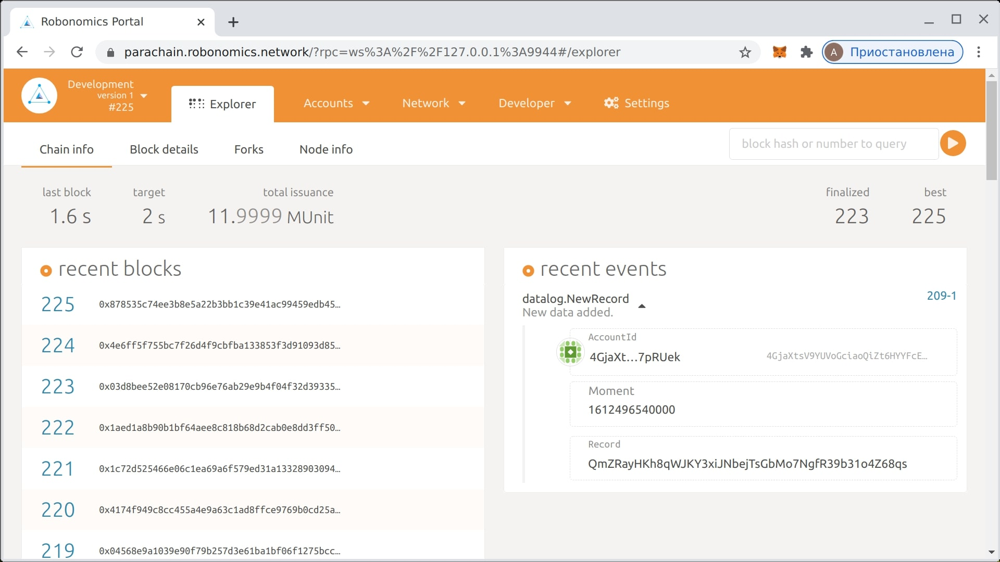

import Asciinema from '~/components/Asciinema.vue'

## 요구 사항

* Docker가 필요합니다, 먼저 [설치](https://docs.docker.com/engine/install/)하십시오.
* [Nova SDS011](https://aqicn.org/sensor/sds011) 센서는 선택 사항입니다.

### SDS011 체크 (선택 사항)

SDS011 센서를 연결한 경우 `/dev`에 표시되고 올바른 액세스 권한이 있는지 확인하십시오.

<Asciinema vid="WCFcx8C6M8e52UKDNei1xZloU"/>

## 빠른 시작

도 커가 설치되면 [공식 저장소에서](https://hub.docker.com/r/robonomics/robonomics) robonomics 도커 이미지를 시작해 보겠습니다. 이 강의에서는 `winter-school` 태그를 사용하겠습니다.

<Asciinema vid="wM43jozIVfcRmt52ENrJ6yPlH"/>

도커 이미지가 준비되면 `robonomics io` 명령 (SDS011 장치가있는 경우 옵션)을 사용하여 데이터를 읽어 보겠습니다.

<Asciinema vid="iztt22tKGaV8wq3cMXY1oUEYv"/>

SDS011 센서가없는 경우 `vsds011.sh`를 통해 동일한 도커 컨테이너에서 사용할 수있는 가상 SDS011 센서를 자유롭게 사용하십시오. 그리고 다음 명령의 모든 곳에서 물리적 센서의 투명한 대체물로 사용하십시오.

<Asciinema vid="GCkSiJBA1DgpLAAHiMhIOSpgG"/>

Robonomics IO 하위 시스템에는 두 가지 종류의 명령이 있습니다:

* `read` - 읽기 액세스를 지원하는 장치에서 데이터를 가져옵니다;
* `write` - 쓰기 액세스를 지원하는 장치에 데이터를 씁니다.

일부 장치는 그들 모두,이 경우, 장치가 모두 명령 인수에 제시된 지원합니다.

> 예를 들어, 가상 장치 `ipfs`는 IPFS에 대한  `write` 데이터와 동일하게 해시별로 IPFS의 `read` 데이터를 지원합니다.

지원되는 장치의 전체 목록은 인수없이 `robonomics io read` 또는 `robonomics io write`를 실행할 수 있습니다.

## IPFS 액세스

다음 단계에서 실행 IPFS 데몬이 필요합니다. 이를 위해 init IPFS를 실행하고 전용 터미널 탭에서 데몬을 실행 해 보겠습니다.

<Asciinema vid="ir6ziXSBUDrRltTmNxg7sdXVY"/>

데몬이 실행되면 별도의 탭에서 도커 이미지를 연결하고 데이터 쓰기 및 읽기를 위해 `robonomics io`를 사용할 수 있습니다.

<Asciinema vid="ZtwcmpB9Lhum2Sc221QmNwHG4"/>

출력 포워딩도 여기서 작동하므로 `|` (파이프) 기호를 사용하여 SDS011 센서 데이터를 IPFS로 포워딩 할 수 있습니다. 

<Asciinema vid="XS0QESWG7f8ELsQe1bGQllb9O"/>

SDS011의 JSON 데이터가 IPFS 작성기에 대한 입력으로 전달되고 결과가 stdout에 게시됩니다.

For virtual sensor use:
```
vsds011.sh | robonomics io write ipfs
```

이 접근 방식을 통해 엔지니어는 `robonomics io` 도구의 원시 독자와 작성자를 결합하여 간단한 프로그램을 매우 빠르게 만들 수 있습니다.

```bash
robonomics io read sds011 | gz | robonomics io write pubsub my-sensor-data
```

## Robonomics 데이터 로그

> Robonomics [데이터 로그](https://crates.robonomics.network/robonomics_protocol/datalog/index.html)의 목표는 데이터 블록 체인화입니다. 이 팔레트는 블록 체인에 커스텀 데이터를 저장하는 기능을 제공하여 향후 변경이 불가능하고 변경이 불가능하도록합니다.

이 레슨의 마지막 부분에서는 robonomics 노드를 실행해야합니다. 빠른 블록 시간과 미리 설정된 계정에 이미 분산 된 잔액 때문에 개발 모드가 선호됩니다. 동일한 컨테이너에있는 별도의 터미널 탭에서 시작하겠습니다.

<Asciinema vid="QnN9l0sdaZZOyK9ah0DntvCXt"/>

그런 다음 `데이터 로그` 장치에 대한 인수로 개인 시드도 필요합니다. 이 시드는 트랜잭션에 서명하고 계정을 보낸 사람으로 표시하는 데 사용됩니다. 내장 된 `robonomics 키` 명령을 사용하여 생성 해 보겠습니다. 

<Asciinema vid="4Cdfl9F0GgjNWv1c1ZcTBBktF"/>

생성 된 주소를 저장하고 나중에 사용할 수 있도록 안전한 곳에 시드하십시오.

현재 주소 잔액은 0이며 네트워크는이 주소에서 트랜잭션을 보내는 것을 허용하지 않습니다. 이 문제를 해결하기 위해 `Alice`의 계정에서 약간의 토큰을 전송 해 보겠습니다. https://parachain.robonomics.network에서 주소가 `ws : //127.0.0.1 : 9944` 인 로컬 노드에 연결된 Robonomics 포털을 사용하겠습니다. 



그런 다음 `데이터 로그` 장치를 사용하여 블록 체인에 데이터를 저장할 수 있습니다. `-s` 키는 계정의 비밀 시드를 설정하는 데 사용됩니다. 거래를 보내려면 계정에 0이 아닌 잔액이 있어야합니다.

<Asciinema vid="FzERH9TmFB8oRuas8ZU202Pv8"/>

모든 것이 올 바르면 Robonomics 포털의 `Explorer` 페이지에 `데이터 로그` 이벤트가 표시됩니다. 



마지막 단계는 약간 복잡하지만이 강의에 대한 모든 지식을 사용해 보는 것이 좋습니다. SDS011 센서 (또는 파일)에서 데이터를 수집하여 IPFS에 압축 한 다음 `데이터 로그` 트랜잭션을 전송하여 블록 체인에 해시를 저장하는 간단한 프로그램을 만들어 보겠습니다.

```
SDS011 -> IPFS -> Blockchain
```

Robonomics IO를 사용하여 쉽게 구현할 수 있습니다.

<Asciinema vid="MTpiawGo8DKEn081OozbYb5mU"/>

For virtual sensor use:
```
vsds011.sh | robonomics io write ipfs | robonomics io write datalog -s <private_key>
```


모든 것이 잘되면 IPFS 해시가있는 `데이터 로그` 이벤트가 표시되어야합니다.


