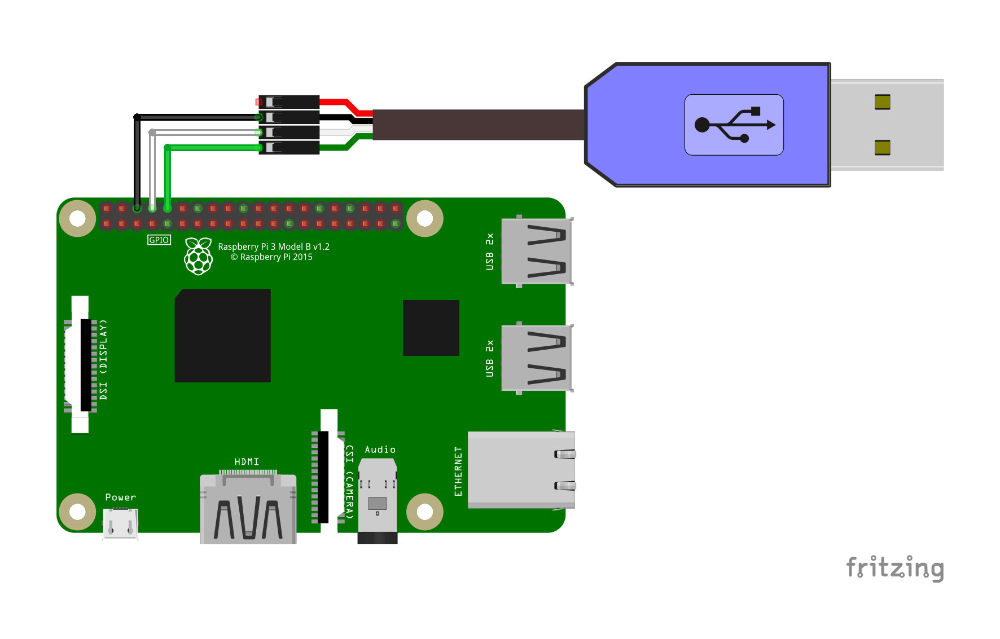
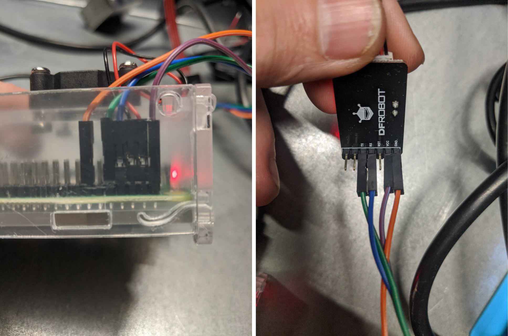

# Open Sensor Network Run by IPFS

Robonomics Network allows you to communicate with any sensor you wish and get data from the sensor all around the world. This data is packed in [rosbag](http://wiki.ros.org/rosbag) format, so you can easily share it using [IPFS protocol](https://ipfs.io).

At this page you'll find step-by-step instruction to connect [SEN0233](https://wiki.dfrobot.com/Air_Quality_Monitor__PM_2.5,_Formaldehyde,_Temperature_&_Humidity_Sensor__SKU__SEN0233) sensor
to [Raspberry Pi 4](https://www.raspberrypi.org/products/raspberry-pi-4-model-b/) and make it publish data on demand.

**After reading this article you should get the main idea and be able to connect any desired sensor. All of the following steps are done on Linux.**

## Requirements

* SEN0233
* PM2.5 Sensor Adapter
* Raspberry Pi 4
* SD Card >=16Gb

## 1. Prepare Raspberry Pi 4

### 1.1 Get the image

The latest AIRA image can be found [here](https://aira.life/channels/aira-unstable/)

```
wget https://aira.life/channels/aira-unstable/aira-image-rpi4-20.03pre-git-aarch64-linux.img
```

### 1.2 Write the image on to a SD card 

```
sudo dd if=aira-image-rpi4-20.03pre-git-aarch64-linux.img of=/dev/sda bs=4M status=progress
sync
```

### 1.3 Boot with the SD card

Plug in the SD card and connect a power supply to the board. Wait a couple of minutes.

By default OS has `root` user with empty password. There are a few ways to log in.

First - using UART-USB cable. Connect the cable as shown below:

* Black to 6th pin
* White to 8th pin (TXD)
* Green to 10th pin (RXD)

Check the official [documentation](https://www.raspberrypi.org/documentation/usage/gpio/) out.



The connection is the same for Raspberry Pi 3 and 4.

Then on your laptop run:

```
screen /dev/ttyUSB 115200
```

And you should see something similar to:

```
<<< Welcome to NixOS 20.03pre-git (aarch64) - ttyS0 >>>  
  
  
aira-rpi4 login: root (automatic login)  

Starting...  

    _    ___ ____      _      
   / \  |_ _|  _ \    / \   
  / _ \  | || |_) |  / _ \  
 / ___ \ | ||  _ <  / ___ \ 
/_/   \_\___|_| \_\/_/   \_\
                        

My Ethereum address is "38411681740ca6214b448d49549bb1dfd0a0cffa"  

Look me at https://status.robonomics.network by "Qmdiiux3uQS8JyuPNa7Vj3iNe7UZBrpMPB2dEqUeo4YRGH"
```

**Save somewhere your ethereum address generated by the OS. You'll need it later.**

By default `sshd` service is up and running. All you need to do is to add your SSH key:

```
mkdir .ssh/
curl -sSL https://github.com/<USERNAME>.keys >> .ssh/authorized_keys
```

It's recommended to add your SSH key to Github account [help](https://help.github.com/en/github/authenticating-to-github/adding-a-new-ssh-key-to-your-github-account)

If you don't have a key attached to your github account then simply put the content of your `~/.ssh/id_rsa.pub` file to `/root/.ssh/authorized_keys` file on the SD card.

Another way to put the key is to unplug the SD card, plug it in a laptop and do above steps manually.

After that you should be able to connect to the board via SSH:

```
ssh root@<RASPBERRY_PI_ADDRESS>
```

### 1.4. Remove blocking parameters

You'll attach the sensor to GPIO pins which are currently are configured for UART connection. 

Open `/boot/cmdline.txt` and remove everything related to `console`. In the end it must look like:

```
cma=256M loglevel=7 init=/nix/store/nlh5fcbb1cj36kn0m2pfvqs7w6dd127w-nixos-system-aira-rpi4-20.03pre197163.0c9d9518676/init
```

Reboot

```
reboot
```

## 2. Connect SEN0233

Connect the sensor as shown below:




## 3. Run the Agent

The agent must be run under `liability` user

```
su liability
cd
```

Now clone the repository and build the agent:

```
git clone https://github.com/Vourhey/sen0233_sensor_agent/
cd sen0233_sensor_agent
nix build -f release.nix
```

Run the agent:

```
source result/setup.bash
roslaunch sensors_pack_agent agent.launch
```

**Don't hesitate to check [the repository](https://github.com/Vourhey/sen0233_sensor_agent/) out. You'll see how easily the sensor can be replaced with any other.**

## 4. Test

To test everything works as expected go to the Dapp:

```
https://dapp.robonomics.network/#/sensors/airalab/QmWjvXGfVUDBNR15BBH5ERGP3SzEKbeLZWx7Fcp4kwwaw9/0x<YOUR_ETHEREUM_ADDRESS>/
```

where `<YOUR_ETHEREUM_ADDRESS>` is the address generated by OS on step 1.3.

To find out the address again you can run:

```
rosservice call /eth/accounts
```
