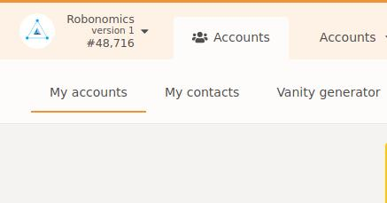

**After successfully creating your accounts on Robonomics portal, it is time to add funds to them so that you would able to initiate transactions.**

## 1. Navigate to Accounts section on Robonomics portal 

## 2. Choose the account you want to transfer funds from

In the development mode, there exist several accounts, with 10000 Units worth of funds each, that can be used to transfer funds to other accounts created in the development network. These accounts are indicated by wrench signs  next to them.

- Click on the "send" button of the account you want to transfer funds from, for example BOB

## 3. Choose the account you want to transfer funds into
After clicking on the "send" button, you would be prompted with the "send funds window". In the prompted window:

- From the list of available accounts, choose the account you want to send funds into.
- Enter the number of Units you want to send.
- Press "make transfer"

## 4. Authorize the transaction

After pressing "make transfer" in the previous stage, you would be prompted with "authorize transaction window". 
Review the details of the transaction and finally click on "sign and submit" button.

In this example, we transferred 500 units of funds from "BOB" to "EMPLOYER". You can see that EMPLOYER's account, which initially did not have any funds, has 500 Units of fund now.

**Make sure that you have enough funds in the accounts you want to use in the playground.**