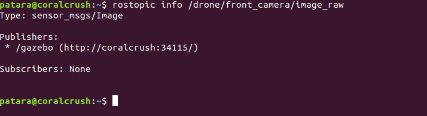
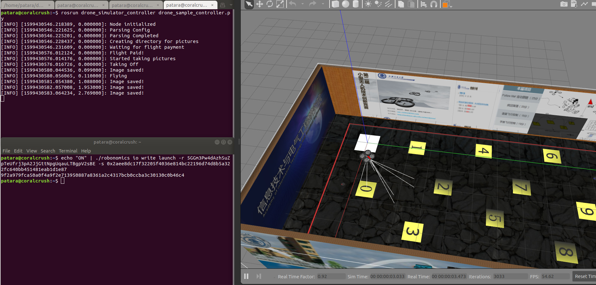
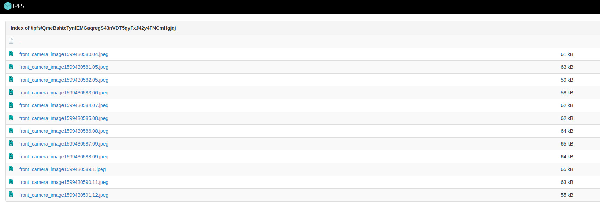

**In this article we will continue using Robonomics tools to make a drone be controlled by a parachain. This time we will add sending data to IPFS and hash storing in chain options. Below is the instruction and code snippets. Requirements:**
- [**Part 1 of this tutorial**](/docs/connect-any-ros-compatible-robot-under-robonomics-parachain-control-1)
- Ubuntu 18.04 LTS
- ROS Melodic + Gazebo + RViz (installation manual [here](http://wiki.ros.org/melodic/Installation))
- IPFS 0.4.22 (download from [here](https://dist.ipfs.io/go-ipfs/v0.4.22/go-ipfs_v0.4.22_linux-386.tar.gz) and install)
- Robonomics node (binary file) (download latest release [here](https://github.com/airalab/robonomics/releases))
- Python dependencies:
```
pip install cv_bridge ipfshttpclient
```
The entire process of coding this part of demo is presented in a video below.

https://www.youtube.com/watch?v=dliLb6GHgpo&feature=youtu.be


## 1. Add dependencies
If we launch a simulation and look at the topic list (see previous tutorial), we will see, that there is one topic containing front camera data and using `sensor_msgs/Image` message type:



Let's try to take a picture every 1 second and after the flight publish these photos to IPFS. If you have completed the first tutorial, you don't need to download anything else. It's the `drone_sample_controller_pictures.py` script.
## 2. Manage accounts in DAPP
As done in a previous tutorial, create a local robonomics network node with robonomics binary file:
```
./robonomics --dev
```
**Important!** Before next launches it is necessary to remove a directory `db` with
```
rm -rf /home/$USER/.local/share/robonomics/chains/dev/db
```
After a successful launch create accounts following [this](/docs/create-account-in-dapp) manual. **Do not forget to save each account's seed and address! You will need them for transactions**. Add these addresses, seeds and path to robonomics binary file to file `config.config` in `robonomics_ws/src/robonomics_sample_controller/src`. Transfer some money (units) to these accounts:


## 3. Launch
Up to now the **only thing running** should be the robonomics local node. In a separate terminal launch drone simulation:
```
roslaunch sjtu_drone simple.launch
```
In another one launch ipfs daemon:
```
ifps init # you only need to do this once
ipfs daemon
```
Run the script:
```
rosrun drone_simulator_controller drone_sample_controller_pictures.py
```
Now you can send a transaction triggering the drone to start flying and taking pictures. To do so, you should use the Robonomics IO `write` subcommand of robonomics binary file:
```
echo "ON" | ./robonomics io write launch -r <DRONE_ADDRESS> -s <EMPLOYER’S_KEY>
```
Where `<DRONE_ADDRESS>`  and `<EMPLOYER’S_KEY>` are replaced with  previously saved strings accordingly.
You should see the log `"Taking Off"` and the drone should start flying and taking pictures:



Later, when the job is done, on the Robonomics portal go to `Developer` -> `Chain state` and add a `DRONE` datalog using `“+”` button with selected `datalog` as state query. The IPFS hash of the telemetry has been saved in the blockchain. To see the data simply copy the hash and add it to the local [gateway](https://gateway.ipfs.io/ipfs/QmeYYwD4y4DgVVdAzhT7wW5vrvmbKPQj8wcV2pAzjbj886/docs/getting-started/) address `localhost:8080/ipfs/`:


