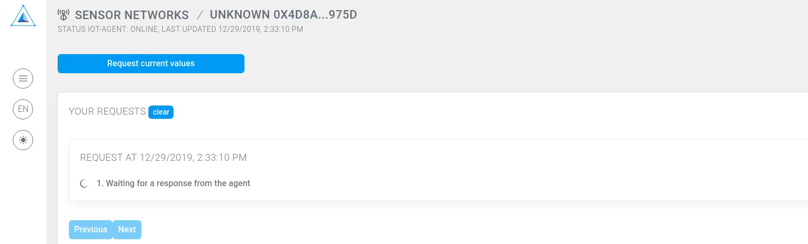

**Let's start from a quick example of what Robonomics is able to do within 5 minutes. Requirements: [Metamask extension](https://metamask.io/)**

To get the weather from sensor on Fuji Mountain, please, open the page of [Fuji Weather sensor](https://dapp.robonomics.network/#/fuji/airalab/QmbQT8cj9TJKfYVaidfShnrEX1g14yTC9bdG1XbcRX73wY/0x4D8a26e1f055c0b28D71cf1deA05f0f595a6975d/) in Robonomics dApp and follow instructions below.

Here's a walkthrough video:

https://www.youtube.com/embed/t098NlMELk4

## 1. Open the Dapp

In case you don't have MetaMask extension you'll see the picture below. Go to the link provided above and install one.

## 2. Allow connection to the extension

## 3. Press "Request current values"

## 4. Sign a message. No token or ether are needed

## 5. Wait until the agent collects the data and sends it back

## 6. Wait until the Dapp downloads the result file from IPFS

## 7. Look at the weather data on Fuji Mountain

Just now you have broadcasted a demand message and got a result from an autonomous agent! The result file is stored in IPFS, the result message is signed with the agent's private key.
