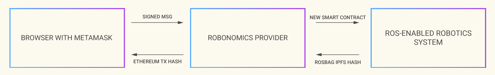

## What is Robonomics

Robonomics platform provides tools for working with the robot economy network. Robonomics allow designers of smart cities and industry 4.0 zones to build trust among the [autonomous robots services](/docs/glossary#cyber-physical-system), provide [direct user access via dapp](/docs/glossary#dapp) for ordering products from autonomous factories and services of urban sensor networks. This in turn will allow us to put in place a decentralized system that globally monitors the activities of cyber physical systems.

The following chart describes what place Robonomics takes in the scenario:

Find more in [Building dApps on Robonomics deck](https://gateway.pinata.cloud/ipfs/QmNNdLG3vuTsJtZtNByWaDTKRYPcBZSZcsJ1FY6rTYCixQ/Robonomics_keypoint_March_2021.pdf)

## Robonomics Network quick start
**For newcomer's convenience core Robonomics developers came up with a [6 lessons learning curve](https://wiki.robonomics.network/docs/en/wschool2021-intro/)!**

You'll explore the serverless IoT architecture! Robonomics Web Services (RWS) is the basic infrastructural service for Robotics and IoT on top of Polkadot && IPFS.

Course graduates can launch a local relay chain and control a ROS-compatible device through cross-chain transaction.

**[Join Robonomics Developers Discord](https://discord.gg/jTxqGeF5Qy) to connect with community and get technical support.**

### Benefits for Robonomics Academy graduates
- Intership for best students   Become a Robonomics team member and contribute to the development of the chosen product.
- Active community && regular events   Become a part of the learner's community, discuss your use-cases with industry experts. Team-up and participate in hackathons!
- Certificate of completion   Add a certificate for completing the course on building DAPPs for IoT to your portfolio.
- Assistance in admission to the ITMO university. Whether you are a bachelor or master, you'll get assistance in your admission to the university.
- Funding && acceleration opportunities: 1)Apply for up to $50.000 Academia - support grant; 2)Participate in Robonomics builders acceleration program supported by Web3 Foundation; 3)Deploy your stand-alone DAPP on top of Robonomics; 4)Monetize it && get marketing support from Robonomics team.

## What the documentation contains

### I'm a Dapp developer

- [Robonomics-js on GitHub](https://github.com/airalab/robonomics-js) - simple Javascript SDK for Robonomics Network dApp developers.
- [dApp template](https://github.com/airalab/vue-dapp-robonomics-template) - uses Vue.js
- [Wiki documentation](/docs/robonomics-js/)

### I'm a robotics engineer

Check out [cases](/docs/iot-sensors-connectivity/) section and start developing by [examples](/docs/agent-development-examples).

