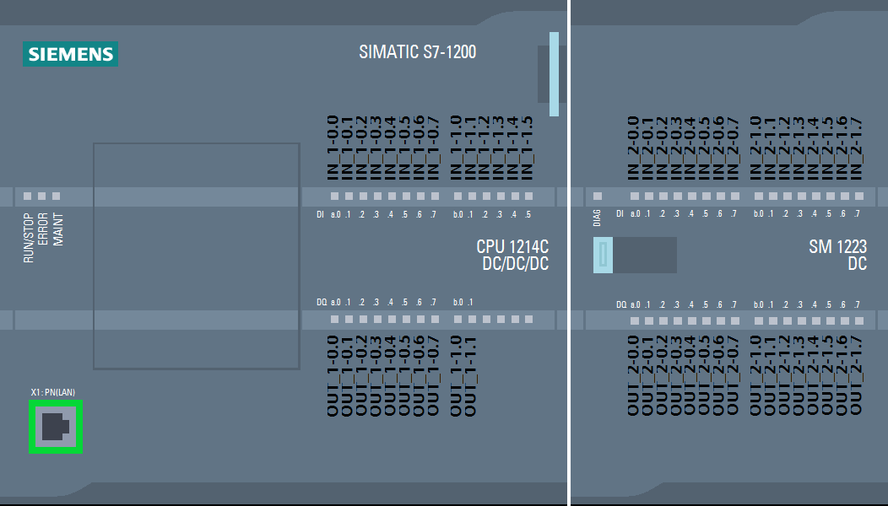

## PLC scheme
 
<b>Notice! </b>AN ports are not represented on the scheme above. Check out table below to see description.  
Main PLC block has its own connection scheme. The rest of the blocks are all similar to each other. 
More information about ports can be found [here](https://docs.google.com/spreadsheets/d/1g_LuqgdKADWxOYnbkcRyZtqtx3cMqh8EEH0UOrVdQ5M). 

## Legend
- 0 - departure warehouse position (e.g. move to 0 means move towards the departure warehouse)
- 1 - arrival warehouse position (e.g. move to 1 means move towards the arrival warehouse)
- sensor M - magnetic sensor
- sensor L - light sensor

## Ports mapping
| Port      | Description                |   | Port     | Description                  |
|-----------|----------------------------|---|----------|------------------------------|
| OUT_1-0.0 |                            |   | IN_1-0.0 | Modbus ON/OFF                |
| OUT_1-0.1 |                            |   | IN_1-0.1 |                              |
| OUT_1-0.2 |    Loader 0 - move to 1    |   | IN_1-0.2 | Warehouse 0 - pos. 01        |
| OUT_1-0.3 |    Loader 0 - move to 0    |   | IN_1-0.3 | Warehouse 0 - pos. 02        |
| OUT_1-0.4 |                            |   | IN_1-0.4 | Warehouse 0 - pos. 03        |
| OUT_1-0.5 |      Loader 0 - move ↑     |   | IN_1-0.5 | Warehouse 0 - pos. 04        |
| OUT_1-0.6 |      Loader 0 - move ↓     |   | IN_1-0.6 | Warehouse 0 - pos. 05        |
| OUT_1-0.7 |    Loader 0 - move ← (1)   |   | IN_1-0.7 | Warehouse 0 - pos. 06        |
| OUT_1-1.0 |    Loader 0 - move → (0)   |   | IN_1-1.0 | Warehouse 0 - pos. 07        |
| OUT_1-1.1 |                            |   | IN_1-1.1 | Warehouse 0 - pos. 08        |
|           |                            |   | IN_1-1.2 | Warehouse 0 - pos. 09        |
|           |                            |   | IN_1-1.3 | Warehouse 0 - pos. 10        |
|           |                            |   | IN_1-1.4 | Warehouse 0 - pos. 11        |
|           |                            |   | IN_1-1.5 | Warehouse 0 - pos. 12        |
| &nbsp;    |                            |   |          |                              |
| OUT_2-0.0 | Loader 1 - move to 0       |   | IN_2-0.0 |                              |
| OUT_2-0.1 | Loader 1 - move to 1       |   | IN_2-0.1 | Loader 0 - ⇵.1 (bottom)      |
| OUT_2-0.2 |                            |   | IN_2-0.2 | Loader 0 - ⇵.2               |
| OUT_2-0.3 | Loader 1 - move ↑          |   | IN_2-0.3 | Loader 0 - ⇵.3               |
| OUT_2-0.4 | Loader 1 - move ↓          |   | IN_2-0.4 | Loader 0 - ⇵.4               |
| OUT_2-0.5 | Loader 1 - move ← (1)      |   | IN_2-0.5 | Loader 0 - ⇵.5               |
| OUT_2-0.6 | Loader 1 - move → (0)      |   | IN_2-0.6 | Loader 0 - ⇵.6               |
| OUT_2-0.7 |                            |   | IN_2-0.7 | Loader 0 - ⇵.7               |
| OUT_2-1.0 | Conveyor 1.1 - move to 0   |   | IN_2-1.0 | Loader 0 - ⇵.8 (top)         |
| OUT_2-1.1 | Conveyor 1.1 - move to 1   |   | IN_2-1.1 | Loader 0 - ⟷.1 (warehouse)   |
| OUT_2-1.2 | Conveyor 1.2 - move to 0   |   | IN_2-1.2 | Loader 0 - ⟷.2 (neutral)     |
| OUT_2-1.3 | Conveyor 1.2 - move to 1   |   | IN_2-1.3 | Loader 0 - ⟷.3 (conveyor)    |
| OUT_2-1.4 | Handler 1 - move to 1      |   | IN_2-1.4 |                              |
| OUT_2-1.5 | Handler 1 - move to 0      |   | IN_2-1.5 |                              |
| OUT_2-1.6 | Handler 1 - move ↓         |   | IN_2-1.6 |                              |
| OUT_2-1.7 | Handler 1 - move ↑         |   | IN_2-1.7 |                              |
| &nbsp;    |                            |   |          |                              |
| OUT_3-0.0 | Handler 1 - on/off         |   | IN_3-0.0 | Conveyor 1.1 - sensor L      |
| OUT_3-0.1 | Handler signal 1 - red     |   | IN_3-0.1 | Conveyor 1.2 - sensor M      |
| OUT_3-0.2 | Handler signal 1 - green   |   | IN_3-0.2 | Handler 1 - ⟷.1              |
| OUT_3-0.3 | Handler signal 1 - yellow  |   | IN_3-0.3 | Handler 1 - ⟷.0              |
| OUT_3-0.4 | Conveyor 1.3 - rotate to 1 |   | IN_3-0.4 | Handler 1 - ↓                |
| OUT_3-0.5 | Conveyor 1.3 - rotate to 0 |   | IN_3-0.5 | Handler 1 - ↑                |
| OUT_3-0.6 | Conveyor 1.3 - move to 0   |   | IN_3-0.6 | Conveyor 1.3 - sensor M      |
| OUT_3-0.7 | Conveyor 1.3 - move to 1   |   | IN_3-0.7 | Conveyor 1.3 - rotate to 0   |
| OUT_3-1.0 | Conveyor 1.4 - move to 0   |   | IN_3-1.0 | Conveyor 1.3 - rotate to 1   |
| OUT_3-1.1 | Conveyor 1.4 - move to 1   |   | IN_3-1.1 | Conveyor 1.4 - sensor M      |
| OUT_3-1.2 |                            |   | IN_3-1.2 | Conveyor 2.1 - sensor L      |
| OUT_3-1.3 | Conveyor 2.1 - move to 0   |   | IN_3-1.3 | Conveyor 2.2 - sensor M      |
| OUT_3-1.4 | Conveyor 2.1 - move to 1   |   | IN_3-1.4 | Handler 2 - ⟷.1              |
| OUT_3-1.5 | Conveyor 2.2 - move to 0   |   | IN_3-1.5 | Handler 2 - ⟷.0              |
| OUT_3-1.6 | Conveyor 2.2 - move to 1   |   | IN_3-1.6 | Handler 2 - ↓                |
| OUT_3-1.7 | Handler 2 - move to 1      |   | IN_3-1.7 | Handler 2 - ↑                |
| &nbsp;    |                            |   |          |                              |
| OUT_4-0.0 | Handler 2 - move to 0      |   | IN_4-0.0 | Conveyor 2.3 - sensor M      |
| OUT_4-0.1 | Handler 2 - move ↓         |   | IN_4-0.1 | Conveyor 2.3 - rotate to 0   |
| OUT_4-0.2 | Handler 2 - move ↑         |   | IN_4-0.2 | Conveyor 2.3 - rotate to 1   |
| OUT_4-0.3 | Handler 2 - on/off         |   | IN_4-0.3 | Conveyor 2.4 - sensor M      |
| OUT_4-0.4 | Handler signal 2 - red     |   | IN_4-0.4 | Conveyor 3.1 - sensor L      |
| OUT_4-0.5 | Handler signal 2 - green   |   | IN_4-0.5 | Conveyor 3.2 - sensor M      |
| OUT_4-0.6 | Handler signal 2 - yellow  |   | IN_4-0.6 | Handler 3 - ⟷.1              |
| OUT_4-0.7 | Conveyor 2.3 - rotate to 0 |   | IN_4-0.7 | Handler 3 - ⟷.0              |
| OUT_4-1.0 | Conveyor 2.3 - rotate to 1 |   | IN_4-1.0 | Handler 3 - ↓                |
| OUT_4-1.1 | Conveyor 2.3 - move to 0   |   | IN_4-1.1 | Handler 3 - ↑                |
| OUT_4-1.2 | Conveyor 2.3 - move to 1   |   | IN_4-1.2 | Conveyor 3.3 - sensor M      |
| OUT_4-1.3 | Conveyor 2.4 - move to 0   |   | IN_4-1.3 | Conveyor 3.3 - rotate to 0   |
| OUT_4-1.4 | Conveyor 2.4 - move to 1   |   | IN_4-1.4 | Conveyor 3.3 - rotate to 1   |
| OUT_4-1.5 |                            |   | IN_4-1.5 | Conveyor 3.4 - sensor M      |
| OUT_4-1.6 | Conveyor 3.1 - move to 0   |   | IN_4-1.6 | Conveyor 4.1 - sensor L      |
| OUT_4-1.7 | Conveyor 3.1 - move to 1   |   | IN_4-1.7 | Conveyor 4.2 - sensor M      |
| &nbsp;    |                            |   |          |                              |
| OUT_5-0.0 | Conveyor 3.2 - move to 0   |   | IN_5-0.0 | Handler 4 - ⟷.1              |
| OUT_5-0.1 | Conveyor 3.2 - move to 1   |   | IN_5-0.1 | Handler 4 - ⟷.0              |
| OUT_5-0.2 | Handler 3 - move to 1      |   | IN_5-0.2 | Handler 4 - ↓                |
| OUT_5-0.3 | Handler 3 - move to 0      |   | IN_5-0.3 | Handler 4 - ↑                |
| OUT_5-0.4 | Handler 3 - move to ↓      |   | IN_5-0.4 | Conveyor 4.3 - sensor M      |
| OUT_5-0.5 | Handler 3 - move to ↑      |   | IN_5-0.5 | Conveyor 4.3 - rotate to 1   |
| OUT_5-0.6 | Handler 3 - on/off         |   | IN_5-0.6 | Conveyor 4.3 - rotate to 0   |
| OUT_5-0.7 | Handler signal 3 - red     |   | IN_5-0.7 |                              |
| OUT_5-1.0 | Handler signal 3 - green   |   | IN_5-1.0 | Conveyor 4.4 - sensor M      |
| OUT_5-1.1 | Handler signal 3 - yellow  |   | IN_5-1.1 | Conveyor 4.5 - sensor L      |
| OUT_5-1.2 | Conveyor 3.3 - rotate to 1 |   | IN_5-1.2 |                              |
| OUT_5-1.3 | Conveyor 3.3 - rotate to 0 |   | IN_5-1.3 | Warehouse 1 - pos. 01        |
| OUT_5-1.4 | Conveyor 3.3 - move to 0   |   | IN_5-1.4 | Warehouse 1 - pos. 02        |
| OUT_5-1.5 | Conveyor 3.3 - move to 1   |   | IN_5-1.5 | Warehouse 1 - pos. 03        |
| OUT_5-1.6 | Conveyor 3.4 - move to 0   |   | IN_5-1.6 | Warehouse 1 - pos. 04        |
| OUT_5-1.7 | Conveyor 3.4 - move to 1   |   | IN_5-1.7 | Warehouse 1 - pos. 05        |
| &nbsp;    |                            |   |          |                              |
| OUT_6-0.0 |                            |   | IN_6-0.0 | Warehouse 1 - pos. 06        |
| OUT_6-0.1 | Conveyor 4.1 - move to 0   |   | IN_6-0.1 | Warehouse 1 - pos. 07        |
| OUT_6-0.2 | Conveyor 4.1 - move to 1   |   | IN_6-0.2 | Warehouse 1 - pos. 08        |
| OUT_6-0.3 | Conveyor 4.2 - move to 0   |   | IN_6-0.3 | Warehouse 1 - pos. 09        |
| OUT_6-0.4 | Conveyor 4.2 - move to 1   |   | IN_6-0.4 | Warehouse 1 - pos. 10        |
| OUT_6-0.5 | Handler 4 - move to 1      |   | IN_6-0.5 | Warehouse 1 - pos. 11        |
| OUT_6-0.6 | Handler 4 - move to 0      |   | IN_6-0.6 | Warehouse 1 - pos. 12        |
| OUT_6-0.7 | Handler 4 - move ↓         |   | IN_6-0.7 |                              |
| OUT_6-1.0 | Handler 4 - move ↑         |   | IN_6-1.0 | Loader 1 - ⇵.1 (bottom)      |
| OUT_6-1.1 | Handler 4 - on/off         |   | IN_6-1.1 | Loader 1 - ⇵.2               |
| OUT_6-1.2 | Handler signal 4 - red     |   | IN_6-1.2 | Loader 1 - ⇵.3               |
| OUT_6-1.3 | Handler signal 4 - green   |   | IN_6-1.3 | Loader 1 - ⇵.4               |
| OUT_6-1.4 | Handler signal 4 - yellow  |   | IN_6-1.4 | Loader 1 - ⇵.5               |
| OUT_6-1.5 | Conveyor 4.3 - rotate to 0 |   | IN_6-1.5 | Loader 1 - ⇵.6               |
| OUT_6-1.6 | Conveyor 4.3 - rotate to 1 |   | IN_6-1.6 | Loader 1 - ⇵.7               |
| OUT_6-1.7 | Conveyor 4.3 - move to 0   |   | IN_6-1.7 | Loader 1 - ⇵.8 (top)         |
| &nbsp;    |                            |&nbsp;&nbsp;&nbsp;&nbsp;&nbsp;&nbsp;&nbsp;&nbsp;&nbsp;&nbsp;&nbsp;&nbsp;&nbsp;&nbsp;&nbsp;&nbsp;&nbsp;&nbsp;|          |                              |
| OUT_7-0.0 | Conveyor 4.3 - move to 1   |   | IN_7-0.0 | Loader 1 - ⟷.1 (conveyor)   |
| OUT_7-0.1 |                            |   | IN_7-0.1 | Loader 1 - ⟷.2 (neutral)    |
| OUT_7-0.2 | Conveyor 4.4 - move to 0   |   | IN_7-0.2 | Loader 1 - ⟷.3 (warehouse)  |
| OUT_7-0.3 | Conveyor 4.4 - move to 1   |   | IN_7-0.3 | Conveyor 1.1 - stop Loader 0 |
| OUT_7-0.4 | Conveyor 4.5 - move to 0   |   | IN_7-0.4 | Conveyor 2.1 - stop Loader 0 |
| OUT_7-0.5 | Conveyor 4.5 - move to 1   |   | IN_7-0.5 | Conveyor 3.1 - stop Loader 0 |
| OUT_7-0.6 | Handler 4 - on/off         |   | IN_7-0.6 | Conveyor 4.1 - stop Loader 0 |
| OUT_7-0.7 |                            |   | IN_7-0.7 | Handler 4 - rotation         |
| OUT_7-1.0 |                            |   | IN_7-1.0 |                              |
| OUT_7-1.1 |                            |   | IN_7-1.1 |                              |
| OUT_7-1.2 |                            |   | IN_7-1.2 |                              |
| OUT_7-1.3 |                            |   | IN_7-1.3 |                              |
| OUT_7-1.4 |                            |   | IN_7-1.4 |                              |
| OUT_7-1.5 |                            |   | IN_7-1.5 |                              |
| OUT_7-1.6 |                            |   | IN_7-1.6 |                              |
| OUT_7-1.7 |                            |   | IN_7-1.7 |                              |
| &nbsp;    |                            |   |          |                              |
|           |                            |   |   AN_1   | Color Recognition Block      |
|           |                            |   |   AN_2   |                              |
