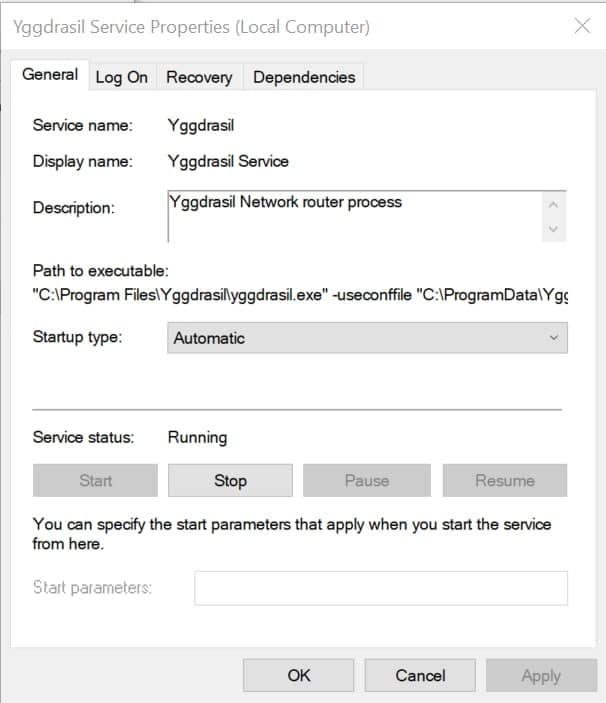

Let's start establishing connection to the robot.
Our goal is to get answers from Spot to our [ping](https://en.wikipedia.org/wiki/Ping_(networking_utility)) signals.
We use Yggdrasil Network to expose Spot to the internet, that means we will need to configure Yggdrasil Network support on your computer first.

## 1. Yggdrasil Installation 

Yggdrasil is an early-stage implementation of a fully end-to-end encrypted IPv6 network. Before startitng the lessons you need to install it on your computer.

### For Linux: 
Installation instructions [here](https://yggdrasil-network.github.io/installation-linux-deb.html).

### For MacOS: 
Download .pkg file from [here](https://github.com/yggdrasil-network/yggdrasil-go/releases/download/v0.4.0/yggdrasil-0.4.0-macos-amd64.pkg).

Locate the downloaded file in Finder. Right-click it and click Open. Step through the installer as usual.

### For Windows:
Download .msi file for [x64 system](https://github.com/yggdrasil-network/yggdrasil-go/releases/download/v0.4.0/yggdrasil-0.4-x64.msi) or for [x32 system](https://github.com/yggdrasil-network/yggdrasil-go/releases/download/v0.4.0/yggdrasil-0.4-x86.msi) and run it with double click.

## 2. Open configuration file

You need to add a list of peers (public nodes) to configuration file so that you will be able to connect to Spot. 

### For MacOS and Linux:
For that, edit the `yggdrasil.conf` file with this command in a terminal:

```bash
sudo nano /etc/yggdrasil.conf
```

### For Windows:
Run `updateconfig.bat` in `C:/Program Files/Yggdrasil`. 

Then in `C:/ProgramData/Yggdrasil` open `yggdrasil.conf` with any text editor.

> `ProgramData` is a hidden folder, so you need to show hidden data.

## 3. Write peers

In the file that you opened find line `Peers:` (it is at the beginning of the file) add 5-6 peers geografically near to you (write them inside the brackets). You can find list of available peers [here](https://github.com/yggdrasil-network/public-peers) or add peers from example below. Example in yggdrasil.conf:

```bash
  Peers:
  [
    tcp://213.188.199.150:10010
    tcp://213.188.210.9:10010
    tcp://[2a09:8280:1::3:312]:10010
    tcp://[2a09:8280:1::a:2e2]:10010
    tcp://46.151.26.194:60575
    tcp://ygg-ru.cofob.ru:18000
    tcp://ygg.tomasgl.ru:61933
    tls://185.22.60.71:8443
    tcp://51.15.118.10:62486
    tls://ygg.loskiq.dev:17314
    tls://longseason.1200bps.xyz:13122
  ]
  ```
Check if the peers online in [Puplic Peers](https://publicpeers.neilalexander.dev/).

## 4. Save and close configuration file

### For Linux and MacOS:

Press `Ctrl+x`, then press `y` to save changes and press `Enter`.

### For Windows:

Save and close file.

## 5. Restart service

### For Linux:

Then restart Yggdrasil using this command:

```bash
systemctl restart yggdrasil
```
### For macOS:

Unload the service and run Yggdrasil with changed config file:

```bash
sudo launchctl unload /Library/LaunchDaemons/yggdrasil.plist
sudo yggdrasil -useconffile /etc/yggdrasil.conf
```
> You will need to do that before every lesson.

### For Windows:

Press win + r and type `services.msc`, find Yggdrasil service, open it and restart (press Stop and Start).



## 6. Check Connection

Check if Yggdrasil works well.

For that try to ping Spot address:
```bash
ping strelka.ygg.khassanov.xyz
```
> To open terminal in Windows press `Win+R`, type `cmd` and press `Enter`.

> On MacOS use `ping6` instead of `ping`.

If you can't ping Spot or you had any errors during the Yggdrasil setup look in [Troubleshooting page](/docs/spot-troubleshooting). If you can't find the solution there, please email spot@robonomics.network.

## 7. Create ssh key

You will connect to Spot via ssh, so you need to create ssh keys which you will use in booking lessons.

Run following command in the terminal:
```bash
ssh-keygen -t rsa
```
> SSH Client is available by default only in Windows 10, so if you use older versions you need to install it. For example you can use [PuTTY](https://www.putty.org/).

Remember the path to your key (by default it is `/home/<user>/.ssh/id_rsa.pub` or `C:\Users\<user>\.ssh\id_rsa.pub`).
