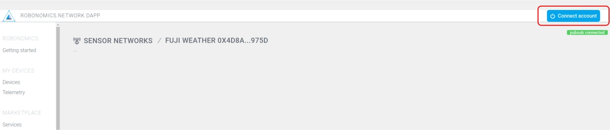
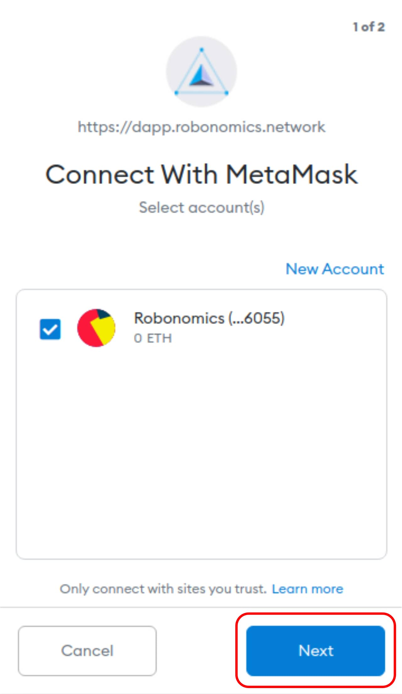
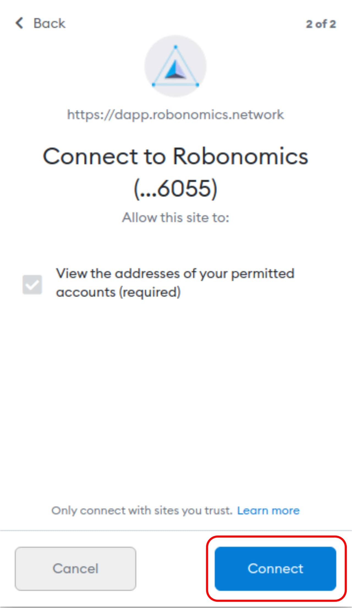

**In this lesson, we will show you how to connect to a sensor on top of Fuji Mountain in Japan to get actual data through Robonomics DAPP.**

Before going further, make sure that you have created MetaMask account and installed its extension on your browser. You can do this by following the procedure in [MetaMask](https://metamask.io/) website.

In order to connect to the sensor on top Fuji Mountain, follow the steps below: 

## 1. Access  Weather Sensor

To access the weather sensor, you should first navigate to Robonomics Services webpages from DAPP. 

- Go to DAPP [webpage](https://dapp.robonomics.network/#/).
- From left sidebar, under market place section, click [Services](https://dapp.robonomics.network/#/services) and choose ["FUJI WEATHER"](https://dapp.robonomics.network/#/fuji/airalab/QmbQT8cj9TJKfYVaidfShnrEX1g14yTC9bdG1XbcRX73wY/0x4D8a26e1f055c0b28D71cf1deA05f0f595a6975d/)

## 2. Connect to MetaMask Account
If you're not connected to your MetaMask account already, you should now get connected to be able to retrieve the sensor data. In order to do that, follow the steps below:
- Click on "Connect account" in the up-right part of the DAPP webpage.

- In the prompted window, choose your account, click "Next" and finally press "Connect"

## 3. Send Request and Sign
After getting connected to your MetaMask account, click on "Sign with ethereum account" and finally sign it in the prompted window. You should receive the sensor data after signing the request.

The following video further illustrates getting data from weather sensor on top of the Fuji Mountain.

https://youtu.be/NOQxyojvaao

- [Reference tutorial on Wiki](https://wiki.robonomics.network/docs/get-weather-on-fuji-mountain/)
- [Dapp](https://dapp.robonomics.network/#/)