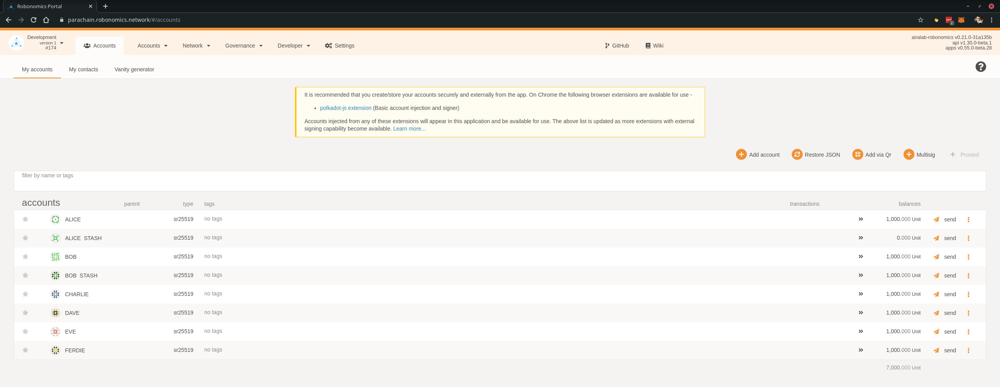
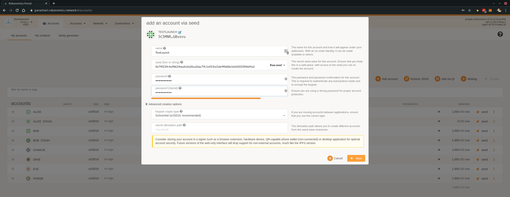
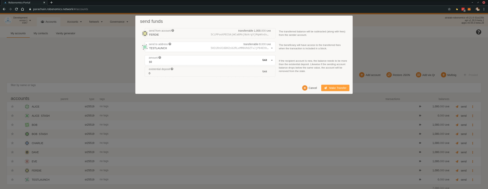

# Robonomics IO Launch

A simple way to turn on and off an IoT device or a robot. Basically sending "ON" will result in `true` state for a device, anything else will result in `false`.

> For the examples the development network is used. Check [this](/docs/rio-overview/#local-testnet) out to set it up for yourself

## Requirements

* `robonomics` [executable](https://github.com/airalab/robonomics/releases)
* Account on parachain 

## Create an Account

Here the [development](/docs/rio-overview/#local-testnet) network is used, but the steps stay the same for the public network

Go to "Accounts":



Click "Add account", give a name, change "Mnemonic" to "Raw seed", put a password and click "Save". 

Note! It's important to save "Raw seed" somewhere! It'll be used in `robonomics io` call



The last thing to do is to transfer some tokens to the newly created account:



## Usage 

To see the result of transaction first of all run `read` part:

```
% ./robonomics io read launch
```

If you have a remote node, specify the address via `--remote` option.

Now let's turn a robot on:

```
% echo "ON" | ./robonomics io write launch -r 5CiPPseXPECbkjWCa6MnjNokrgYjMqmKndv2rSnekmSK2DjL -s 0xb046fc3c322e91e14a61ad4f08a3809ee0de7092e73aa9b3c2b642a0f476d4d6
0c71f523533445ea193223e635448b6186899270ae1dd0dd8ad21b56d7870fa3
```

Then you should see in the first terminal window:

```
% ./robonomics io read launch
5H3iRnX16DH2sb2RLxMM8UhDZTvJjP84EhhKXv3sCiEDq6bH >> 5CiPPseXPECbkjWCa6MnjNokrgYjMqmKndv2rSnekmSK2DjL : true
```

Let's describe all the accounts and options above. 

* `-r 5CiPPseXPECbkjWCa6MnjNokrgYjMqmKndv2rSnekmSK2DjL` means robot's address
* `-s 0xb046fc3c322e91e14a61ad4f08a3809ee0de7092e73aa9b3c2b642a0f476d4d6` private key of the account to launch from (must have tokens for a transaction)
* `5H3iRnX16DH2sb2RLxMM8UhDZTvJjP84EhhKXv3sCiEDq6bH` address that launches a robot
* `5CiPPseXPECbkjWCa6MnjNokrgYjMqmKndv2rSnekmSK2DjL` robot's address
* `true` turn it on

If we pass anything else but "ON" the state becomes `false`

