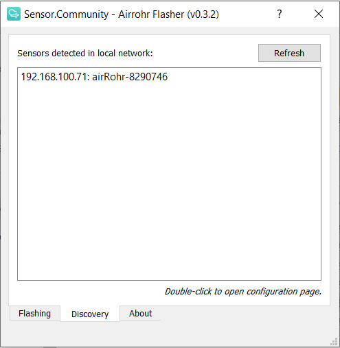

## Устройство датчика

Универсальная плата датчика качества воздуха, основанная на ESP8266. Устройство рассчитано на питание 6 - 20 вольта.


Данная плата позволяет подключить датчики PM:

- [SDS011](https://cdn-reichelt.de/documents/datenblatt/X200/SDS011-DATASHEET.pdf)

Возможность подключения по интерфейсу I2C :

- [BMP180](https://cdn-shop.adafruit.com/datasheets/BST-BMP180-DS000-09.pdf) - температура и влажность
- [BME/P280](https://www.mouser.com/datasheet/2/783/BST-BME280-DS002-1509607.pdf) - температура, влажность, атмосферное давление
- [HTU21D](https://eu.mouser.com/ProductDetail/Measurement-Specialties/HTU21D?qs=tx5doIiTu8oixw1WN5Uy8A%3D%3D) - температура и влажность
- SHT3x (I2C) - температура и влажность
- [CCS811 VOC SENSOR](https://www.sciosense.com/wp-content/uploads/documents/Application-Note-Baseline-Save-and-Restore-on-CCS811.pdf) - Летучие органические вещества, эквивалент СО2
- LCD1602/ 2004 / OLED SSD1306 /  SH1106 - поддерживаемые дисплеи

Возможность подключения по интерфейсу 1 Wire :

- DTH22(AM2302) - температура и влажность
- DS18B20 - температура.

Также существует модель MINI уменьшенного размера и с урезанным списком подключаемых устройств. Исходные схемы для обеих моделей можно найти по ссылкам для [полной модели](https://oshwlab.com/ludovich88/aira_sensor_rev0-1) и [модели MINI](https://oshwlab.com/ludovich88/aira_sensor_d1_mini).

> Чтобы получить готовую плату, свяжитесь с разработчиками по адресу vm@multi-agent.io или ping@airalab.org.

После получения/сборки датчика остается только прошить и настроить его.

## Сборка

Рассмотрим плату подробнее:
У платы есть несколько разъемов подключения - они выделены синим и зеленым цветом. Рассмотрим синий блок клеммных колодок.


Слева направо(все клеммы подписаны):
- Клемма для подключения питания платы. Рекомендуемое напряжение 12 вольт. 
- Земля (точка нулевого потенциала). Служит как для подключения нулевого потенциала питания, так и для подключения датчиков.
- Питание датчиков. Настраиваемый выход питания, к которому подключаются датчики. Выход может быть настроен на 3.3 или 5 вольт.
- Клемма SDA. Последовательная линия данных (SDA, англ. Serial DAta), служит для подключения датчиков по интерфейсу I2C.
- Клемма SСL/1-Wire. Настраиваемая клемма, к которой подключается последовательная линия тактирования (SCL, англ. Serial CLock). Служит для подключения датчиков по интерфейсу I2C или 1-Wire.

Настройка выхода питания для датчика и выбор интерфейса осуществляется установкой перемычек, обозначенный желтым на изображении.
Перемычки устанавливаются горизонтально, места для установки перемычек подписаны. 

***ВНИМАНИЕ!!!*** выбирать напряжение для питания можно устанавливая только одну перемычку на 3.3 вольта или 5 вольт. Установка двух перемычек на 3.3 и 5 вольт приведет к повреждению устройства. Такое же правило работает при выборе интерфейса для датчиков устанавливать только одну перемычку на место i2c или 1-Wire. Установка двух перемычек может привести к повреждению устройства. 


Также есть дополнительный блок входов для подключения датчиков по интерфейсу I2C. На изображении он обозначен зеленым цветом.

> Для принудительной перезагрузки платы слева от синего блока установлен переключатель питания. По умолчанию он стоит в положение ВКЛ.
## Прошивка

Наша прошивка основана на прошивке от [Sensor.Community](https://github.com/opendata-stuttgart/sensors-software), в которую были добавлены несколько датчиков и изменена схема отправки данных. Исходный код можно найти [по ссылке](https://github.com/LoSk-p/sensors-software/tree/master/airrohr-firmware). 

Чтобы прошить датчик вы можете использовать `airrohr-flasher`. Скачайте исполняемый файл для вашей операционной системы из [последнего релиза](https://github.com/airalab/sensors-connectivity/releases).

### Для Linux

Сначала вам нужно добавить пользователя в группу `dialout` (для Ubuntu) для получения доступа к USB порту:

```bash
sudo usermod -a -G dialout $USER
```

После этого перезагрузите компьютер. Далее поменяйте разрешения файла и запустите его:

```bash
chmod +x airrohr-flasher-linux
./airrohr-flasher-linux
```

### Для Windows:
Распакуйте флешер и запустите его двойным кликом. Также вам нужно установить драйвера для USB2serial (Windows 10 должен начать загрузку автоматически):

* Драйвера для NodeMCU v3 (CH340): [Windows](http://www.wch.cn/downloads/file/5.html) ([2018/09/04 v3.4 зеркало](https://d.inf.re/luftdaten/CH341SER.ZIP))

### Для MacOS
Скачайте флешер и запустите его. Также вам нужно установить драйвера для USB2serial: 
* Драйвера for NodeMCU v3 (CH340): [MacOS](http://www.wch.cn/downloads/file/178.html) ([2018/09/04 v1.4 зеркало](https://d.inf.re/luftdaten/CH341SER_MAC.ZIP))

---

Выберите прошивку (на английском или на русском) и нажмите `Upload`. Загрузка прошивки займет некоторое время.


## Настройка

После загрузки прошивки перезагрузите ESP (просто отключите и подключите заново USB).

Через некоторое время после перезагрузки ESP создаст Wi-Fi сеть с названием RobonomicsSensor-xxxxxxx. Подключитесь к ней с телефона или с компьютера, далее откроется окно авторизации (если оно не открылось в любом браузере перейдите по адресу 192.168.4.1). Выберете в списке вашу Wi-Fi сеть (или напишите сами, если ее нет в списке) и заполните поле с паролем. Также напишите координаты места, где будет установлен датчик, в поле ниже:


Нажмите `Сохранить и перезапустить`.

Плата подключится к указанной Wi-Fi сети и через пару минут вы сможете увидеть данные на [карте](https://sensors.robonomics.network/#/):


## Дополнительная настройка

Для более детальной настройки (она может понадобиться для подключения дополнительных датчиков или отправки данных на собственный сервер) вам нужно найти адрес датчика в вашей Wi-Fi сети. Для этого можно использовать `airrohr-flasher` (ваш компьютер должен находиться в той же сети, к которой подключен датчик). Запустите его и перейдите во вкладку `Discovery`, далее нажмите `Refresh`, подождите немного и появится адрес вашего датчика.



Перейдите по этому адресу двойным кликом (или введите его в браузере), вы попадете в меню датчика:


Во вкладке `Конфигурация` можно настроить используемые датчики:


А также настроить отправку на собственный сервер. Для этого во вкладке `APIs` нужно убрать отметку с `Robonomics` и отметить `Отправить в свой API` и указать адрес сервера и порт (65 для sensors connectivity):


Для сохранения настроек нажмите `Сохранить и перезапустить`.